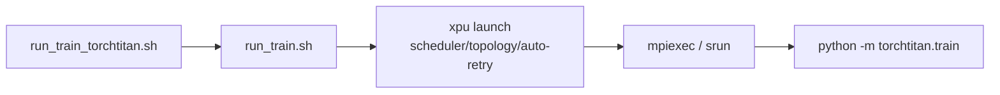
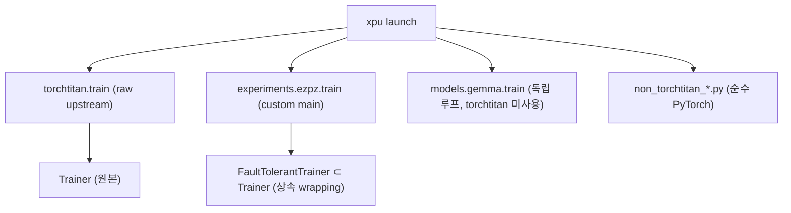

# xpu_launcher와 TorchTitan의 관계

이 문서는 두 가지 질문에 대한 정리입니다:

1. `xpu_launcher`가 torchtitan을 사용하는가? train 할 때 사용하도록 하는 코드가 존재하는가?
2. torchtitan은 어떤 형태로 wrapping 되어 있는가, 아니면 raw torchtitan을 사용하는가?

---

## 1. xpu_launcher는 torchtitan을 사용하는가?

**`xpu_launch` 패키지 자체는 torchtitan을 사용하지 않는다.** `src/`와 `tests/`에는
torchtitan 참조가 전혀 없다. 패키지는 프레임워크 무관(framework-agnostic)한
launcher로, 다음만 담당한다:

- `mpiexec`/`mpirun`/`srun` 커맨드 조립
- 스케줄러(PBS/SLURM) 감지 및 topology 추론
- watchdog / auto-retry / bad-node failover
- accelerator 백엔드(XPU/CUDA/ROCm) 감지 (`src/cli/accelerators/`)

실행할 커맨드는 인자로 받을 뿐이다.

**단, train 시 torchtitan과 함께 쓰도록 하는 wrapper 스크립트는 repo 최상위에 존재한다:**

| 스크립트 | 역할 |
|---|---|
| `run_train.sh` | 기본 wrapper — `xpu` 바이너리를 찾아 (`PATH` → `./.venv` → `../torchtitan/.venv/bin/xpu` 폴백) `xpu launch --scheduler ... -n ... --auto-retry ...`를 조립 |
| `run_train_torchtitan.sh` | run_train.sh 위에 얹힌 torchtitan 템플릿 — 최종적으로 `python -m torchtitan.train`을 launch 커맨드로 전달 (MODULE/CONFIG/TORCHTITAN_ROOT env로 설정) |
| `run_agpt_torchtitan_xpu.sh` | aGPT 학습용 — `python -m torchtitan.experiments.ezpz.train` 실행 |
| `run_gemma_torchtitan_xpu.sh` | Gemma용 torchtitan 학습 wrapper (`runpy` bootstrap 사용) |
| `non_torchtitan_*.py` / `run_*_non_torchtitan*.sh` | torchtitan 없이 순수 PyTorch FSDP로 학습하는 대안 경로 |

즉 구조는 **`xpu launch <launcher flags> -- python -m torchtitan.train <args>`**
형태로, launcher(패키지)와 학습 프레임워크(torchtitan)는 의존성 없이 분리되어
있고, shell wrapper가 둘을 연결한다.

---

## 2. torchtitan은 어떤 형태로 wrapping 되어 있는가?

torchtitan clone(`/lus/flare/projects/datascience/seonghapark/torchtitan`,
saforem2 fork의 ezpz 브랜치)에는 **raw 경로와 wrapping 경로가 공존**한다.

### 2.1 Raw torchtitan (`python -m torchtitan.train`)

`run_train_torchtitan.sh`가 사용. upstream 그대로의 진입점 `torchtitan/train.py`
→ `ConfigManager.parse_args()` → 원본 `Trainer`(`torchtitan/trainer.py`, 약 944줄).
수정 없는 raw 사용.

### 2.2 ezpz wrapper (`python -m torchtitan.experiments.ezpz.train`) — 가장 두꺼운 wrapping

`run_agpt_torchtitan_xpu.sh`가 사용. raw main을 대체하는 커스텀 `main()`으로,
torchtitan 내부 기계는 그대로 쓰되 다음을 추가한다:

- **`FaultTolerantTrainer(Trainer)`** — upstream `Trainer`를 **상속**한 서브클래스
  (`experiments/ezpz/trainer.py`, 약 887줄), torchft fault-tolerance 통합
- 커스텀 optimizer 컨테이너 스왑 (Muon, MuonClip, SophiaG, ADOPT, SPAM,
  ScheduleFree, Mano 등) — `--optimizer` 플래그를 tyro 파싱 전에 가로채서 주입
- XPU 대응: torch<2.11에서 IPEX import (TP collective hang 우회),
  `xccl_split_group_workaround.py`
- wandb setup, rank-0 abort-chain 로깅, legacy arg 변환, LR finder 모드
- 자체 dataset registry (`experiments/ezpz/datasets.py` — 임의 HF dataset 허용)

### 2.3 Gemma standalone (`torchtitan.models.gemma.train`) — 이름만 torchtitan

`run_gemma_torchtitan_xpu.sh`가 `runpy` bootstrap으로 실행. 약 1100줄짜리 이
파일은 **torchtitan을 전혀 import하지 않는** 독립 학습 루프이다 (자체 FSDP,
`_WandbSink`, `_ResourceMonitor`, xpu-smi/nvidia-smi 샘플링). torchtitan repo
안에 위치만 할 뿐 사실상 별도 trainer.

### 2.4 torchtitan 미사용 경로

xpu_launcher의 `non_torchtitan_*.py` (`non_torchtitan_gemma_train_FSDP.py` 등) —
torchtitan 없이 순수 PyTorch FSDP.

### 전체 구조

핵심 학습(aGPT)은 **상속 기반 wrapping**(`FaultTolerantTrainer` +
optimizer/XPU/wandb 확장)이고, 모델 아키텍처·병렬화·체크포인트 등 코어는 raw
torchtitan 코드를 그대로 사용한다.

---

### 참고: 이름 정리 (2026-09-16)

xpu_launcher 패키지에서 ezpz 관련 이름과 의존성은 제거되었다:

- `src/cli/ezpz_compat.py` → `src/cli/compat.py` (표준 라이브러리 +
  `cli.accelerators`/`cli.scheduler_topology`만 사용, `import ezpz` 제거)
- `EZPZ_SCHEDULER` env 폴백 제거 (`XPU_SCHEDULER`만 인식)
- auto-retry의 ezpz `scrape_bad_nodes` 연동 제거 (내장 `_extract_bad_hosts`가 담당)
- `xpu integrations` 목록에서 ezpz 제거

단, torchtitan repo 쪽의 `torchtitan/experiments/ezpz/` 패키지명과 wrapper
스크립트가 참조하는 `-m torchtitan.experiments.ezpz.train` 모듈 경로는 이 정리
범위에 포함되지 않았다 (외부 `ezpz` 라이브러리에 실제로 의존하기 때문).
