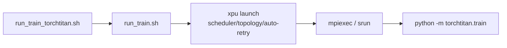
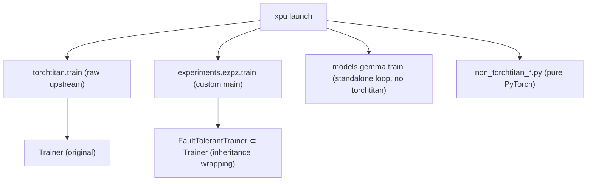

# Relationship between xpu_launcher and TorchTitan

This document answers two questions:

1. Does `xpu_launcher` use torchtitan? Is there code that hooks it into training?
2. How is torchtitan wrapped — or is raw torchtitan used as-is?

---

## 1. Does xpu_launcher use torchtitan?

**The `xpu_launch` package itself does not use torchtitan.** There are no
torchtitan references in `src/` or `tests/`. The package is a
framework-agnostic launcher responsible only for:

- Assembling `mpiexec`/`mpirun`/`srun` commands
- Scheduler (PBS/SLURM) detection and topology inference
- Watchdog / auto-retry / bad-node failover
- Accelerator backend (XPU/CUDA/ROCm) detection (`src/cli/accelerators/`)

The command to execute is simply taken as an argument.

**However, wrapper scripts that pair it with torchtitan for training exist in `xpu_torchtitan/` (torchtitan-dependent wrappers are isolated there):**

| Script | Role |
|---|---|
| `run_train.sh` | Base wrapper — finds the `xpu` binary (`PATH` → `./.venv` → `../torchtitan/.venv/bin/xpu` fallback) and assembles `xpu launch --scheduler ... -n ... --auto-retry ...` |
| `xpu_torchtitan/run_train_torchtitan.sh` | TorchTitan template on top of run_train.sh — ultimately passes `python -m torchtitan.train` as the launch command (configured via MODULE/CONFIG/TORCHTITAN_ROOT env) |
| `xpu_torchtitan/run_agpt_torchtitan_xpu.sh` | aGPT training — runs `python -m torchtitan.experiments.ezpz.train` via `xpu launch` |
| `xpu_torchtitan/run_gemma_torchtitan_xpu.sh` | TorchTitan training wrapper for Gemma (uses a `runpy` bootstrap) |
| `non_torchtitan_*.py` / `run_*_non_torchtitan*.sh` | Alternative path training with pure PyTorch FSDP, without torchtitan |

So the structure is **`xpu launch <launcher flags> -- python -m torchtitan.train <args>`**:
the launcher (package) and the training framework (torchtitan) are decoupled
with no dependency, and shell wrappers connect the two.

---

## 2. How is torchtitan wrapped?

In the torchtitan clone (`/lus/flare/projects/datascience/seonghapark/torchtitan`,
the ezpz branch of the saforem2 fork), **raw and wrapped paths coexist**.

### 2.1 Raw torchtitan (`python -m torchtitan.train`)

Used by `run_train_torchtitan.sh`. The unmodified upstream entrypoint `torchtitan/train.py`
→ `ConfigManager.parse_args()` → the original `Trainer` (`torchtitan/trainer.py`, ~944 lines).
Raw usage, no modifications.

### 2.2 ezpz wrapper (`python -m torchtitan.experiments.ezpz.train`) — the thickest wrapping

Used by `run_agpt_torchtitan_xpu.sh`. A custom `main()` replacing the raw one;
it reuses torchtitan's internal machinery but adds:

- **`FaultTolerantTrainer(Trainer)`** — a subclass **inheriting** the upstream `Trainer`
  (`experiments/ezpz/trainer.py`, ~887 lines), integrating torchft fault tolerance
- Custom optimizer container swapping (Muon, MuonClip, SophiaG, ADOPT, SPAM,
  ScheduleFree, Mano, etc.) — intercepts the `--optimizer` flag before tyro parsing
- XPU support: IPEX import on torch<2.11 (works around a TP collective hang),
  `xccl_split_group_workaround.py`
- wandb setup, rank-0 abort-chain logging, legacy arg translation, LR finder mode
- Its own dataset registry (`experiments/ezpz/datasets.py` — allows arbitrary HF datasets)

### 2.3 Gemma standalone (`torchtitan.models.gemma.train`) — torchtitan in name only

Run by `run_gemma_torchtitan_xpu.sh` via a `runpy` bootstrap. This ~1100-line
file **does not import torchtitan at all** — an independent training loop
(its own FSDP, `_WandbSink`, `_ResourceMonitor`, xpu-smi/nvidia-smi sampling).
It merely lives inside the torchtitan repo; effectively a separate trainer.

### 2.4 Paths that skip torchtitan

xpu_launcher's `non_torchtitan_*.py` (`non_torchtitan_gemma_train_FSDP.py`, etc.) —
pure PyTorch FSDP without torchtitan.

### Overall structure

The core training path (aGPT) uses **inheritance-based wrapping**
(`FaultTolerantTrainer` + optimizer/XPU/wandb extensions), while the core —
model architecture, parallelism, checkpointing — is raw torchtitan code.

---

### Note: naming cleanup (2026-09-16)

ezpz-related names and dependencies were removed from the xpu_launcher package:

- `src/cli/ezpz_compat.py` → `src/cli/compat.py` (uses only the standard
  library + `cli.accelerators`/`cli.scheduler_topology`; `import ezpz` removed)
- `EZPZ_SCHEDULER` env fallback removed (only `XPU_SCHEDULER` is recognized)
- ezpz `scrape_bad_nodes` integration removed from auto-retry (the built-in
  `_extract_bad_hosts` handles it)
- ezpz removed from the `xpu integrations` list

However, the `torchtitan/experiments/ezpz/` package name on the torchtitan
side and the `-m torchtitan.experiments.ezpz.train` module path referenced by
the wrapper scripts were intentionally left out of this cleanup (they actually
depend on the external `ezpz` library).
