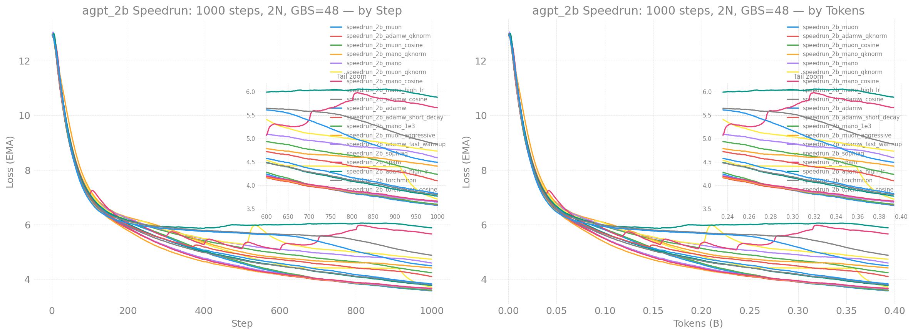
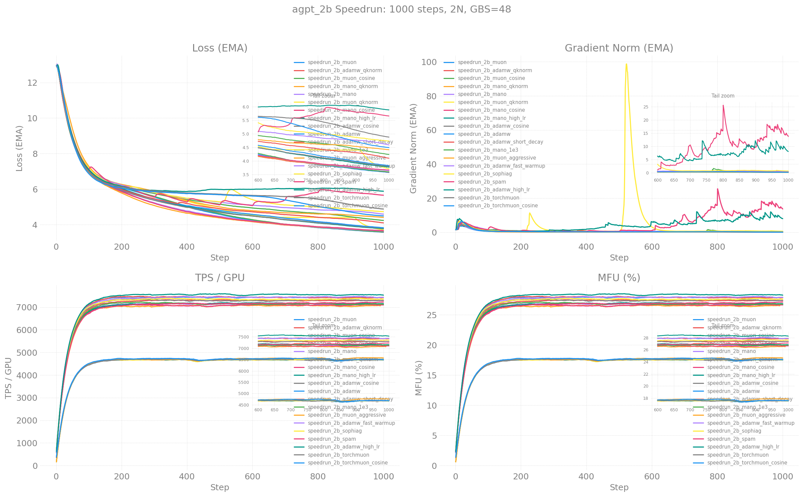

# agpt_2b Speedrun Competition

**Goal:** Lowest training loss in 1000 steps on 2 Sunspot nodes (24 XPU tiles).

**W&B Report:** [aurora_gpt/torchtitan.ezpz.train](https://api.wandb.ai/links/aurora_gpt/hda3milo)

**Full training results (10B tokens):** [agpt2b-n8-10BT](../agpt2b-n8-10BT/)

## Rules

1. **Model:** `agpt_2b` (2048 dim, 12 layers, 256k vocab) — architecture tweaks allowed
2. **Hardware:** 2 nodes, 24 XPU tiles
3. **Steps:** exactly 1000
4. **Dataset:** `HuggingFaceFW/fineweb-edu` (streaming) — fixed for fairness
5. **Batch size:** LBS=2, GBS=48 — fixed for fairness
6. **Sequence length:** 8192 — fixed for fairness
7. All changes must stay within `experiments/ezpz/`
8. **Tunable:** optimizer, LR, LR schedule, gradient clipping, architecture tweaks

## Loss Curves



## Training Metrics



## Leaderboard

| Rank | Config | Optimizer | LR | Loss | TPS/GPU |
|------|--------|-----------|------|------|---------|
| **1** | **`speedrun_2b_muon`** | Muon (custom) | 2.4e-3 | **3.557** | 4,556 |
| **2** | **`speedrun_2b_adamw_qknorm`** | **AdamW + QK-Norm** | 1.3e-3 | **3.569** | 7,178 |
| 3 | `speedrun_2b_muon_cosine` | Muon + cosine | 2.4e-3 | 3.591 | 4,625 |
| 4 | `speedrun_2b_mano_qknorm` | Mano + QK-Norm | 3.0e-4 | 3.604 | 6,980 |
| 5 | `speedrun_2b_mano` | Mano | 3.0e-4 | 3.631 | 7,048 |
| 6 | `speedrun_2b_muon_qknorm` | Muon + QK-Norm | 2.4e-3 | 3.650 | 4,655 |
| 7 | `speedrun_2b_mano_cosine` | Mano + cosine | 3.0e-4 | 3.663 | 6,959 |
| 8 | `speedrun_2b_mano_high_lr` | Mano (6e-4) | 6.0e-4 | 3.749 | 7,140 |
| 9 | `speedrun_2b_adamw_cosine` | AdamW + cosine | 1.3e-3 | 3.790 | 7,195 |
| 10 | `speedrun_2b_adamw` | AdamW (baseline) | 1.3e-3 | 3.801 | 7,245 |
| 11 | `speedrun_2b_adamw_short_decay` | AdamW (10% decay) | 1.3e-3 | 4.053 | 7,294 |
| 12 | `speedrun_2b_mano_1e3` | Mano (1e-3) | 1.0e-3 | 4.208 | 7,062 |
| 13 | `speedrun_2b_muon_aggressive` | Muon (4.8e-3) | 4.8e-3 | 4.391 | 4,617 |
| 14 | `speedrun_2b_adamw_fast_warmup` | AdamW (5-step wu) | 1.3e-3 | 4.546 | 7,172 |
| 15 | `speedrun_2b_sophiag` | SophiaG | 3.1e-4 | 4.719 | 7,208 |
| 16 | `speedrun_2b_spam` | SPAM | 1.3e-3 | 5.625 | 7,073 |
| 17 | `speedrun_2b_adamw_high_lr` | AdamW (2.6e-3) | 2.6e-3 | 5.850 | 7,344 |

### Wall-Clock Champion

**AdamW + QK-Norm** (3.569 at 7,178 TPS) is the practical winner — within 0.01
of Muon's loss but at 1.58x the throughput.

## Key Findings

- **QK-Norm is the single biggest improvement** — 0.23 loss improvement
  for AdamW (3.80->3.57), also helps Mano (3.63->3.60)
- **Muon wins on raw loss** (3.557) but is 35% slower per step due to
  Newton-Schulz iterations — inherent to the algorithm on XPU, not an
  implementation issue (`torch.optim.Muon` is the same speed as custom)
- **Mano matches Muon loss at AdamW speed** — manifold projection via
  vector-norm ops instead of matrix Newton-Schulz
- **Cosine decay beats linear** across all optimizers (~0.01-0.03)
- **Streaming data shuffle dominates variance** — same optimizer gives 1.3
  loss difference across runs due to HF streaming data ordering
- **Shorter decay (10%) hurts** — not enough time in decay phase
- **Shorter warmup (5 steps) hurts** — destabilizes early training
- **SPAM underperforms** — spike clipping doesn't help on clean data
- **SophiaG underperforms** AdamW by ~0.9 loss

## TorchMuon Results

`torch.optim.Muon` confirmed identical to our custom implementation on XPU —
same TPS (~4,600), same algorithm. The 35% overhead is inherent to Newton-Schulz
on this hardware. Different final loss is from streaming data shuffle variance.

| Config | Loss | TPS | Notes |
|--------|------|-----|-------|
| `speedrun_2b_torchmuon` | 4.836 | 4,508 | Data shuffle variance |
| `speedrun_2b_torchmuon_cosine` | 4.477 | 4,572 | Cosine still beats linear |

## Modifications Log

### Optimizers Added

| Optimizer | File | Key Idea | Source |
|-----------|------|----------|--------|
| **Mano** | `optimizer/mano.py` | Tangent-space projection on rotating Oblique manifold | [arxiv 2601.23000](https://arxiv.org/abs/2601.23000) |
| **SPAM** | `optimizer/spam.py` | Spike-aware gradient clipping + periodic momentum reset | [arxiv 2501.06842](https://arxiv.org/abs/2501.06842) |
| **TorchMuon** | `optimizer/containers.py` | Wrapper for `torch.optim.Muon` | [PyTorch docs](https://docs.pytorch.org/docs/stable/generated/torch.optim.Muon.html) |

### Architecture Tweaks

| Tweak | File | Key Idea | Source |
|-------|------|----------|--------|
| **QK-Norm** | `agpt/__init__.py` | RMSNorm on Q,K before attention dot product | Gemma 2, NanoGPT speedrun |

## Quick Start

```bash
ezpz launch python3 -m torchtitan.experiments.ezpz.train \
    --module ezpz.agpt --config speedrun_2b_adamw_qknorm

qsub -l select=2 -N speedrun_2b_muon -v CONFIG=speedrun_2b_muon \
    torchtitan/experiments/ezpz/competition/submit_run.sh
```
