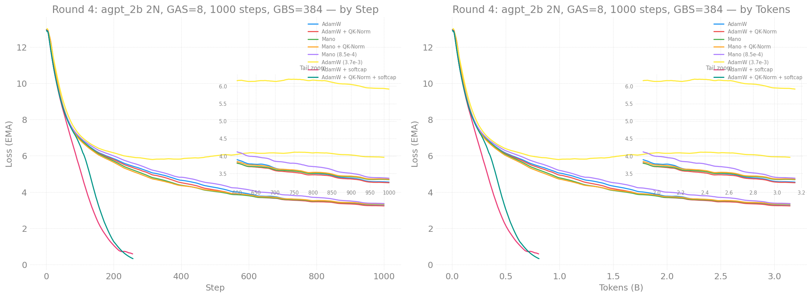
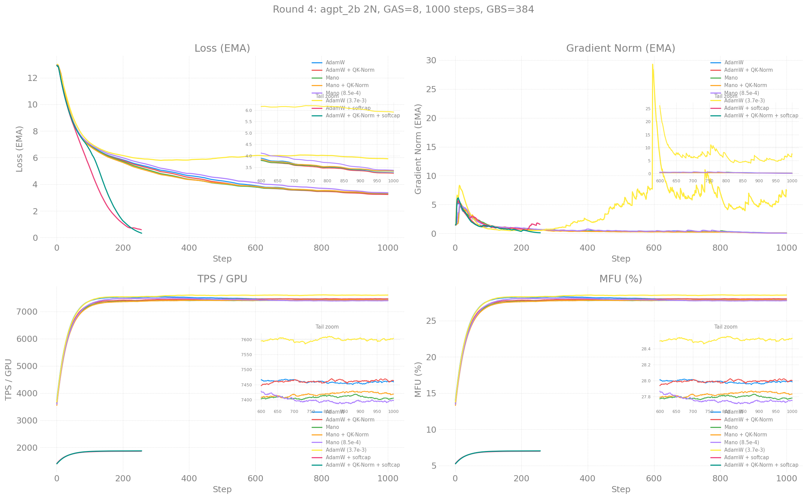

# agpt_2b Round 4 — 2 Nodes, GAS=8, 1000 Steps

> 2026-04-27 (in progress)

**W&B Report:** [aurora_gpt/torchtitan.ezpz.train](https://api.wandb.ai/links/aurora_gpt/hda3milo)

## Configuration

| Field | Value |
|-------|-------|
| Model | agpt_2b (2048 dim, 12 layers, 256k vocab) |
| Nodes | 2 (24 XPU tiles) |
| Dataset | FineWeb-Edu 100BT (local cache) |
| LBS | 2 |
| GAS | 8 |
| GBS | 384 |
| Seq len | 8192 |
| Steps | 1000 |
| Tokens | ~3.15B |
| LR schedule | Cosine WSD (warmup=20, decay last 20%) |
| Checkpoint | Disabled |

## Loss Curves

## Training Metrics

## Results

| Rank | Config | Optimizer | LR | Loss | TPS/GPU |
|------|--------|-----------|------|------|---------|
| **1** | **`r4_adamw_qknorm`** | **AdamW+QK-Norm** | 1.3e-3 | **3.205** | 7,428 |
| 2 | `r4_adamw` | AdamW | 1.3e-3 | 3.220 | 7,397 |
| 3 | `r4_mano` | Mano | 3.0e-4 | 3.294 | 7,397 |
| 4 | `r4_mano_qknorm` | Mano+QK-Norm | 3.0e-4 | 3.307 | 7,423 |
| 5 | `r4_mano_higher_lr` | Mano | 8.5e-4 | 3.328 | 7,348 |
| 6 | `r4_adamw_higher_lr` | AdamW | 3.7e-3 | 5.884 | 7,603 |
| — | `r4_adamw_softcap` | AdamW+Softcap | 1.3e-3 | memorized | 1,865 |
| — | `r4_adamw_qknorm_softcap` | AdamW+QKN+Softcap | 1.3e-3 | memorized | 1,876 |

### Final Findings

- **AdamW+QK-Norm wins** (3.205) — QK-Norm gave 0.015 improvement over plain AdamW
- **Mano leads early/mid training** but **AdamW catches up and wins in the decay phase**
  — Mano was ahead by 0.25 at step 300, but AdamW overtook during cosine decay
- **QK-Norm helps both optimizers** — 0.015 for AdamW, -0.013 for Mano
- **sqrt-scaled LR is too aggressive** — AdamW at 3.7e-3 diverged (5.88),
  Mano at 8.5e-4 slightly behind base Mano at 3e-4 (3.33 vs 3.29)
- **Softcap results invalid** — local dataset loader causes memorization with
  FlexAttention path (loss dropped to 0.05). Data sharding bug, not a
  softcap evaluation.
- **Consistent with 8-node 10B results** — AdamW wins at GBS=384 regardless
  of whether it's 2N×GAS=8 or 8N×GAS=2

## Key Questions

1. Will Mano hold its lead through the cosine decay phase?
2. Does GAS=8 vs GAS=2 explain why Mano beats AdamW here but lost in the 8N run?
3. Can softcap finish 1000 steps in the 12h walltime? (at 1,865 TPS → ~14h, tight)
