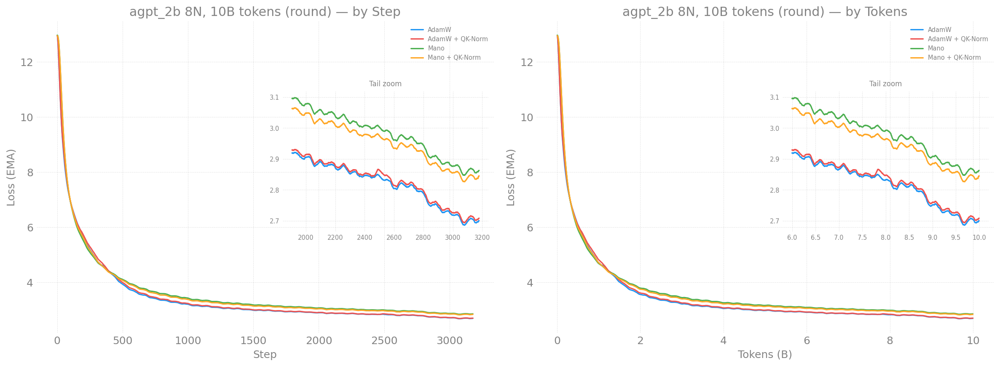
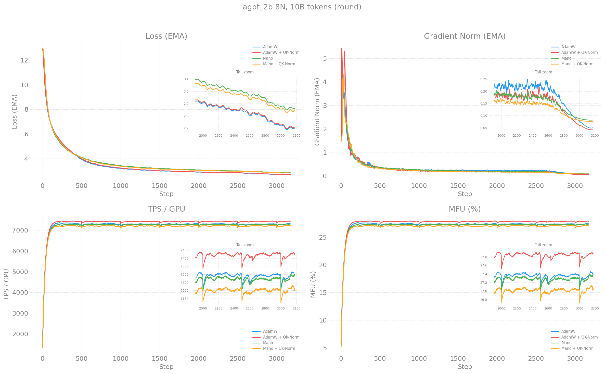

# agpt_2b Optimizer Sweep — 10B Tokens, 8 Nodes

> Sam Foreman
> 2026-04-27

## Overview

Full 10B token training run comparing optimizer and architecture choices
at scale, using the top configs from the
[1000-step speedrun competition](../agpt2b-n2-1000steps/).

**W&B Report:** [aurora_gpt/torchtitan.ezpz.train](https://api.wandb.ai/links/aurora_gpt/be9nm7s9)

## Configuration

| Field | Value |
|-------|-------|
| Model | agpt_2b (2048 dim, 12 layers, 256k vocab) |
| Nodes | 8 (96 XPU tiles) |
| Dataset | FineWeb-Edu 100BT (local cache, 267 GB) |
| LBS | 2 |
| GAS | 2 |
| GBS | 384 |
| Seq len | 8192 |
| Steps | 3,178 |
| Tokens | ~10B |
| LR schedule | Cosine WSD (warmup 2%, decay last 20%) |
| Checkpoint | Every 500 steps |
| Compile | On (model + loss) |

## Loss Curves

## Training Metrics

## Results

| Rank | Config | Optimizer | LR | Final Loss | TPS/GPU | Wall Time |
|------|--------|-----------|------|------------|---------|-----------|
| **1** | **`full_2b_adamw`** | AdamW | 1.3e-3 | **2.711** | 7,354 | ~4h |
| 2 | `full_2b_adamw_qknorm` | AdamW + QK-Norm | 1.3e-3 | 2.720 | 7,480 | ~4h |
| 3 | `full_2b_mano_qknorm` | Mano + QK-Norm | 3.0e-4 | 2.854 | 7,346 | ~4h |
| 4 | `full_2b_mano` | Mano | 3.0e-4 | 2.875 | 7,429 | ~4h |
| 5 | `full_2b_muon` | Muon (custom) | 2.4e-3 | DNF | — | Stuck compiling |

## Key Findings

### AdamW wins at large batch (GBS=384)

Plain AdamW achieved the best final loss (2.711), beating AdamW+QK-Norm (2.720)
and Mano variants (2.85-2.87). The simpler update rule is more compute-efficient
per token at larger batch sizes.

### QK-Norm effect diminishes at longer training

In the 1000-step speedruns, QK-Norm gave a 0.23 loss improvement for AdamW.
At 10B tokens (3,178 steps), the improvement shrunk to just 0.009. QK-Norm
helps early attention stabilization but the benefit washes out as the model
trains longer. AdamW+QK-Norm did briefly lead around step 2100 but AdamW
pulled ahead in the final decay phase.

### Mano needs LR re-tuning for larger batch

Mano (3.0e-4) was ~0.16 behind AdamW (1.3e-3) throughout training. The LR
was tuned at GBS=48 (speedrun setting). At GBS=384, Mano likely needs a
proportionally higher LR. The Mano+QK-Norm variant (2.854) did beat plain
Mano (2.875) by 0.021 — QK-Norm helps Mano more than it helps AdamW at
this scale.

### Muon compile broken with GAS

Muon never started training — the `torch.compile` inductor failed with
"can't pickle cyclic objects" during Newton-Schulz compilation with
gradient accumulation on torch 2.13. This is a torch-version-specific
issue, not a fundamental Muon limitation.

### 8-node scaling is excellent

All configs achieved 7,100-7,500 TPS/GPU on 8 nodes (96 tiles), consistent
with the 7,200 TPS/GPU seen at 2 nodes. Near-linear weak scaling.

## Comparison with Speedrun Results

| Metric | Speedrun (1000 steps) | Full Training (10B) |
|--------|----------------------|---------------------|
| Best optimizer | Muon (3.557) | AdamW (2.711) |
| QK-Norm improvement | +0.23 | +0.009 |
| Mano vs AdamW gap | -0.17 (Mano better) | +0.16 (AdamW better) |
| Best wall-clock | AdamW+QK-Norm | AdamW |

The rankings flip between short and long training: fancy optimizers (Muon, Mano)
win speedruns where per-step convergence matters most, but AdamW wins at scale
where per-token efficiency dominates.

## Recommendations for Production

1. **Use AdamW** with cosine WSD schedule for production training at GBS >= 192
2. **QK-Norm is optional** — marginal benefit at long training, slight overhead
3. **Mano deserves an LR sweep** at larger batch — the current 3e-4 is likely
   suboptimal for GBS=384
4. **Fix Muon compile with GAS** — disable `torch.compile` for the Newton-Schulz
   function, or skip compile entirely for Muon runs

## Related

- [Speedrun competition](../agpt2b-n2-1000steps/) — 1000 steps, 2 nodes
- [Scaling study](../../scaling/agpt-2b.md) — weak scaling results
