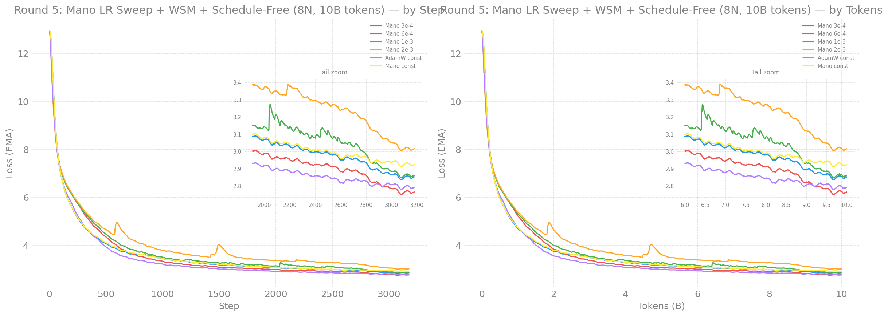
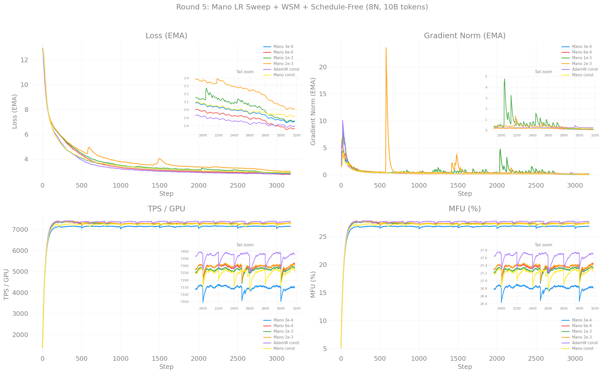

# Round 5: Mano LR Sweep + WSM + Schedule-Free — 8N, 10B Tokens

> 2026-04-28

**W&B:** [aurora_gpt/torchtitan.ezpz.train](https://api.wandb.ai/links/aurora_gpt/hda3milo)

## Configuration

| Field | Value |
|-------|-------|
| Nodes | 8 (96 XPU tiles) |
| Dataset | FineWeb-Edu 100BT (local) |
| LBS | 2, GAS | 2, GBS | 384 |
| Seq len | 8192 |
| Steps | 3,178 (~10B tokens) |
| LR schedule | Cosine WSD (except constant-LR and schedule-free) |

## Loss Curves

## Training Metrics

## Results

| Rank | Config | Optimizer | LR | Loss | TPS/GPU |
|------|--------|-----------|------|------|---------|
| **1** | **`r5_mano_lr6e4`** | **Mano** | **6.0e-4** | **2.776** | 7,470 |
| 2 | `r5_adamw_constant_lr` | AdamW (no decay) | 1.3e-3 | 2.800 | 7,420 |
| 3 | `r5_mano_lr3e4` | Mano | 3.0e-4 | 2.865 | 7,307 |
| 4 | `r5_mano_lr1e3` | Mano | 1.0e-3 | 2.873 | 7,444 |
| 5 | `r5_mano_constant_lr` | Mano (no decay) | 3.0e-4 | 2.931 | 7,402 |
| 6 | `r5_mano_lr2e3` | Mano | 2.0e-3 | 3.027 | 7,470 |
| 7 | `r5_schedulefree` | Schedule-Free AdamW | 2.5e-3 | DNF | — |

## Key Findings

### Mano wins at scale for the first time

Mano at 6e-4 achieved **2.776** — beating AdamW constant-LR (2.800) and
closing to within 0.065 of AdamW with cosine decay (2.711 from round 3).
This is the first time Mano has beaten AdamW at 10B token scale.

### LR finder needs batch-size correction

The LR finder at GBS=48 found 3e-4 optimal for Mano. At GBS=384 (8x larger),
**6e-4 (2x the finder LR) is optimal**. This suggests a sqrt(batch_ratio)
scaling rule: `LR_optimal = LR_finder * sqrt(GBS_new / GBS_finder)` =
`3e-4 * sqrt(384/48)` = `3e-4 * 2.83` ≈ `8.5e-4`. The actual optimum (6e-4)
is between 2x and 2.83x, supporting sub-linear LR scaling.

### Mano LR sweep ranking

| LR | Loss | vs baseline |
|----|------|-------------|
| 3e-4 (baseline) | 2.865 | — |
| **6e-4** | **2.776** | **-0.089** |
| 1e-3 | 2.873 | +0.008 |
| 2e-3 | 3.027 | +0.162 |

Sweet spot at 6e-4. Higher LRs converge faster early but plateau higher.
The crossover where 6e-4 overtook 3e-4 happened around step 700.

### WSM baselines

Constant-LR configs (no decay) for offline checkpoint merging:
- AdamW: 2.800 (16 checkpoints saved at 200-step intervals)
- Mano: 2.931

TODO: Run `eval/merge_checkpoints.py` with linear weighting and compare
merged loss to cosine-decayed equivalents.

### Schedule-Free failed

AdamWScheduleFree requires `.train()` called before each training step.
The torchtitan trainer doesn't call this. Needs a hook in `train.py`
to detect schedule-free optimizers and call `.train_mode()`.

## Comparison Across Rounds

| Round | Best Config | Loss | Notes |
|-------|-------------|------|-------|
| 1-3 (GBS=48, 1000 steps) | Muon | 3.557 | Slow per-step |
| 4 (GBS=384, 1000 steps) | AdamW+QK-Norm | 3.205 | |
| 8N 10B (GBS=384) | AdamW | 2.711 | |
| **5 (GBS=384, 10B)** | **Mano 6e-4** | **2.776** | **First Mano win at scale** |
