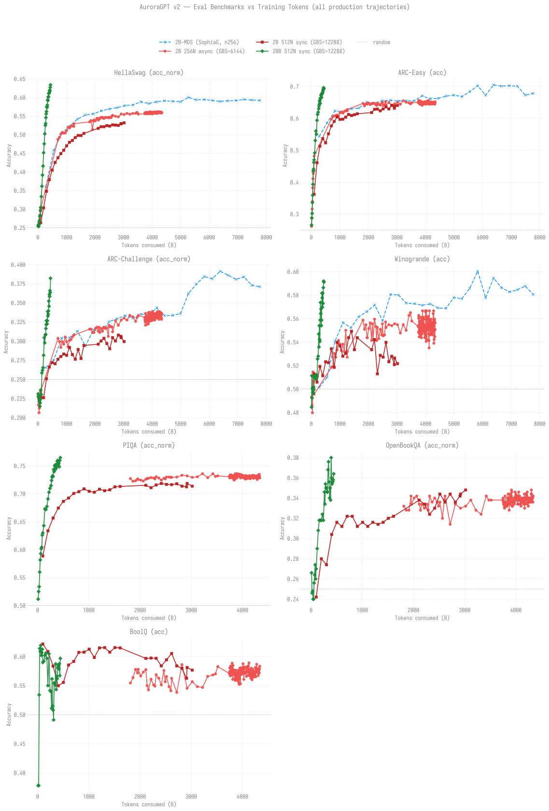

# Evaluation Results

Benchmark evaluations of AuroraGPT production checkpoints using
[lm-eval-harness](https://github.com/EleutherAI/lm-evaluation-harness).

## All-production overlay (vs tokens)

One chart, 4 panels (HellaSwag acc_norm, ARC-Easy acc, ARC-C acc_norm,
Winogrande acc), 4 trajectories overlaid: 2B-MDS reference, 2B 256N async,
2B 512N sync, 20B 512N sync. X-axis = tokens consumed (linear) so
GBS-different trajectories are directly comparable.



**Headline (2026-05-27):** the 20B 512N sync chain (green) at
~322B tokens is **already at the level the 2B chains reach around
~2T tokens** on HellaSwag norm and ARC-Easy. The 2B-MDS reference
(blue, ~7.77T tokens, SophiaG continuation) sets the upper-bound
ceiling for the 2B size class — both v2 2B chains (salmon-red 256N,
dark red 512N) are still climbing toward that ceiling.

Regenerate with:

```bash
.venv/bin/python -m torchtitan.experiments.ezpz.eval.plot_evals_combined
```

## Per-trajectory eval pages

| Model | Source | Steps Evaluated | Status |
|-------|--------|-----------------|--------|
| [agpt 2B](agpt/2b/) | torchtitan DCP (v1 + v2 256N async + v2 512N sync) | v2 256N step-36K–49.5K + v2 512N step-1K–25K | **🏁 Sync-mode workaround validated 2026-05-24** |
| [agpt 20B](agpt/20b/) | torchtitan DCP (v1 + v2 512N sync + v2 256N) | v2 512N step-900–3,200 + v2 256N step-100–300 | **🏁 20B 512N sync now beats 2B 256N async per token on every benchmark (2026-05-27)** |
| [agpt 2B (MDS)](agpt/2b-mds/) | Megatron-DeepSpeed SophiaG | steps 5K–140K (28 unique × 3 replicates) | Done — clean reference baseline |

## Pipelines

```
# torchtitan DCP runs
DCP checkpoint → eval/convert_to_hf.py → HF safetensors → lm-eval (HF backend, XPU)

# Megatron-DeepSpeed runs
mp_rank_00_model_states.pt → eval/mds_to_hf.py → HF safetensors → lm-eval (HF backend, XPU)
```

See `scripts/eval/convert_and_eval.sh` (DCP) and `scripts/eval/eval_mds_sweep.sh` (MDS)
for the end-to-end scripts. Aggregate with
`eval/aggregate_evals.py --model {2b,20b,2b-mds}`.

> Note: the canonical chart/table path is now `scripts/update_all_charts.sh`
> (via the per-model `docs/evals/agpt/{2b,20b}/plot_eval_overview.py`), which
> `scripts/refresh_all.sh` runs automatically. `aggregate_evals.py` remains a
> manual fallback aggregator.

## Environment

- **Module:** `frameworks/2025.3.1` (bare, no user venv)
- **Must set:** `HF_HUB_ENABLE_HF_TRANSFER=0`
- **Device:** `--device xpu`
- **Do NOT** use `ezpz_setup_env` — the user venv has transformers 5.6.2
  which breaks lm-eval's HF backend
