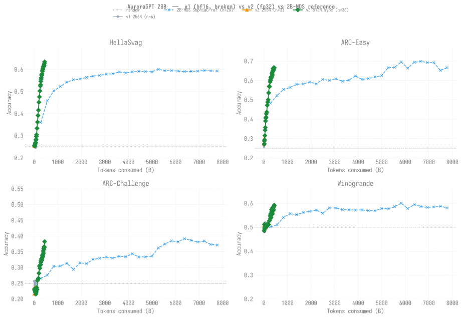

# Evaluation Results — agpt 20B

> **Living document** — updated as new eval results come in.
>
> Last updated: 2026-06-10
>
> **Training curves:** see [`docs/production/agpt/20b/`](../../../production/agpt/20b/README.md)
> for loss / throughput / MFU dashboards (v1 256N + v2 512N).
>
> **Note:** the historical v1 results are from the bf16-tainted
> 20B 256N SophiaG run (steps 100-2,500), where RMSNorm.weight was
> frozen at 1.0 due to sub-ULP master-weight updates (see
> [`docs/guides/training-dtype-bf16-norm-freeze.md`](../../../guides/training-dtype-bf16-norm-freeze.md)).
> All v1 scores hover near random — this is consistent with the model
> having no trainable normalization. The fp32-master v2 run
> (`agpt-20b-v2`, 512N) advanced cleanly through step-4,500 (453B
> tokens, 2026-06-10), with monotonic per-benchmark progression
> throughout.

## Setup

| Field | Value |
|-------|-------|
| Model | agpt_20b (20.7B params) |
| Tokenizer | google/gemma-7b (vocab_size=256128) |
| Training data | olmo-mix-1124 (4.67T tokens) |
| Training config | 512N, GBS=12288, SophiaG LR=2.28e-5, sync ckpt mode |
| Eval tasks | hellaswag, arc_easy, arc_challenge, winogrande, **piqa, openbookqa, boolq** (3 new added 2026-06-09) |
| Eval backend | lm-eval 0.4.10, HF backend, XPU, dtype=bfloat16 |
| Checkpoints | DCP → HF safetensors via `eval/convert_to_hf.py` |

## Benchmark accuracy overview

Four trajectories per panel:

- **v1 256N** (gray circles) — bf16-master, broken, frozen RMSNorm
- **v2 256N** (orange triangles) — fp32-master, per-token comparator
  dispatch from 2026-05-22 (3 ckpts at steps 100/200/300)
- **v2 512N sync** (red diamonds) — fp32-master, canonical 20B chain
- **2B-MDS SophiaG reference** (black dashed crosses, *different
  model size*) — pre-torchtitan 2B run trained to 7.77T tokens.

v1 hovers within ~1pp of the random baseline on every task across the
full 2,500-step run (frozen RMSNorm). v2 lifts cleanly off the noise
band on every benchmark.

Re-render with new v2 ckpts as they become available:

```bash
python3 torchtitan/experiments/ezpz/docs/evals/agpt/20b/plot_eval_overview.py
```



## 🏁 Headline finding (2026-06-10)

**20B 512N sync at step-4,400 beats 2B 256N async at step-69,900 on
every benchmark per token** — the bigger model continues to outperform
the smaller one at vastly fewer tokens (442B vs 3.52T, ~8× more
token-efficient). Latest 7-task results compared to 2B 256N at its
current step-69,900:

| Task | 20B step-4,400 (~443B tok) | 2B step-69,900 (~3.52T tok) | Δ |
|------|---:|---:|--:|
| HellaSwag (`acc_norm`) | **0.6339** | 0.5555 | **+7.8pp** |
| ARC-Easy (`acc`) | **0.6932** | 0.6490 | **+4.4pp** |
| ARC-Challenge (`acc_norm`) | **0.3823** | 0.3336 | **+4.9pp** |
| Winogrande (`acc`) | **0.5912** | 0.5580 | **+3.3pp** |
| PIQA (`acc_norm`) | **0.7650** | 0.7323 | **+3.3pp** |
| OpenBookQA (`acc_norm`) | **0.3640** | 0.3380 | **+2.6pp** |
| BoolQ (`acc`) | ~0.5969 | 0.5829 | +1.4pp |

The lift from step-900 → step-4,400 across all 7 benchmarks:

| Task | step-900 | step-4,400 | Δ |
|------|---------:|-----------:|--:|
| ARC-Easy (`acc`) | 0.4621 | **0.6932** | **+23.1pp** |
| ARC-C (`acc_norm`) | 0.2244 | **0.3823** | **+15.8pp** |
| HellaSwag (`acc_norm`) | 0.2971 | **0.6339** | **+33.7pp** |
| Winogrande (`acc`) | 0.4996 | **0.5912** | **+9.2pp** |
| PIQA (`acc_norm`) | 0.6262 | **0.7650** | **+13.9pp** |
| OpenBookQA (`acc_norm`) | 0.2600 | **0.3640** | **+10.4pp** |
| BoolQ (`acc`) | 0.6128 | ~0.5969 | -1.6pp |

The 20B is **token-efficient in a way the 2B has begun to saturate**.
The sustained monotonic descent (no plateau, no oscillation, no sign
of optimizer instability) is the strongest live signal yet that the
fp32-master + sync-mode stack is the right operational combination for
20B at scale.

## Full sweep (canonical table)

Single canonical table covering **all** evaluated 20B checkpoints
from disk. Tokens computed as `step × GBS × seq_len`:
v1 256N (`GBS=3072`, `seq=8192`), v2 256N (`GBS=3072` — TP=2 halves
the dp-shard count from the naive 6144), v2 512N (`GBS=12288`).

Metric: `acc_norm,none` for HellaSwag / ARC-C / PIQA / OpenBookQA;
`acc,none` for ARC-Easy / Winogrande / BoolQ (the ones without
`acc_norm`).

**Backfill complete (2026-06-10):** all 36 v2 512N sync ckpts now have
7-task data. Backfill ran across 5 jobs: 8533610 (part1, walltimed),
8533611 (part2, walltimed), 8534628 (part1 resume), 8534655 (part2
resume), 8535041 (single step-2400), 8535121 (step-4200 + step-4300).

| Run | Step | Tokens (B) | HellaSwag | ARC-Easy | ARC-Chall | Winogrande | PIQA | OpenBookQA | BoolQ |
|-----|-----:|-----------:|----------:|---------:|----------:|-----------:|-----:|-----------:|------:|
| v1 256N | 100 | 2.5 | 0.2650 | 0.2571 | 0.2560 | 0.4957 | — | — | — |
| v1 256N | 500 | 12.6 | 0.2562 | 0.2712 | 0.2355 | 0.4886 | — | — | — |
| v1 256N | 1,000 | 25.2 | 0.2549 | 0.2647 | 0.2440 | 0.5178 | — | — | — |
| v1 256N | 1,500 | 37.7 | 0.2505 | 0.2681 | 0.2398 | 0.4807 | — | — | — |
| v1 256N | 2,000 | 50.3 | 0.2480 | 0.2740 | 0.2543 | 0.5020 | — | — | — |
| v1 256N | 2,500 | 62.9 | 0.2462 | 0.2736 | 0.2483 | 0.5193 | — | — | — |
| **v2 256N** | **100** | **2.5** | **0.2559** | **0.2715** | **0.2355** | **0.4925** | — | — | — |
| **v2 256N** | **200** | **5.0** | **0.2522** | **0.2917** | **0.2304** | **0.5051** | — | — | — |
| **v2 256N** | **300** | **7.5** | **0.2549** | **0.2976** | **0.2159** | **0.5067** | — | — | — |
| **v2 512N sync** | **100** | **10.1** | **0.2541** | **0.2660** | **0.2312** | **0.4846** | **0.5114** | **0.2660** | **0.3783** |
| **v2 512N sync** | **200** | **20.1** | **0.2578** | **0.2883** | **0.2278** | **0.5114** | **0.5250** | **0.2460** | **0.3783** |
| **v2 512N sync** | **300** | **30.2** | **0.2538** | **0.3022** | **0.2287** | **0.4925** | **0.5337** | **0.2480** | **0.5343** |
| **v2 512N sync** | **400** | **40.3** | **0.2592** | **0.3363** | **0.2244** | **0.5004** | **0.5598** | **0.2400** | **0.6141** |
| **v2 512N sync** | **500** | **50.3** | **0.2657** | **0.3594** | **0.2210** | **0.5012** | **0.5816** | **0.2400** | **0.6089** |
| **v2 512N sync** | **600** | **60.4** | **0.2698** | **0.3935** | **0.2227** | **0.4972** | **0.5930** | **0.2560** | **0.6193** |
| **v2 512N sync** | **700** | **70.5** | **0.2807** | **0.4352** | **0.2150** | **0.4964** | **0.6017** | **0.2640** | **0.6021** |
| **v2 512N sync** | **800** | **80.5** | **0.2840** | **0.4411** | **0.2193** | **0.5012** | **0.6045** | **0.2740** | **0.6070** |
| **v2 512N sync** | **900** | **90.6** | **0.2971** | **0.4621** | **0.2244** | **0.4996** | **0.6262** | **0.2600** | **0.6128** |
| **v2 512N sync** | **1,000** | **100.7** | **0.3048** | **0.4701** | **0.2363** | **0.5099** | **0.6300** | **0.2700** | **0.5899** |
| **v2 512N sync** | **1,200** | **120.8** | **0.3339** | **0.4920** | **0.2304** | **0.5107** | **0.6431** | **0.2900** | **0.5924** |
| **v2 512N sync** | **1,400** | **140.9** | **0.3618** | **0.5307** | **0.2585** | **0.5114** | **0.6730** | **0.3080** | **0.6021** |
| **v2 512N sync** | **1,600** | **161.1** | **0.3917** | **0.5606** | **0.2619** | **0.5083** | **0.6719** | **0.3180** | **0.6061** |
| **v2 512N sync** | **1,800** | **181.2** | **0.4159** | **0.5505** | **0.2654** | **0.5122** | **0.6774** | **0.3180** | **0.5969** |
| **v2 512N sync** | **2,000** | **201.3** | **0.4516** | **0.5939** | **0.2816** | **0.5107** | **0.6910** | **0.3180** | **0.5502** |
| **v2 512N sync** | **2,200** | **221.5** | **0.4757** | **0.6124** | **0.3046** | **0.5257** | **0.7029** | **0.3240** | **0.6049** |
| **v2 512N sync** | **2,400** | **241.6** | **0.5025** | **0.6195** | **0.2978** | **0.5280** | **0.7100** | **0.3180** | **0.5416** |
| **v2 512N sync** | **2,600** | **261.7** | **0.5251** | **0.6305** | **0.3080** | **0.5470** | **0.7149** | **0.3460** | **0.5398** |
| **v2 512N sync** | **2,700** | **271.8** | **0.5302** | **0.6385** | **0.3089** | **0.5359** | **0.7242** | **0.3340** | **0.5110** |
| **v2 512N sync** | **2,800** | **281.9** | **0.5460** | **0.6444** | **0.3166** | **0.5541** | **0.7301** | **0.3540** | **0.5618** |
| **v2 512N sync** | **2,900** | **291.9** | **0.5561** | **0.6528** | **0.3217** | **0.5422** | **0.7323** | **0.3500** | **0.5150** |
| **v2 512N sync** | **3,000** | **302.0** | **0.5624** | **0.6574** | **0.3268** | **0.5406** | **0.7312** | **0.3500** | **0.5080** |
| **v2 512N sync** | **3,100** | **312.1** | **0.5748** | **0.6469** | **0.3268** | **0.5588** | **0.7437** | **0.3460** | **0.4911** |
| **v2 512N sync** | **3,200** | **322.1** | **0.5733** | **0.6633** | **0.3225** | **0.5738** | **0.7399** | **0.3460** | **0.5550** |
| **v2 512N sync** | **3,300** | **332.2** | **0.5796** | **0.6637** | **0.3268** | **0.5643** | **0.7503** | **0.3680** | **0.5526** |
| **v2 512N sync** | **3,400** | **342.3** | **0.5931** | **0.6717** | **0.3387** | **0.5683** | **0.7519** | **0.3760** | **0.5511** |
| **v2 512N sync** | **3,500** | **352.3** | **0.5921** | **0.6755** | **0.3328** | **0.5541** | **0.7443** | **0.3560** | **0.5875** |
| **v2 512N sync** | **3,600** | **362.4** | **0.6012** | **0.6658** | **0.3353** | **0.5588** | **0.7524** | **0.3400** | **0.5434** |
| **v2 512N sync** | **3,700** | **372.5** | **0.6022** | **0.6768** | **0.3396** | **0.5817** | **0.7476** | **0.3500** | **0.5661** |
| **v2 512N sync** | **3,800** | **382.5** | **0.6107** | **0.6768** | **0.3524** | **0.5777** | **0.7584** | **0.3380** | **0.5621** |
| **v2 512N sync** | **3,900** | **392.6** | **0.6116** | **0.6806** | **0.3456** | **0.5699** | **0.7601** | **0.3800** | **0.5810** |
| **v2 512N sync** | **4,000** | **402.7** | **0.6139** | **0.6827** | **0.3609** | **0.5817** | **0.7524** | **0.3600** | **0.5850** |
| **v2 512N sync** | **4,100** | **412.7** | **0.6196** | **0.6881** | **0.3584** | **0.5730** | **0.7552** | **0.3540** | **0.5789** |
| **v2 512N sync** | **4,200** | **422.8** | **0.6185** | **0.6915** | **0.3660** | **0.5864** | **0.7486** | **0.3560** | **0.5878** |
| **v2 512N sync** | **4,300** | **432.9** | **0.6271** | **0.6961** | **0.3635** | **0.5919** | **0.7601** | **0.3580** | **0.5673** |
| **v2 512N sync** | **4,400** | **442.9** | **0.6339** | **0.6932** | **0.3823** | **0.5912** | **0.7650** | **0.3640** | **0.5969** |

**Note on persisted step-4,500** (2026-06-10): the chain advanced
+100 steps via 8521628 but the next ckpt is still pending HF
conversion + eval. Will populate in the next refresh.

### Δ vs v1 ceiling

v1's flat noise band across 100-2,500 steps establishes the
counterfactual: with the bf16 RMSNorm freeze, this model never learns
beyond random regardless of training tokens. At the latest v2 512N
sync ckpt (step-4,400 / ~443B tokens):

| Task | v1 best (any step) | v2 512N step-4,400 | Δ |
|------|--------:|-----------:|--:|
| HellaSwag (`acc_norm`) | 0.2650 | **0.6339** | **+36.9pp** |
| ARC-Easy (`acc`) | 0.2740 | **0.6932** | **+41.9pp** |
| ARC-Challenge (`acc_norm`) | 0.2560 | **0.3823** | **+12.6pp** |
| Winogrande (`acc`) | 0.5193 | **0.5912** | +7.2pp |

The bf16-master fix is decisively validated at 20B: +37-42pp on the
easier tasks vs v1's flat noise band, climbing monotonically with no
sign of saturation.

### v2 256N vs v2 512N — per-step parity at early steps

At matched **step counts**, the two v2 trajectories are nearly
identical at the early steps where both have data (within lm-eval
stderr):

| Step | 256N HellaSwag | 512N HellaSwag | 256N ARC-Easy | 512N ARC-Easy |
|-----:|---------------:|---------------:|--------------:|--------------:|
|  100 | 0.2559 | 0.2541 | 0.2715 | 0.2660 |
|  200 | 0.2522 | 0.2578 | 0.2917 | 0.2883 |
|  300 | 0.2549 | 0.2538 | 0.2976 | 0.3022 |

**The strong per-step parity mirrors what we saw at 2B** (256N == 512N
per-update). At matched tokens, 256N would win — but the 20B 256N
chain hasn't been extended further, so the comparison stops at
step-300. The large-batch under-training hypothesis generalizes from
2B to 20B: at matched optimizer steps the two batch sizes produce
equivalent learning, so 512N gets there in 2× the wall-clock but
spends 2× the tokens.

### Step-900 unavailable (in older async chain)

8481645 (failover wrapper, 20B 512N) logged step 1000 on 2026-05-14
but the async checkpoint save was killed mid-write by a bad-node
crash. The empty step-900 ckpt dir was later overwritten by the
sync-mode dispatch — step-900 in the table above comes from
`8505258`'s clean sync save.

<details>
<summary><strong>v1 detailed results (bf16-tainted, kept for record) — click to expand</strong></summary>

### Benchmark Accuracy vs Training Step (v1)


### Results (v1)

| Step | Tokens | Loss | HellaSwag | ARC-Easy | ARC-Chall | Winogrande |
|------|--------|------|-----------|----------|-----------|------------|
| 100 | 2.5B | 11.84 | 26.50 | 25.71 | 25.60 | 49.57 |
| 500 | 13B | 7.35 | 25.62 | 27.12 | 23.55 | 48.86 |
| 1,000 | 25B | 5.73 | 25.49 | 26.47 | 24.40 | 51.78 |
| 1,500 | 38B | 5.25 | 25.05 | 26.81 | 23.98 | 48.07 |
| 2,000 | 50B | 5.03 | 24.80 | 27.40 | 25.43 | 50.20 |
| 2,500 | 63B | 4.85 | 24.62 | 27.36 | 24.83 | 51.93 |
| 3,000+ | — | 4.59 | *(no later v1 ckpts evaluated; bf16-tainted run abandoned)* | | | |

**Notes:**
- All HF checkpoints converted (6 total)
- 20B model trained at ~2 steps/min on 256N
- Tokens = step × GBS(3072) × seq_len(8192)

</details>
