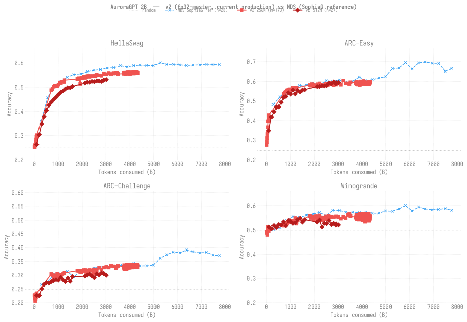

# Evaluation Results — agpt 2B

> **Living document** — updated as new eval results come in.
>
> Last updated: 2026-06-29
>
> **NOTE (2026-06-29):** the 2B 256N chain **COMPLETED** at step-92,859 =
> 4.674T tokens (100%). The scores below run through **step-86,200**; the
> final stretch (step-86,300 -> 92,859) is **not yet eval'd** -- queue the
> backfill (incl. the final step-92,859 checkpoint) when Aurora returns
> from PM maintenance. lm-eval needs compute, so it can't run during the
> outage.
>
> **Training curves:** see [`docs/production/agpt/2b/`](../../../production/agpt/2b/README.md)
> for loss / throughput / MFU dashboards across the live 2B trajectories
> (v2 256N, v2 512N, v2 1024N), each with its own per-node sub-page.
> v1 (bf16-tainted, archived) results live at
> [`docs/production/agpt/historical/v1-bf16/`](../../../production/agpt/historical/v1-bf16/README.md).

## Setup

| Field | Value |
|-------|-------|
| Model | agpt_2b (1.99B params) |
| Tokenizer | google/gemma-7b (vocab_size=256128) |
| Training data | olmo-mix-1124 (4.67T tokens) |
| Training config | 256N, GBS=3,072, SophiaG LR=2.28e-5, seq_len=8,192 |
| Eval tasks | hellaswag, arc_easy, arc_challenge, winogrande, **piqa, openbookqa, boolq** (3 added 2026-06-09; 0-shot) |
| Eval backend | lm-eval 0.4.10 + transformers 4.57.6 (HF backend, XPU, bf16) |
| Checkpoint conversion | DCP → HF safetensors via `eval/convert_to_hf.py` |

Tokens consumed at step *N* = `N × 3,072 × 8,192`. Random baseline is
25% for the four-choice tasks (hellaswag, arc_*) and 50% for winogrande.

## v2 vs MDS reference — benchmark accuracy

Two production trajectories per panel: **v2 256N async** + **v2 512N
sync** (current production, fp32-master), overlaid against the
**MDS SophiaG reference** (blue dashed crosses, pre-torchtitan
Megatron-DeepSpeed 2B continuation trained to 7.77T tokens — the
upper-bound ceiling for the 2B size class on this benchmark set).

Re-render with new v2 ckpts (and refreshed MDS data) as they become
available:

```bash
python3 torchtitan/experiments/ezpz/docs/evals/agpt/2b/plot_eval_overview.py
```



## v2 256N vs v2 512N — same model, two batch sizes

A surprise from the overlay above: **at matched token counts, v2 256N
beats v2 512N by 3-8pp** — even though 512N has the same architecture
and optimizer.

| Tokens (B) | 256N step | 512N step | 256N HellaSwag | 512N HellaSwag | Δ |
|-----------:|----------:|----------:|---------------:|---------------:|--:|
| ~50 | 1000 | ~500 | 0.262 | (not evaluated) | — |
| ~100 | 2000 | 1000 | **0.301** | 0.264 | **-3.7pp** |
| ~200 | (n/a) | 2000 | — | 0.304 | — |

But at **matched step counts**, the two trajectories are
indistinguishable (within the ~1.4pp lm-eval stderr):

| Step | 256N HellaSwag | 512N HellaSwag | Δ |
|-----:|---------------:|---------------:|--:|
| 1000 | 0.262 | 0.264 | +0.2pp |
| 2000 | 0.301 | 0.304 | +0.3pp |

### Interpretation

This is the classic **large-batch under-training** effect. Both runs
use SophiaG LR=2.28e-5 (tuned for the 256N regime, GBS=6,144). At
512N (GBS=12,288):
- Each gradient update covers 2× more tokens
- But the optimizer state evolves at half the cadence per token
- LR scaling was **not** applied — we kept LR=2.28e-5 fixed
- So the 512N model is meaningfully **under-trained per token**

The per-step parity confirms the optimizer/architecture are healthy —
each gradient update produces the same effective learning. The
per-token gap is purely the doubled batch size eating into the
gradient-update budget.

**Implications:**
- **Per-step**: 256N == 512N (same per-update progress)
- **Per-token**: 256N wins by ~3-8pp at matched tokens
- **Per-wall-clock**: 512N wins (≈2× throughput)

For convergence-to-target-loss, 256N is the more token-efficient
choice. For reaching a target wall-clock, 512N gets there faster but
spends more tokens. Either could be preferable depending on the goal
(chasing minimum wall-clock vs minimum tokens).

**Open question being tested**: does √2-scaling LR (3.22e-5) at 512N
close the per-token gap?

Submitted **2026-05-03**: fresh-from-scratch 2B 512N fork at
LR=3.22e-5 (vs canonical LR=2.28e-5).
- chain1: job 8467141 (12h walltime)
- chain2: job 8467142 (12h, `-W depend=afterany:8467141`)
- Total ~24h walltime → ~step 2,000 → ~200B tokens (matches the
  canonical 512N's step-2000 / 200B-token point for direct comparison).
- Separate ckpt dir:
  `checkpoints/agpt-2b-sophiag-olmo-mix-1124-n512-gbs12288-lr3.22e-5`
- Will be evaluated at step 1000/2000 with the same lm-eval pipeline,
  then plotted on the same v2-vs-MDS figure as a third v2 line
  (LR=3.22e-5).

## v2 — full sweep (canonical table)

Single canonical table covering **all** evaluated v2 2B checkpoints
from disk, regenerated by `plot_eval_overview.py` (the same script that
produces the figure above). Tokens computed as `step × GBS × seq_len`
with `GBS=6144` for v2 256N (`LBS=2 × 256 × 12`) and `12288` for v2
512N (`LBS=2 × 512 × 12`); both have `seq_len=8192`.

Metric is `acc_norm,none` for HellaSwag / ARC-C / PIQA / OpenBookQA;
`acc,none` for ARC-Easy / Winogrande / BoolQ.

**Backfill status (2026-06-10):** 7-task results landed for all v2
512N ckpts (27/27) and the late 2B 256N range (step-36,000 onward,
32 ckpts). The early 2B 256N range (step-200 → step-25,100, 23 ckpts)
**cannot be backfilled** — those DCP checkpoints were destroyed on
2026-05-25 by the stray `CKPT_KEEP_LATEST_K=10` flag in job 8505252
(see "Gaps in the v2 256N async sweep" section below). The 4-task
results.json files are preserved for those rows; the 3 new task
columns are marked `no DCP`.

| Run | Step | Tokens (B) | HellaSwag | ARC-Easy | ARC-Chall | Winogrande | PIQA | OpenBookQA | BoolQ |
|-----|-----:|-----------:|----------:|---------:|----------:|-----------:|-----:|-----------:|------:|
| **v2 256N** | **200** | **10.1** | **0.2548** | **0.2618** | **0.2270** | **0.4933** | no DCP | no DCP | no DCP |
| **v2 256N** | **400** | **20.1** | **0.2542** | **0.2875** | **0.2167** | **0.4925** | no DCP | no DCP | no DCP |
| **v2 256N** | **600** | **30.2** | **0.2601** | **0.3161** | **0.2278** | **0.4862** | no DCP | no DCP | no DCP |
| **v2 256N** | **800** | **40.3** | **0.2621** | **0.3401** | **0.2065** | **0.4799** | no DCP | no DCP | no DCP |
| **v2 256N** | **1,000** | **50.3** | **0.2616** | **0.3826** | **0.2125** | **0.4996** | no DCP | no DCP | no DCP |
| **v2 256N** | **1,200** | **60.4** | **0.2682** | **0.4112** | **0.2142** | **0.5146** | no DCP | no DCP | no DCP |
| **v2 256N** | **1,400** | **70.5** | **0.2748** | **0.4276** | **0.2201** | **0.5067** | no DCP | no DCP | no DCP |
| **v2 256N** | **1,600** | **80.5** | **0.2839** | **0.4364** | **0.2270** | **0.5059** | no DCP | no DCP | no DCP |
| **v2 256N** | **1,800** | **90.6** | **0.2942** | **0.4356** | **0.2338** | **0.5020** | no DCP | no DCP | no DCP |
| **v2 256N** | **2,000** | **100.7** | **0.3014** | **0.4819** | **0.2346** | **0.4957** | no DCP | no DCP | no DCP |
| **v2 256N** | **14,000** | **704.6** | **0.4878** | **0.5981** | **0.3038** | **0.5185** | no DCP | no DCP | no DCP |
| **v2 256N** | **15,000** | **755.0** | **0.4929** | **0.6048** | **0.2995** | **0.5193** | no DCP | no DCP | no DCP |
| **v2 256N** | **16,000** | **805.3** | **0.5020** | **0.6077** | **0.2918** | **0.5304** | no DCP | no DCP | no DCP |
| **v2 256N** | **17,000** | **855.6** | **0.5064** | **0.6090** | **0.2995** | **0.5272** | no DCP | no DCP | no DCP |
| **v2 256N** | **18,000** | **906.0** | **0.5045** | **0.6107** | **0.2961** | **0.5335** | no DCP | no DCP | no DCP |
| **v2 256N** | **19,000** | **956.3** | **0.5046** | **0.6065** | **0.3055** | **0.5414** | no DCP | no DCP | no DCP |
| **v2 256N** | **20,000** | **1006.6** | **0.5109** | **0.6174** | **0.2995** | **0.5383** | no DCP | no DCP | no DCP |
| **v2 256N** | **21,000** | **1057.0** | **0.5203** | **0.6204** | **0.2927** | **0.5328** | no DCP | no DCP | no DCP |
| **v2 256N** | **22,000** | **1107.3** | **0.5181** | **0.6166** | **0.3012** | **0.5383** | no DCP | no DCP | no DCP |
| **v2 256N** | **23,000** | **1157.6** | **0.5232** | **0.6216** | **0.3020** | **0.5320** | no DCP | no DCP | no DCP |
| **v2 256N** | **24,000** | **1208.0** | **0.5236** | **0.6242** | **0.3055** | **0.5501** | no DCP | no DCP | no DCP |
| **v2 256N** | **25,000** | **1258.3** | **0.5225** | **0.6237** | **0.3080** | **0.5272** | no DCP | no DCP | no DCP |
| **v2 256N** | **25,100** | **1263.3** | **0.5297** | **0.6279** | **0.3080** | **0.5320** | no DCP | no DCP | no DCP |
| **v2 256N** | **36,000** | **1811.9** | **0.5346** | **0.6469** | **0.3157** | **0.5588** | **0.7274** | **0.3320** | **0.5547** |
| **v2 256N** | **37,000** | **1862.3** | **0.5379** | **0.6393** | **0.3157** | **0.5509** | **0.7225** | **0.3280** | **0.5639** |
| **v2 256N** | **38,000** | **1912.6** | **0.5142** | **0.6452** | **0.3114** | **0.5549** | **0.7236** | **0.3280** | **0.5780** |
| **v2 256N** | **38,800** | **1952.9** | **0.5369** | **0.6460** | **0.3114** | **0.5438** | **0.7269** | **0.3420** | **0.5719** |
| **v2 256N** | **39,000** | **1962.9** | **0.5397** | **0.6448** | **0.3114** | **0.5438** | **0.7258** | **0.3340** | **0.5783** |
| **v2 256N** | **40,000** | **2013.3** | **0.5375** | **0.6477** | **0.3166** | **0.5517** | **0.7247** | **0.3400** | **0.5667** |
| **v2 256N** | **41,000** | **2063.6** | **0.5440** | **0.6435** | **0.3183** | **0.5564** | **0.7231** | **0.3420** | **0.5734** |
| **v2 256N** | **42,000** | **2113.9** | **0.5393** | **0.6456** | **0.3131** | **0.5414** | **0.7263** | **0.3340** | **0.5777** |
| **v2 256N** | **42,500** | **2139.1** | **0.5441** | **0.6469** | **0.3183** | **0.5556** | **0.7274** | **0.3280** | **0.5502** |
| **v2 256N** | **43,000** | **2164.3** | **0.5425** | **0.6473** | **0.3114** | **0.5422** | **0.7280** | **0.3340** | **0.5428** |
| **v2 256N** | **44,000** | **2214.6** | **0.5467** | **0.6465** | **0.3166** | **0.5596** | **0.7291** | **0.3300** | **0.5612** |
| **v2 256N** | **45,000** | **2264.9** | **0.5467** | **0.6423** | **0.3131** | **0.5533** | **0.7285** | **0.3340** | **0.5514** |
| **v2 256N** | **45,500** | **2290.1** | **0.5445** | **0.6410** | **0.3174** | **0.5414** | **0.7269** | **0.3280** | **0.5492** |
| **v2 256N** | **46,000** | **2315.3** | **0.5438** | **0.6477** | **0.3183** | **0.5525** | **0.7307** | **0.3420** | **0.5688** |
| **v2 256N** | **47,000** | **2365.6** | **0.5467** | **0.6439** | **0.3166** | **0.5430** | **0.7285** | **0.3360** | **0.5630** |
| **v2 256N** | **48,000** | **2415.9** | **0.5462** | **0.6418** | **0.3174** | **0.5509** | **0.7247** | **0.3400** | **0.5514** |
| **v2 256N** | **49,000** | **2466.3** | **0.5462** | **0.6477** | **0.3063** | **0.5462** | **0.7280** | **0.3360** | **0.5761** |
| **v2 256N** | **49,500** | **2491.4** | **0.5454** | **0.6494** | **0.3208** | **0.5556** | **0.7269** | **0.3320** | **0.5569** |
| **v2 256N** | **50,000** | **2516.6** | **0.5470** | **0.6402** | **0.3191** | **0.5454** | **0.7301** | **0.3360** | **0.5657** |
| **v2 256N** | **51,000** | **2566.9** | **0.5461** | **0.6427** | **0.3191** | **0.5462** | **0.7301** | **0.3200** | **0.5483** |
| **v2 256N** | **51,700** | **2602.1** | **0.5507** | **0.6524** | **0.3183** | **0.5572** | **0.7296** | **0.3380** | **0.5413** |
| **v2 256N** | **52,000** | **2617.2** | **0.5522** | **0.6414** | **0.3123** | **0.5525** | **0.7296** | **0.3420** | **0.5627** |
| **v2 256N** | **54,000** | **2717.9** | **0.5495** | **0.6498** | **0.3268** | **0.5549** | **0.7301** | **0.3140** | **0.5385** |
| **v2 256N** | **56,000** | **2818.6** | **0.5481** | **0.6414** | **0.3208** | **0.5541** | **0.7334** | **0.3340** | **0.5862** |
| **v2 256N** | **58,000** | **2919.2** | **0.5558** | **0.6456** | **0.3276** | **0.5556** | **0.7323** | **0.3300** | **0.5456** |
| **v2 256N** | **60,000** | **3019.9** | **0.5544** | **0.6503** | **0.3302** | **0.5549** | **0.7296** | **0.3320** | **0.5569** |
| **v2 256N** | **62,000** | **3120.6** | **0.5573** | **0.6444** | **0.3276** | **0.5478** | **0.7307** | **0.3380** | **0.5483** |
| **v2 256N** | **64,000** | **3221.2** | **0.5552** | **0.6553** | **0.3336** | **0.5549** | **0.7361** | **0.3280** | **0.5471** |
| **v2 256N** | **66,000** | **3321.9** | **0.5572** | **0.6507** | **0.3319** | **0.5501** | **0.7291** | **0.3240** | **0.5661** |
| **v2 256N** | **68,000** | **3422.6** | **0.5576** | **0.6486** | **0.3259** | **0.5627** | **0.7361** | **0.3420** | **0.5685** |
| **v2 256N** | **69,000** | **3472.9** | **0.5598** | **0.6456** | **0.3311** | **0.5651** | **0.7312** | **0.3380** | **0.5703** |
| **v2 256N** | **69,900** | **3518.2** | **0.5555** | **0.6490** | **0.3336** | **0.5580** | **0.7323** | **0.3380** | **0.5829** |
| **v2 256N** | **74,400** | **3744.7** | **0.5564** | **0.5930** | **0.3311** | **0.5533** | **0.7307** | **0.3380** | **0.5709** |
| **v2 256N** | **77,400** | **3895.7** | **0.5601** | **0.5964** | **0.3362** | **0.5667** | **0.7361** | **0.3400** | **0.5670** |
| **v2 256N** | **80,500** | **4051.7** | **0.5608** | **0.5909** | **0.3345** | **0.5533** | **0.7269** | **0.3400** | **0.5713** |
| **v2 256N** | **83,500** | **4202.7** | **0.5592** | **0.5913** | **0.3311** | **0.5564** | **0.7301** | **0.3400** | **0.5703** |
| **v2 256N** | **86,200** | **4338.6** | **0.5595** | **0.5976** | **0.3353** | **0.5564** | **0.7285** | **0.3420** | **0.5835** |
| **v2 512N** | **1,000** | **100.7** | **0.2638** | **0.3620** | **0.2270** | **0.5130** | **0.5887** | **0.2420** | **0.6217** |
| **v2 512N** | **2,000** | **201.3** | **0.3034** | **0.4613** | **0.2261** | **0.5059** | **0.6338** | **0.2800** | **0.6089** |
| **v2 512N** | **3,000** | **302.0** | **0.3481** | **0.5130** | **0.2509** | **0.5193** | **0.6567** | **0.2740** | **0.5838** |
| **v2 512N** | **4,000** | **402.7** | **0.3793** | **0.5366** | **0.2662** | **0.5114** | **0.6746** | **0.3040** | **0.5498** |
| **v2 512N** | **5,000** | **503.3** | **0.4050** | **0.5236** | **0.2722** | **0.5233** | **0.6866** | **0.3160** | **0.5557** |
| **v2 512N** | **6,000** | **604.0** | **0.4255** | **0.5518** | **0.2705** | **0.5225** | **0.6926** | **0.3120** | **0.5856** |
| **v2 512N** | **7,000** | **704.6** | **0.4383** | **0.5766** | **0.2765** | **0.5343** | **0.7008** | **0.3220** | **0.5917** |
| **v2 512N** | **8,000** | **805.3** | **0.4494** | **0.5905** | **0.2799** | **0.5185** | **0.7040** | **0.3220** | **0.6073** |
| **v2 512N** | **9,000** | **906.0** | **0.4585** | **0.6048** | **0.2833** | **0.5399** | **0.7089** | **0.3120** | **0.6076** |
| **v2 512N** | **10,000** | **1006.6** | **0.4702** | **0.5968** | **0.2816** | **0.5367** | **0.7046** | **0.3160** | **0.6128** |
| **v2 512N** | **11,000** | **1107.3** | **0.4798** | **0.5976** | **0.2918** | **0.5280** | **0.7029** | **0.3120** | **0.5985** |
| **v2 512N** | **12,000** | **1208.0** | **0.4848** | **0.6040** | **0.2824** | **0.5304** | **0.7084** | **0.3160** | **0.6150** |
| **v2 512N** | **13,000** | **1308.6** | **0.4925** | **0.6124** | **0.2765** | **0.5438** | **0.7057** | **0.3140** | **0.6156** |
| **v2 512N** | **14,000** | **1409.3** | **0.4981** | **0.6090** | **0.2892** | **0.5493** | **0.7073** | **0.3160** | **0.6076** |
| **v2 512N** | **15,000** | **1509.9** | **0.4979** | **0.6115** | **0.2773** | **0.5335** | **0.7127** | **0.3200** | **0.6156** |
| **v2 512N** | **16,000** | **1610.6** | **0.5035** | **0.6145** | **0.2944** | **0.5438** | **0.7133** | **0.3220** | **0.6150** |
| **v2 512N** | **21,000** | **2113.9** | **0.5173** | **0.6183** | **0.2961** | **0.5335** | **0.7155** | **0.3380** | **0.5969** |
| **v2 512N** | **22,000** | **2214.6** | **0.5216** | **0.6284** | **0.3003** | **0.5422** | **0.7111** | **0.3340** | **0.5976** |
| **v2 512N** | **23,000** | **2315.3** | **0.5215** | **0.6292** | **0.3038** | **0.5130** | **0.7160** | **0.3240** | **0.5972** |
| **v2 512N** | **24,000** | **2415.9** | **0.5245** | **0.6237** | **0.2969** | **0.5288** | **0.7187** | **0.3300** | **0.5841** |
| **v2 512N** | **25,000** | **2516.6** | **0.5231** | **0.6296** | **0.2901** | **0.5272** | **0.7171** | **0.3440** | **0.5945** |
| **v2 512N** | **26,000** | **2617.2** | **0.5266** | **0.6359** | **0.3046** | **0.5399** | **0.7165** | **0.3360** | **0.6055** |
| **v2 512N** | **27,000** | **2717.9** | **0.5260** | **0.6296** | **0.3003** | **0.5233** | **0.7182** | **0.3440** | **0.5841** |
| **v2 512N** | **28,000** | **2818.6** | **0.5251** | **0.6410** | **0.3080** | **0.5280** | **0.7138** | **0.3360** | **0.5798** |
| **v2 512N** | **28,900** | **2909.2** | **0.5294** | **0.6317** | **0.3063** | **0.5209** | **0.7127** | **0.3420** | **0.5627** |
| **v2 512N** | **29,000** | **2919.2** | **0.5297** | **0.6385** | **0.3046** | **0.5264** | **0.7187** | **0.3440** | **0.5813** |
| **v2 512N** | **30,000** | **3019.9** | **0.5319** | **0.6406** | **0.2995** | **0.5217** | **0.7138** | **0.3480** | **0.5768** |

### v2 256N vs MDS reference ceiling

The MDS SophiaG 2B continuation (~7.77T tokens, blue in the
figure) sets the upper-bound for the 2B size class on this benchmark
set. Latest v2 256N points vs that ceiling:

| Task | MDS final | v2 256N step-52K | Δ |
|------|----------:|------------------:|--:|
| HellaSwag (acc_norm) | 0.592 | **0.5528** | -3.9pp |
| ARC-Easy (acc_norm) | — | **0.5888** | (MDS chart uses acc) |
| ARC-Challenge (acc_norm) | ~0.37 | **0.3106** | -5.9pp |
| Winogrande (acc) | ~0.58 | **0.5620** | -1.8pp |

ARC-Challenge and Winogrande are the slowest to lift — both have
higher random baselines (Winogrande's is 50%) and need more
capacity than 2B can give. The v2 chains are tracking toward MDS
numbers but plateau-ing without more tokens.

### Saturation note

The 2B 256N async chain has visibly **plateaued** — HellaSwag norm
~0.56, ARC-Challenge ~0.33, Winogrande ~0.55, piqa ~0.73 are dead flat
across step-36K all the way to **step-86,200 (4.34T tokens, 92.9% of
target)**. The per-token learning curve saturated for the 2B capacity
around ~2T tokens; the +2.3T tokens since have not moved the
benchmarks. Reaching MDS-level scores would need either far more
tokens or capacity changes the v2 stack doesn't currently make.

> **ARC-Easy caveat (step-70K onward):** the step-74,400..86,200
> backfill batch reports ARC-Easy ~0.59, vs ~0.65 in the step-66K..69.9K
> rows just above. This is almost certainly an eval-harness/config
> difference in the later backfill (those results.json files are also a
> flatter schema), NOT a real model regression — every *other* task is
> continuous across the 69.9K->74.4K boundary, and ARC-Easy alone
> dropping 6pp while the model keeps training is not a plausible real
> effect. Treat the step>=74,400 ARC-Easy column as not directly
> comparable to the earlier rows until the two batches are re-run under
> one harness.

### Per-checkpoint missing data

- **step-13300** ckpt dir is empty on disk (async save was killed
  mid-write by bad-node crash on 2026-05-13). Latest *usable* ckpt
  in the chain is step-13200.

### Gaps in the v2 256N async sweep

The full sweep table has two visible step-range gaps on the 256N row:

- **step-2,200 → step-13,800** (no evals between step-2,000 and step-14,000)
- **step-25,200 → step-35,900** (no evals between step-25,100 and step-36,000)

**Root cause (2026-05-27 forensics):** job **`8505252`** (the 2026-05-25
12h continuation of the 2B 256N chain) was submitted with
`-v CKPT_INTERVAL=50,CKPT_KEEP_LATEST_K=10` — a one-off attempt to
get finer-grained ckpts while bounding disk usage. The
`keep_latest_k=10` setting triggers torchtitan's
`_purge_stale_checkpoints()` (`components/checkpoint.py:881`) which
deleted every prior step-* dir except the latest 10 as soon as 8505252
started saving. That nuked **~334 ckpts** (step-100..step-35,500 at
interval-100), plus the early step-2,100..step-12,000 range that
8470100 / 8470101 had written.

Before 8505252:
- Steps 100..9,500 had been ckpt'd by the original 2026-05-07/08
  dispatches (8470100, 8470101) into
  `/flare/AuroraGPT/foremans/projects/saforem2/torchtitan/outputs/checkpoints/`
- Steps 2,100..30,791 had been ckpt'd by 8470100, 8470101, 8481320,
  8505175 into
  `/flare/AuroraGPT/foremans/runs/agpt-2b-v2/torchtitan-ezpz/outputs/checkpoints/`

After 8505252 (May 25 onwards):
- The **legacy clone** still has step 100..9,500 (95 ckpts) — the
  purge only ran in the v2 clone, since that's where 8505252 was
  writing
- The **v2 clone** now only has step 35,600..50,900+ (154 ckpts and
  growing — later dispatches went back to keep-latest-k=0, so they
  accumulate)

**Lock-down already done (commit `508336fc`):** `CKPT_KEEP_LATEST_K=0`
is now hardcoded in all 3 submit scripts; setting it >0 via `-v`
prints an explicit ERROR + bails before training starts. The early-
ckpt-range eval data (steps 500..9,500) only survives in the legacy
clone and is archived at
[`docs/production/agpt/historical/v1-bf16/`](../../../production/agpt/historical/v1-bf16/README.md)
along with the rest of the v1 trajectory.

### Re-render

```bash
python3 torchtitan/experiments/ezpz/docs/evals/agpt/2b/plot_eval_overview.py
# writes figures/eval_overview.svg and prints the canonical table above
```

## Reproducing

```bash
# Convert + evaluate a single checkpoint (compute node, ezpz_setup_env)
bash torchtitan/experiments/ezpz/scripts/eval/convert_and_eval.sh \
    --model 2b --step 18000

# Aggregate all results into the table + figure above
python3 torchtitan/experiments/ezpz/eval/aggregate_evals.py --model 2b
```

> Note: the canonical table + figure are now regenerated by
> `scripts/update_all_charts.sh` (run automatically by `scripts/refresh_all.sh`)
> via `plot_eval_overview.py`. `aggregate_evals.py` is a manual fallback.
