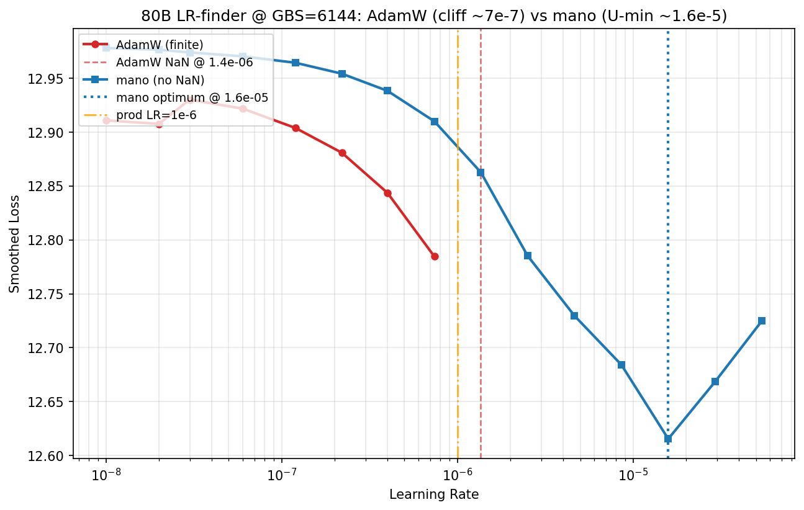

# 80B LR-finder at the production batch (GBS=6144) -- Sunspot, 2026-06-27

The earlier LR-finder ran at **GBS=192** (world_size x LBS / TP, no GAS)
-- ~32x below the ~6144 production target. Optimal LR is batch-size
dependent, so that sweep could not calibrate production. This run sweeps
LR **at the real production batch, GBS=6144**, per optimizer.

**Headline (two findings):**
1. **AdamW @ GBS=6144 has its usable LR ceiling at ~7e-7, and the
   production default LR=1e-6 sits right on the cliff edge** (last stable
   7.4e-7, first NaN 1.36e-6) -- explaining the nondeterministic NaNs at
   GBS~6000. If staying on AdamW, drop to ~5e-7.
2. **mano is dramatically better-behaved at GBS=6144**: no divergence
   cliff, a real loss minimum at lr=1.6e-5, ~20x more LR headroom, and
   lower loss (12.62 vs 12.78). It looks like the better production
   optimizer at this batch -- worth a head-to-head convergence run.

## Setup

- `submit_lr_finder.sh` -> `run_lr_finder.sh`, per-optimizer jobs, Sunspot
  `workq`, **64 nodes (dp_degree=192)**, TP=4 / LBS=1 / GAS=32 ->
  **GBS=6144**, compile=OFF, AC=full, bf16.
- Sweep lr = **1e-8 -> 1e-4** over 15 steps (log-spaced, mult=1.848).
- Shared warm index: adamw cold-builds the GBS=6144 blendcorpus index
  (race-free -- see "Race fix validated"); mano/muon/sophiag load it warm
  via job dependency.

## Result: AdamW (job 12469723, DONE)


(The finder's auto-generated `lr_vs_loss.png` is misleading here: it drops
the 7 NaN points entirely and its derivative-based annotations misfire on
the near-flat floor -- it labels the trivial step-2 loss bump as the
"blow-up" and "suggests" lr=1.17e-9. The plot above is rebuilt from the
CSV to show the actual NaN cliff and the real ceiling.)

Exact curve (`lr_finder_data.csv`):

```
lr=1.0e-08  loss=12.911
lr=1.8e-08  loss=12.908
lr=3.4e-08  loss=12.930
lr=6.3e-08  loss=12.922
lr=1.2e-07  loss=12.904
lr=2.2e-07  loss=12.881
lr=4.0e-07  loss=12.844
lr=7.4e-07  loss=12.785   <- last finite (min loss)
lr=1.4e-06  loss=NaN      <- diverged
lr=2.5e-06 ... 5.4e-05    loss=NaN (rest of sweep)
```

- **Loss decreases monotonically** from lr=1e-8 (12.91) to lr=7.4e-7
  (12.785), then **NaNs at lr=1.36e-6**. No U-turn -- the minimum is at
  the last finite point, i.e. the cliff is reached before the curve bottoms
  out. The usable LR is bounded by divergence, not by a loss minimum.
- **Usable LR ceiling ~= 7.4e-7.** First NaN at 1.36e-6.
- **Production LR=1e-6 lies between them** (7.4e-7 stable, 1.36e-6 NaN) --
  on the marginal edge. Combined with the XPU-execution-order
  nondeterminism documented for the 80B grad spike, this is why GBS~6000
  runs at LR=1e-6 sometimes survive and sometimes NaN (the GBS=5952
  reruns NaN'd at step 29 and step 4 -- different steps, same config).

## Batch dependence (why the small-batch finder misled)

The optimal/ceiling LR shifts strongly with batch size:

| Finder batch | AdamW usable-LR ceiling |
|---|---|
| GBS=192 (provisional, earlier) | ~1e-5 (mano/sophiag proxies; adamw curve was lost to the cold-cache race) |
| **GBS=6144 (this run)** | **~7e-7** |

That's a **~14x lower ceiling at the production batch.** Calibrating
production from the GBS=192 sweep would have suggested LR an order of
magnitude too high. This is the concrete payoff of sweeping at the target
batch.

## Optimizer comparison @ GBS=6144



| Optimizer | Job | behavior | usable LR | min loss | Status |
|---|---|---|---|---|---|
| adamw | 12469723 | **cliff** -- NaN @ 1.36e-6 | ~7.4e-7 (cliff-bounded) | 12.78 @ 7.4e-7 | DONE |
| mano | 12469724 | **clean U-curve** -- no NaN through 5.4e-5 | ~1.6e-5 (minimum-bounded) | **12.62 @ 1.6e-5** | DONE |
| muon | 12469725 | expected NaN early (bf16 overflow dim=9216) | TBD | TBD | queued |
| sophiag | 12469726 | expected NaN early (bf16 overflow dim=9216) | TBD | TBD | queued |

**mano is dramatically better-behaved than AdamW at the production batch:**

- **No divergence** -- mano stayed finite across the entire 1e-8 -> 5.4e-5
  sweep, where AdamW NaN'd at 1.36e-6.
- **A real optimum, not a cliff** -- mano's loss bottoms at lr=1.58e-5
  (12.615) then rises (12.62 -> 12.67 -> 12.72): a textbook LR-finder
  U-shape. AdamW has no minimum in-range; its "best" LR is just the last
  point before the NaN wall.
- **~20x higher usable LR** (1.6e-5 vs 7.4e-7) and **lower achievable
  loss** (12.62 vs 12.78).
- Rule-of-thumb production LR for mano (min/10 .. min/3): **~1.6e-6 ..
  5.3e-6**.

(SophiaG/Muon are documented-broken at 80B; their sweeps run for
confirmation, not as production candidates.)

This reframes the production question: it is not only "AdamW LR=1e-6 is
too hot" -- **mano looks like the materially better production optimizer
at GBS=6144** (no cliff, lower loss, an order of magnitude more LR
headroom). Worth a head-to-head convergence run (mano @ ~3e-6 vs AdamW @
~5e-7) before committing the production config.

## Production recommendation

- **If staying on AdamW: LR=1e-6 is too hot at GBS=6144** -- it sits in the
  NaN-marginal zone (between the 7.4e-7 stable point and the 1.36e-6 NaN).
  Recommend **LR ~= 5e-7**, or keep 1e-6 only with a longer warmup that
  holds effective LR below ~7e-7 well past the step-15-25 grad-spike window.
- **Strongly consider switching the production optimizer to mano.** At
  GBS=6144 it has no divergence cliff, a real loss minimum at lr=1.6e-5,
  ~20x more LR headroom, and lower loss (12.62 vs AdamW's 12.78) in the
  same 15-step sweep. Suggested mano production LR **~3e-6** (min/5).
- **Next step:** a head-to-head short convergence run -- mano @ ~3e-6 vs
  AdamW @ ~5e-7 at GBS=6144 -- to confirm the finder ranking holds over
  more steps before locking the production config. (The finder measures
  early-step stability/descent, not full convergence.)
- This finally gives a *measured* basis for the 80B production LR, vs the
  prior "1e-6 because 1.1e-5 NaN'd" heuristic (which bracketed the ceiling
  from above but never located it).

## Race fix validated (blendcorpus)

The GBS=6144 index **cold-built cleanly at 768 ranks** on the adamw run
("building on rank 0" -> "finished saving" with zero EOFError /
DistNetworkError / mmap-length errors), and mano loaded it warm in 0.03s.
This is the 80B-scale validation of the atomic-write + poll-for-complete
fix (blendcorpus `041d015`): the build-then-load race that crashed
adamw/muon in the GBS=192 finder no longer fires.

## Caveats / open

- mano/muon/sophiag ceilings pending (cluster-queued).
- The adamw curve has 8 finite points then NaN; the exact ceiling is
  between 7.4e-7 and 1.36e-6. A finer sweep in [5e-7, 1.5e-6] would
  localize it, but ~7e-7 is sufficient for the "drop to 5e-7" call.
- Sweep is at fixed warmup; the interaction of a low constant LR vs a
  warmup schedule that crosses 7e-7 later in training is not probed here.
