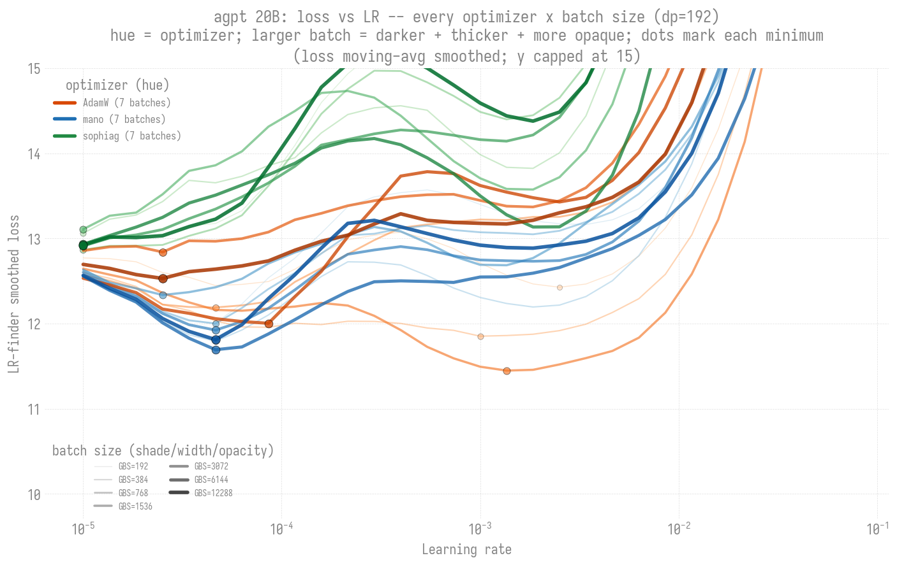
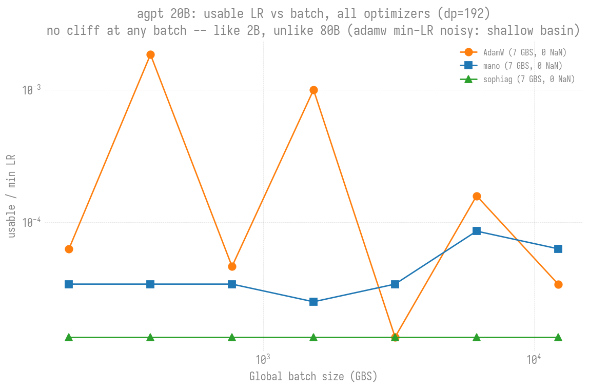
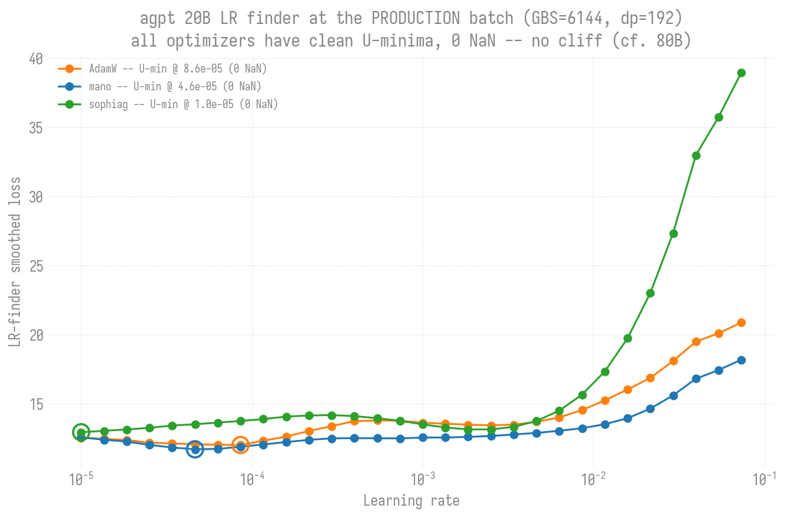
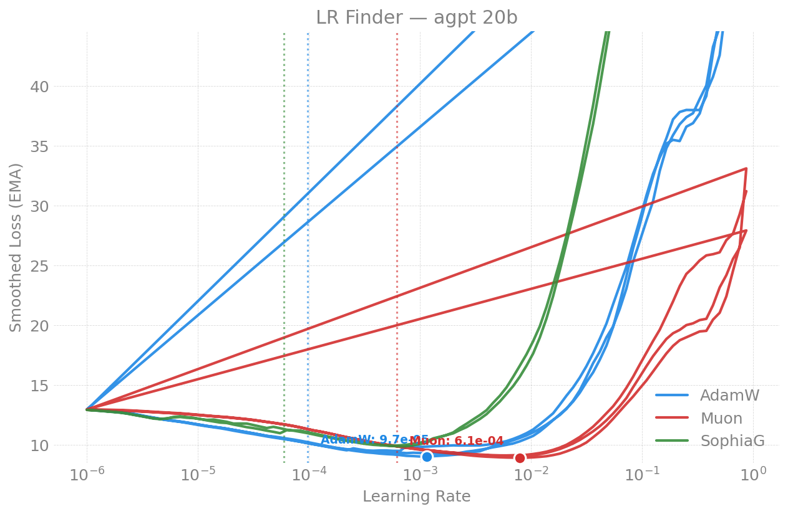
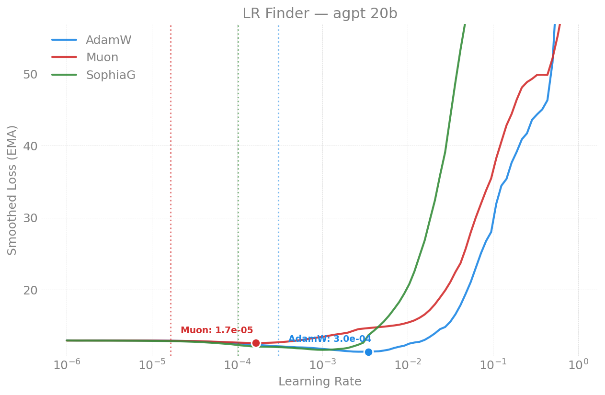
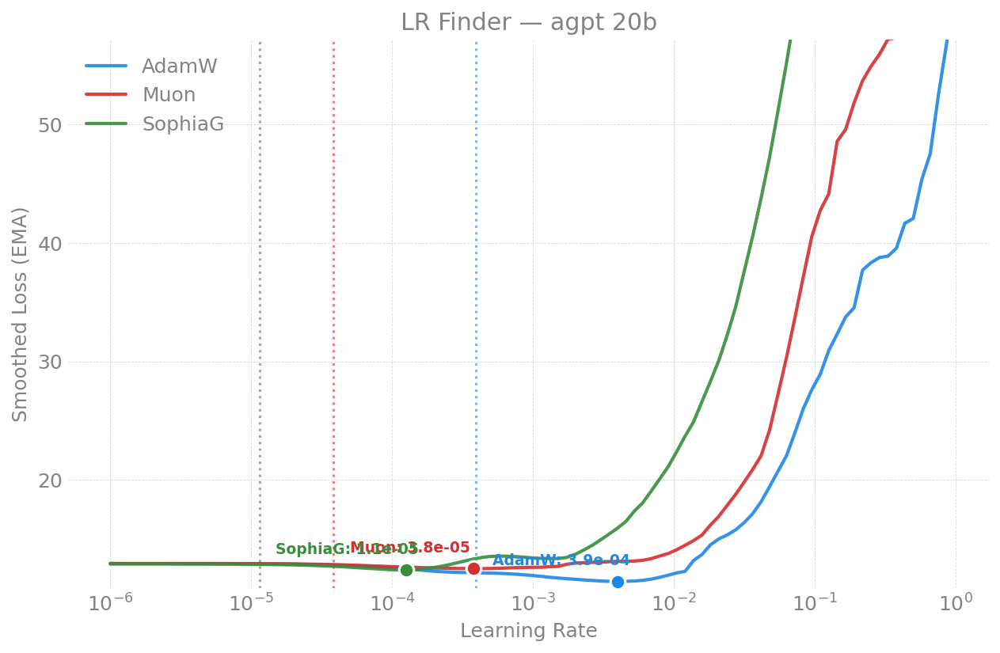

# LR Finder -- agpt 20B

Learning-rate-finder results for the dense **agpt 20B** model. For how the
finder works see the [methodology README](../../README.md); for the
cross-model recommendation table and findings see the
[agpt index](../README.md). Figures in [`figures/`](figures/).

**Recommended (small-batch, `sqrt(2/(5*d))` init):** AdamW **4.0e-4**, Muon
**1.7e-4**, SophiaG **1.8e-5** (Sunspot 2026-04-14).

**Key result (2026-06-29):** like 2B and unlike 80B, **20B never cliffs.**
Across GBS 192..12288 (production batch 6144 + 512N batch 12288), every
optimizer is a clean U-min with 0 NaN -- the AdamW NaN cliff is specific to
80B (dim=9216); 20B (dim=5120) stays on the clean side. See the trend section
below.

---

## 2026-06-29 -- LR-ceiling vs GBS trend (16N, TP=1, dp=192)

Reproducing the 80B
[LR-ceiling-vs-GBS trend](../80b/README.md#lr-ceiling-vs-gbs-trend-adamw) at
20B (dim=5120), the midpoint of the model-size axis. Run at 16N / TP=1 ->
dp_degree=192 (the same dp as the 2B and 80B production-batch sweeps, so all
three overlay on one x-axis). adamw + mano + sophiag at each GBS, LR
1e-5 -> 1e-1, 30 steps. Jobs 12469786-815.

### Result: 20B never cliffs (the cliff is 80B-only)

Every cell is a clean U-min with **0 NaN**, across the whole batch range
including both production batches (6144, 12288):

| GBS | AdamW | mano | sophiag |
|----:|-------|------|---------|
| 192   | 6.3e-5 / 12.1 | 3.4e-5 / 11.8 | 1.4e-5 / 12.4 |
| 384   | 1.8e-3 / 11.7 | 3.4e-5 / 11.7 | 1.4e-5 / 12.4 |
| 768   | 4.6e-5 / 12.0 | 3.4e-5 / 11.8 | 1.4e-5 / 12.4 |
| 1536  | 1.0e-3 / 11.3 | 2.5e-5 / 12.0 | 1.4e-5 / 12.4 |
| 3072  | 1.4e-5 / 12.4 | 3.4e-5 / 11.8 | 1.4e-5 / 12.4 |
| **6144** (prod) | 1.6e-4 / 11.9 | 8.6e-5 / 11.5 | 1.4e-5 / 12.4 |
| **12288** (512N) | 3.4e-5 / 12.3 | 6.3e-5 / 11.7 | 1.4e-5 / 12.4 |

(cells are min-LR / min-loss; **all 21 cells 0 NaN** -- 20B never cliffs.)

**AdamW's min-LR is noisy** -- it scatters 1.4e-5..1.8e-3 across batches
because the 20B AdamW basin is broad and shallow, so the derivative-based
min-detector latches onto different points. Do NOT read a trend into the
AdamW point estimates; the robust signal is that the curve is a clean U with
0 NaN at every batch. **mano and sophiag are far more stable** (mano ~3e-5,
sophiag dead-flat ~1.4e-5) -- a sharper, more consistent basin than AdamW at
20B.

Usable LR vs batch, all optimizers:

All three optimizers at the production batch (GBS=6144) -- clean U-minima:

### Contrast across model size (same dp=192)

| | 2B (dim=2048) | 20B (dim=5120) | 80B (dim=9216) |
|---|---|---|---|
| AdamW @ GBS=6144 | 8.6e-3, clean U | 1.6e-4, clean U | ~7.4e-7, **NaN cliff** |
| behavior across batch | flat, no cliff | declines, no cliff | falls ~20x then cliffs |
| 0 NaN everywhere? | yes | yes | no (cliff at >=6144) |

**Conclusion:** the batch-dependent NaN cliff is **not a smooth function of
model size that 20B sits midway on** -- 20B is firmly on the *clean* side of a
threshold that only 80B crosses. The optimal LR does scale down with size
(2B ~1e-2 -> 20B ~1e-4 -> 80B ~1e-6, the expected ~N^-x law), but the cliff
*failure mode* appears only at 80B (dim=9216), consistent with the bf16
fragility that also breaks muon/sophiag there. Cross-model overlay:
[2B-vs-20B-vs-80B](../2b/figures/lr_ceiling_vs_gbs_2b_vs_80b.png).

---

<b>Small-batch debug experiments (2026-04, 2-node finders)</b>

The original small-batch (GBS=48-384, 2-node) finders from April. Superseded
for production by the trend sweep above -- kept for the historical record and
the cross-hardware / dim-aware-init comparisons.

### 2026-04-14 -- 20B (Sunspot, dim-aware init)

2 nodes / 24 XPU tiles, 100 finder steps (5 warmup + 95 sweep), LR 1e-6 -> 1.0,
weight init `sqrt(2/(5*d))` (dim-aware), blendcorpus (books). (Same job also
swept 2B -- see [2B page](../2b/README.md).)

| Optimizer | Blow-up LR | Suggested LR |
|-----------|-----------|-------------|
| AdamW   | 3.95e-3 | **4.0e-4** |
| Muon    | 1.65e-3 | **1.7e-4** |
| SophiaG | 1.82e-4 | **1.8e-5** |

**Effect of dim-aware init** -- `sqrt(2/(5*d))` (vs fixed `std=0.02`) most
affects Muon: 20B Muon 1.7e-5 -> 1.7e-4 (10x higher). AdamW and SophiaG
relatively unaffected.

### 2026-04-21 -- 20B verification + GAS sweep (Sunspot)

Re-ran 20B on torch 2.13 (compile enabled) alongside the 80B finder.

| Optimizer | NaN | Suggested LR | Blow-up |
|-----------|-----|-------------|---------|
| AdamW | 0/100 | ~4.6e-5 | ~4.6e-4 |
| Muon | 0/100 | ~7.4e-4 | ~7.4e-3 |
| SophiaG | 7-9/100 | ~4.6e-7 | ~4.6e-6 |

20B GAS=4/8/16 (GBS 96/192/384) all completed with 0 NaN; suggested LRs not
captured in output (SSH pipe buffering). 20B (dim=5120) works fine for Muon
and SophiaG -- the bf16 overflow that breaks them is specific to 80B
(dim=9216).

### 2026-04-13 -- 20B (Polaris, NVIDIA A100)

2 nodes / 8 A100-40GB, 100 finder steps, LR 1e-6 -> 1.0, fixed `std=0.02` init,
blendcorpus (books), NCCL.

| Optimizer | Min Loss | LR @ Min | Blow-up LR | Suggested LR | Final Loss |
|-----------|----------|----------|-----------|-------------|-----------|
| AdamW   | 11.38 | 3.5e-3 | ~8e-3 | **4e-4** | 85.7 |
| Muon    | 12.59 | 1.7e-4 | ~3e-4 | **2e-5** | 66.0 |
| SophiaG | 11.64 | 1.0e-3 | ~2e-3 | **1e-4** | NaN  |

**Reproduces Aurora** closely: AdamW min loss 11.38 @ LR 3.5e-3 (Aurora:
11.43 @ 4.0e-3), blow-up ~8e-3 (Aurora ~5e-3). The 20B AdamW sweep ran on a
second allocation (4951s wall).

W&B: [AdamW](https://wandb.ai/aurora_gpt/torchtitan.ezpz.train/runs/9vx92cl7).

### 2026-04-12 -- 20B (Aurora, first run)

2 nodes / 24 XPU tiles, 100 finder steps, LR 1e-6 -> 1.0, fixed `std=0.02` init,
blendcorpus (books), xccl.

| Optimizer | Min Loss | LR @ Min | Blow-up LR | Suggested LR | Final Loss |
|-----------|----------|----------|-----------|-------------|-----------|
| AdamW   | 11.43 | 4.0e-3 | ~5e-3 | **4e-4** | 57.1   |
| Muon    | 12.51 | 3.8e-4 | ~5e-4 | **4e-5** | 67.9   |
| SophiaG | 12.40 | 1.3e-4 | ~2e-4 | **1e-5** | 7528.9 |

SophiaG shows catastrophic divergence (loss > 7500) vs AdamW/Muon (~60) --
the Hessian-based preconditioning produces violent blow-ups at high LR.

---

## Reports index

| Date | Machine | GBS | Optimizers | Nodes | Key Result |
|------|---------|-----|-----------|-------|------------|
| 2026-06-29 | Sunspot | 192..12288 | AdamW, mano, sophiag | 16 | LR-ceiling-vs-GBS trend: 20B never cliffs (0 NaN all batches; cliff is 80B-only) |
| 2026-04-21 | Sunspot | 96..384 | AdamW, Muon, SophiaG | 2 | torch-2.13 verify + GAS; Muon/SophiaG fine at dim=5120 |
| 2026-04-14 | Sunspot | 48 | AdamW, Muon, SophiaG | 2 | dim-aware init: AdamW 4.0e-4, Muon 1.7e-4 (10x higher) |
| 2026-04-13 | Polaris | 48 | AdamW, Muon, SophiaG | 2 | reproduces Aurora; cross-hardware consistency |
| 2026-04-12 | Aurora | 48 | AdamW, Muon, SophiaG | 2 | AdamW 4e-4; SophiaG catastrophic blow-up (7528) |
