# LR Finder -- agpt 2B

Learning-rate-finder results for the dense **agpt 2B** model. For how the
finder works see the [methodology README](../../README.md); for the
cross-model recommendation table and findings see the
[agpt index](../README.md). Figures in [`figures/`](figures/).

**Recommended (small-batch, `sqrt(2/(5*d))` init):** AdamW **1.3e-3**, Muon
**2.4e-3**, SophiaG **3.1e-4** (Sunspot 2026-04-14).

**Key result (2026-06-28):** unlike 80B, **2B never cliffs.** Its AdamW usable
LR is flat at ~1e-2 across the entire GBS 192..24576 range (128x batch, 0 NaN
anywhere) -- the usable-LR collapse + NaN cliff seen at 80B is a large-model
(dim=9216 bf16) phenomenon, not universal. See sections 1-2 below.

---

## 1. Production GBS ladder, 100 steps (best results)

The headline 2B finder: the full **production GBS ladder**
(1536 / 3072 / 6144 / 12288 / 24576) swept at **100 steps** (the classic finder
length -- smooth curves, deep minima) for all three optimizers. Same batch
sweep as the 15-step trend in section 2, re-run at the longer length. Run at
16N, TP=1 -> dp=192 (same dp as the 15-step trend, so the min-LR is directly
comparable). Jobs 12469854-868, isolated dumps
`outputs/lrfind-2b-100step-prod/gbs<N>/`.

**Complete (2026-06-29): all 15 jobs done, 0 NaN across the full ladder.**

Everything on one axis, hue = optimizer and batch size encoded three ways at
once (shade light->dark, width thin->thick, opacity faint->opaque, all
increasing with GBS):

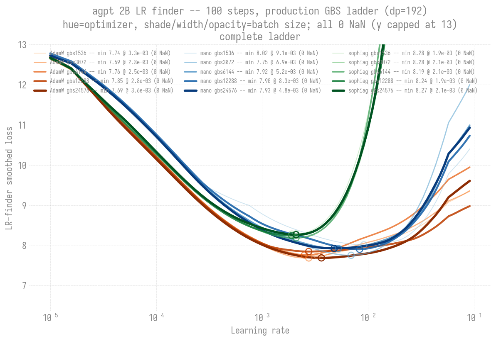

Optimal (min-loss) LR vs batch size, 100-step sweeps:

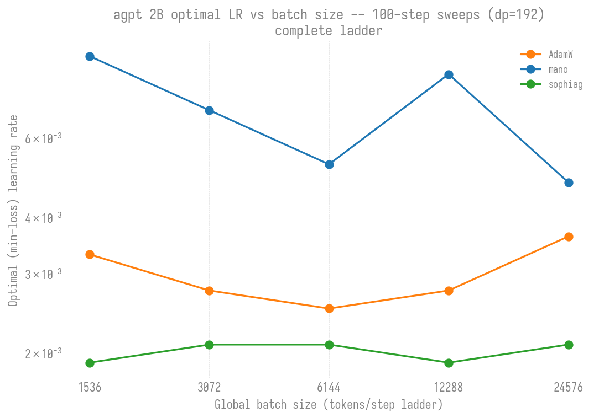

Smoothed-min LR / loss at every batch (all 0 NaN):

| GBS | AdamW | mano | sophiag |
|----:|-------|------|---------|
| 1536 | 3.3e-3 / 7.74 | 9.1e-3 / 8.02 | 1.9e-3 / 8.28 |
| 3072 | 2.8e-3 / 7.69 | 6.9e-3 / 7.75 | 2.1e-3 / 8.28 |
| **6144** (prod) | 2.5e-3 / 7.76 | 5.2e-3 / 7.92 | 2.1e-3 / 8.19 |
| 12288 | 2.8e-3 / 7.85 | 8.3e-3 / 7.90 | 1.9e-3 / 8.24 |
| 24576 | 3.6e-3 / 7.69 | 4.8e-3 / 7.93 | 2.1e-3 / 8.27 |

The 100-step ladder confirms the 15-step trend at the classic finder length:
**0 NaN at every batch across the full 16x range** (2B never cliffs, even at
100 steps + 4x the production batch), and **no batch-scaling trend** -- each
optimizer's optimal LR is flat-to-shallow-U across the ladder (AdamW
~2.5-3.6e-3, mano ~5-9e-3, sophiag dead flat ~2e-3), 3-4 orders of magnitude
above the 80B cliff at ~7e-7. Optimizer ordering is stable (sophiag lowest,
AdamW in the middle, mano highest) and the basin shape is consistent (AdamW
widest, sophiag sharpest blow-up). The deep minima (~7.7..8.3 vs ~11.5 at 15
steps) are the cumulative-training sweep-length effect, not a better LR --
compare by min-LR, not loss value.

---

## 2. Production GBS ladder, 15 steps (LR-ceiling vs GBS trend)

Reproducing the 80B
[LR-ceiling-vs-GBS trend](../80b/README.md#lr-ceiling-vs-gbs-trend-adamw) at
2B: does the usable-LR collapse + U-min -> cliff transition also appear at 2B,
or does the smaller model (dim=2048) stay clean across the whole batch range?
Run at **16N, TP=1 -> dp_degree=192** (the *same* dp as the 80B GBS=6144
headline run, so the two curves overlay on one x-axis with only model size
differing). Each GBS swept adamw + mano + sophiag (muon dropped -- it crashes
every job via a oneCCL collective abort; use `torchmuon` if needed).

- LR range 1e-5 -> 1e-1 (2B optimal ~1e-2, ~100x higher than 80B).
- GBS ladder 192 .. 24576 (6144 = common production batch / 2B 256N + all
  80B; 12288 = 2B 512N, 24576 = 2B 1024N).
- Jobs 12469769-776, isolated dumps `outputs/lrtrend-2b/gbs<N>/`.

### Result: 2B never cliffs

> **Loss-depth note:** this trend swept **15 steps** per GBS, so its minima
> bottom out near loss ~11.3. The 100-step ladder (section 1) and the
> 2026-04 debug runs (collapsed below) reach loss ~7-10. That is a
> sweep-length artifact -- the finder trains cumulatively, so more steps =
> lower loss at the same LR -- **not** a difference in the optimal LR (both
> agree at ~8.6e-3). See [the methodology note](../../README.md#important-notes).
> Compare these figures by the LR-of-minimum, not the loss value.

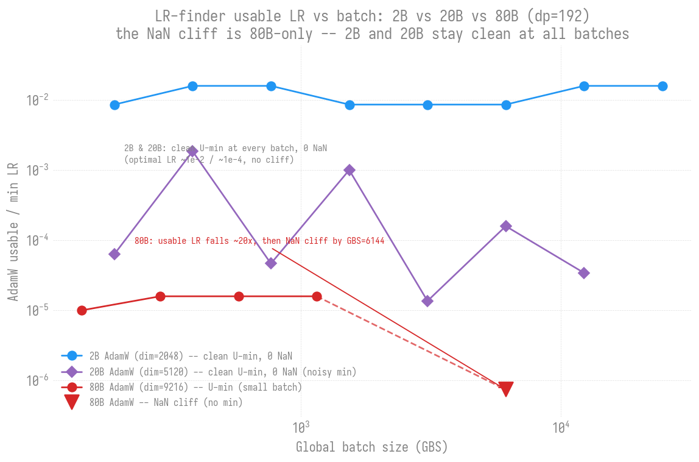

Every point is a clean U-min with **0 NaN** -- across a **128x** batch range.
The AdamW usable LR sits flat at ~1e-2 the whole way; there is no collapse and
no divergence cliff, all the way out to GBS=24576 (4x the GBS=6144 production
batch).

All three optimizers ran to completion (15/15, 0 NaN) at all 8 batch sizes.

| GBS | AdamW min-LR | AdamW min-loss | mano min-LR | sophiag min-LR [1] |
|----:|--------------|---------------:|-------------|--------------------|
| 192   | 8.6e-3 | 11.25 | 8.6e-3 | 1.2e-4 |
| 384   | 1.6e-2 | 11.51 | 8.6e-3 | 1.4e-3 |
| 768   | 1.6e-2 | 11.68 | 8.6e-3 | 7.4e-4 |
| 1536  | 8.6e-3 | 11.53 | 8.6e-3 | 8.6e-3 |
| 3072  | 8.6e-3 | 11.53 | 8.6e-3 | 8.6e-3 |
| **6144** (prod / 256N) | 8.6e-3 | 11.57 | 1.6e-2 | 1.4e-3 |
| 12288 (512N chain) | 1.6e-2 | 11.56 | 1.6e-2 | 8.6e-3 |
| 24576 (1024N chain) | 1.6e-2 | 11.63 | 8.6e-3 | 8.6e-3 |

[1] sophiag's auto-detected min-LR is noisy at small batch (the
derivative-based detector latches onto early-curve noise, the same artifact
seen in the MoE finder) -- it reads 1e-4..1e-3 at GBS<=768 but the curves
show the real basin is ~1e-2 once the batch is large enough to sharpen the U
(GBS>=1536). See the per-optimizer figures below.

All three optimizers at the production batch (GBS=6144, the common 2B 256N +
80B batch) -- every curve is a clean U-min that turns back up, 0 NaN (contrast
the [80B production-batch figure](../80b/README.md#headline-result-all-four-optimizers-at-the-production-batch),
where AdamW cliffs to NaN):

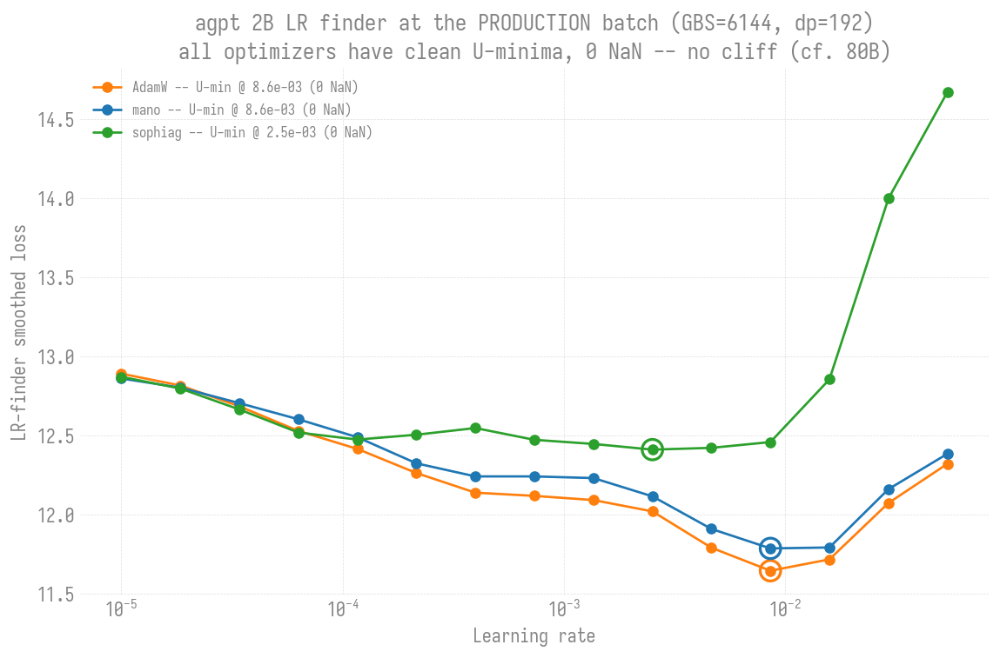

The same holds at the larger 2B 512N batch (GBS=12288) -- still a clean U-min
for all three, confirming the batch-independence past the common batch:

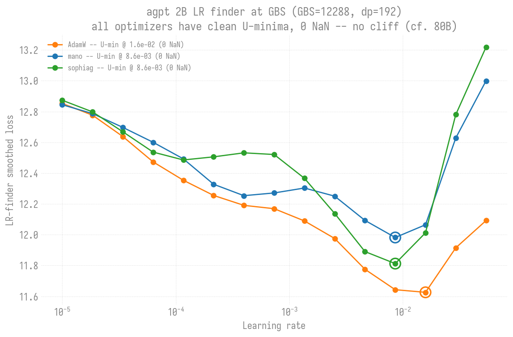

The full AdamW loss-vs-LR curve at every batch size (one line per GBS) makes
the batch-independence visual -- all 8 curves share the same ~1e-2 minimum,
no drift, no NaN:

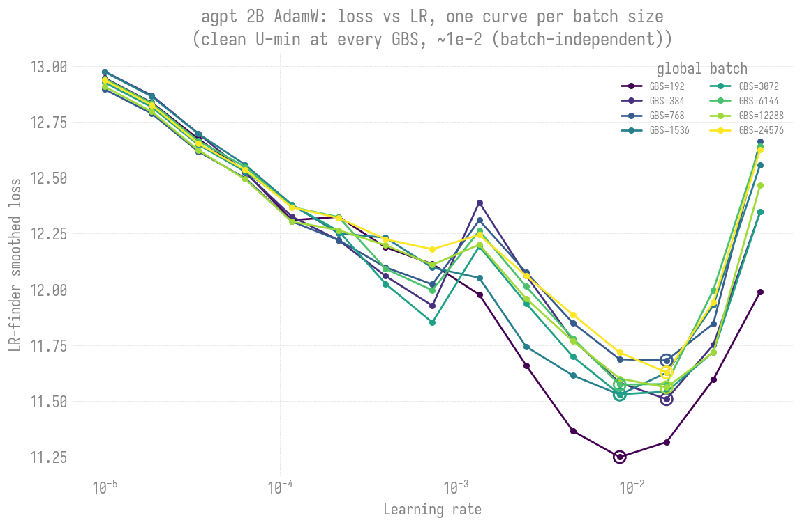

The same per-GBS view for mano and sophiag (all 8 batches, 0 NaN). mano is
batch-independent like AdamW; sophiag's U sharpens and deepens as the batch
grows -- small batches are shallow/noisy, but by GBS>=1536 it settles into a
clean ~1e-2 minimum:

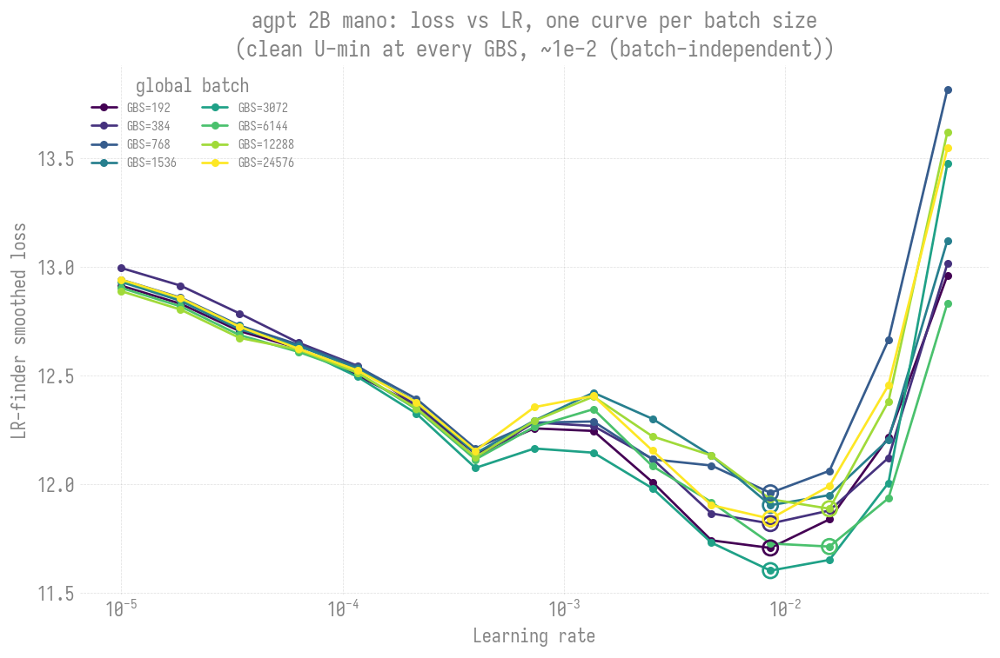

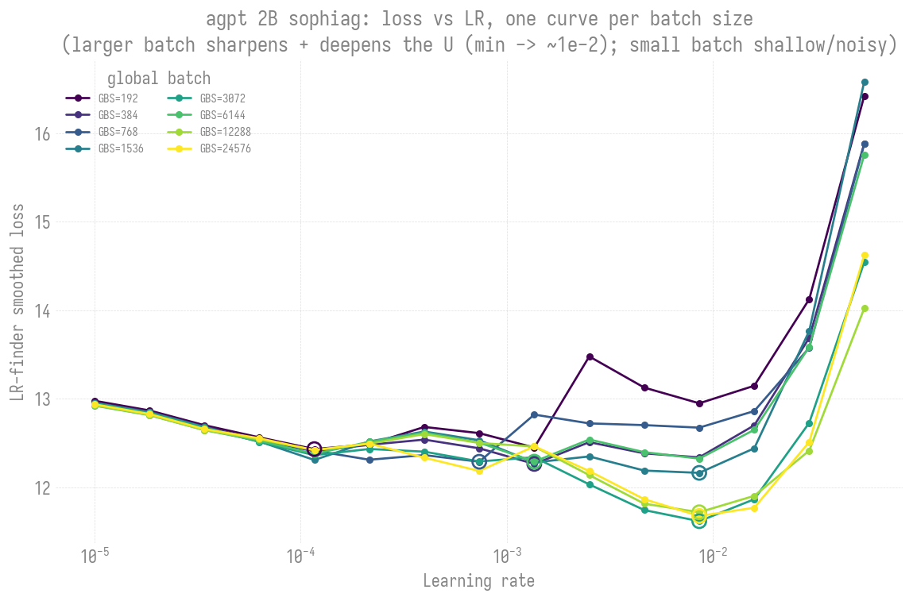

Usable LR vs batch for all three optimizers on one axis -- none collapses,
none cliffs (the direct 2B counterpart to the 80B trend, where AdamW falls
~20x and NaNs):

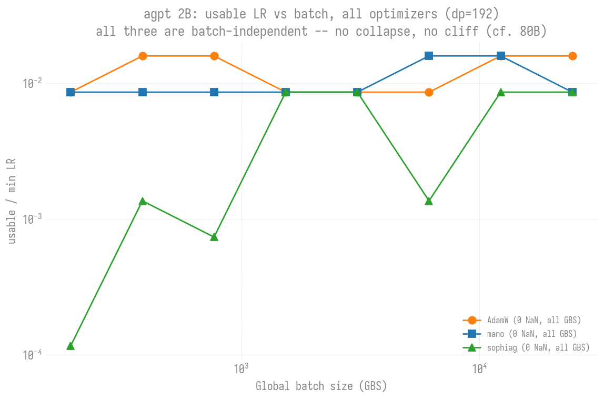

Everything on one axis -- all 24 curves (3 optimizers x 8 batch sizes). Hue
is the optimizer (orange AdamW / blue mano / green sophiag), shade is the
batch size (light = small GBS, dark = large). The optimizer families separate
cleanly (AdamW reaches the deepest loss, sophiag the shallowest), and within
each family the U-minima all stack around ~1e-2 regardless of batch -- the
batch-independence, shown directly. The light (small-batch) curves are the
ones that blow up highest at the right, as expected:

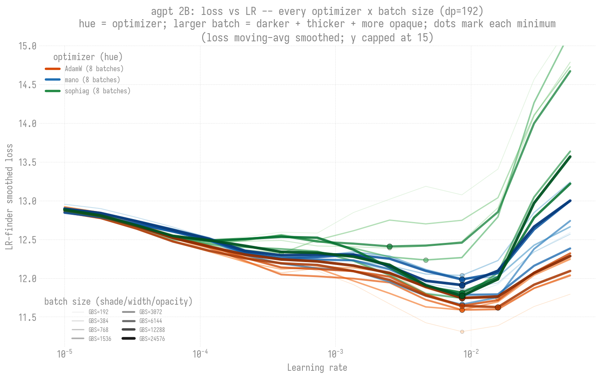

---

## 3. Additional findings

Supplementary 2B results that support the two production sweeps above: the
first 100-step run (a single small batch, which motivated the ladder), and the
head-to-head contrast with 80B that frames the whole "2B never cliffs" story.

### 100 steps, single small batch (precursor to the ladder)

This was the first 100-step 2B sweep (job 12469840) -- a single small batch,
all three optimizers -- that motivated the full production ladder in section 1.
The 15-step trend sweeps (section 2) use 15 steps each because the high-GBS/80B
sweeps are expensive; at 2B the steps are cheap (~1-2 s each), so 100 steps is
affordable -- the classic finder length, matching the 2026-04 debug runs below.

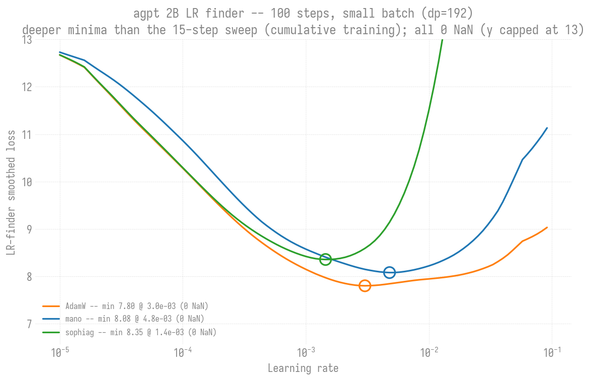

Two things the longer sweep buys: (1) **much smoother curves** -- 100 steps +
moving-average smoothing gives clean textbook U's with none of the 15-step
jaggedness; (2) **far deeper minima** -- AdamW 7.80, mano 8.08, sophiag 8.35
(vs ~11.3-12.4 at 15 steps). **The depth is a sweep-length effect, not a
better LR**: the finder trains cumulatively, so 100 steps drives the loss
much lower than 15 by the time it reaches the optimal-LR region. The
*min-LR* (AdamW ~3e-3, mano ~4.8e-3, sophiag ~1.4e-3) is the quantity that's
comparable across sweep lengths; the loss *value* is not. Optimizer ordering
is consistent with the trend (AdamW deepest + widest basin, sophiag
shallowest + sharpest blow-up). All three 0 NaN.

### Contrast with 80B (same dp=192)

| | 2B (dim=2048) | 80B (dim=9216) |
|---|---|---|
| usable LR @ GBS=6144 | **8.6e-3** (clean U-min, 0 NaN) | ~7.4e-7 (NaN cliff, 7/15 NaN) |
| trend across batch | **flat ~1e-2, 192 -> 24576** | falls ~20x, 1.6e-5 -> 7e-7, then cliffs |
| failure mode at high batch | none | clean U -> noisy basin -> hard NaN cliff |

**Conclusion:** the batch-dependent usable-LR collapse documented for 80B is
**not a universal scaling law** -- it is specific to the large model. The most
likely mechanism is the same dim=9216 bf16 fragility that breaks muon/sophiag
at 80B: at large model width the AdamW update at high effective batch enters a
numerically unstable regime that 2B (dim=2048) never reaches. Practically: a
small-model finder is a poor proxy for large-model production LR (the 80B
lesson), but small models themselves are forgiving of large batches.

---

<b>4. Small-batch debug experiments (2026-04, 2-node finders)</b>

### 2026-04-14 -- 2B (Sunspot, dim-aware init)

2 nodes / 24 XPU tiles, 100 finder steps (5 warmup + 95 sweep), LR 1e-6 -> 1.0,
weight init `sqrt(2/(5*d))` (dim-aware), blendcorpus (books). (Same job also
swept 20B -- see [20B page](../20b/README.md).)

| Optimizer | Blow-up LR | Suggested LR |
|-----------|-----------|-------------|
| AdamW   | 1.30e-2 | **1.3e-3** |
| Muon    | 2.36e-2 | **2.4e-3** |
| SophiaG | 3.08e-3 | **3.1e-4** |

**Effect of dim-aware init** -- `sqrt(2/(5*d))` (vs fixed `std=0.02`) most
affects Muon: 2B Muon 7.5e-4 -> 2.4e-3 (3x). AdamW and SophiaG relatively
unaffected. Smaller init weights mean smaller gradients, so Muon can tolerate
higher LRs.

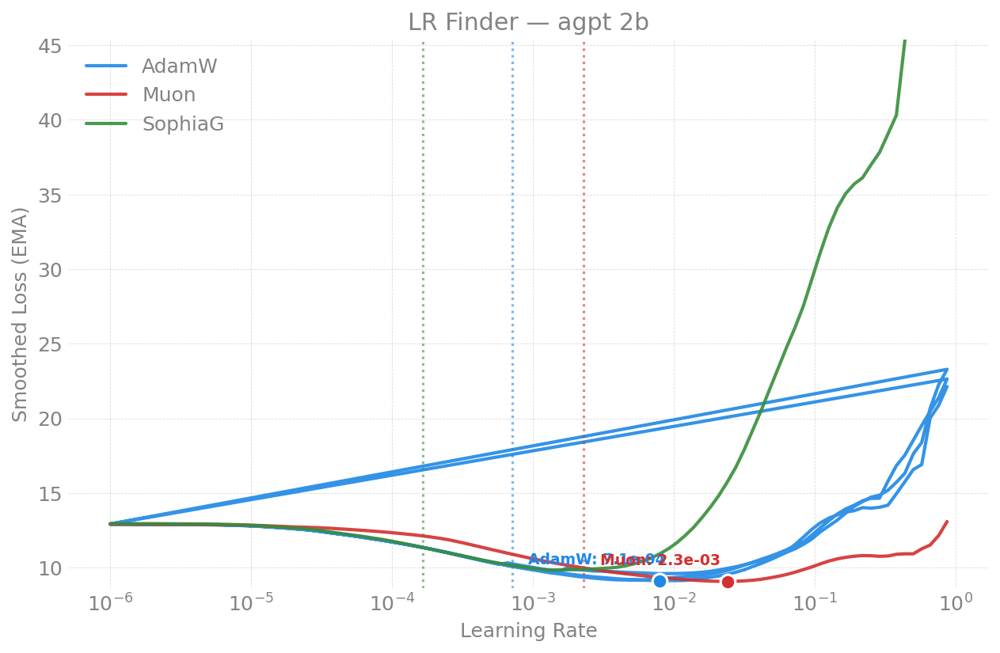

### 2026-04-21 -- 2B verification + GAS sweep (Sunspot)

Re-ran 2B on torch 2.13 (compile enabled) alongside the 80B finder to verify
no regression, plus a gradient-accumulation sweep.

| Optimizer | NaN | Suggested LR | Blow-up |
|-----------|-----|-------------|---------|
| AdamW | 0/100 | ~8e-4 | ~8e-3 |
| Muon | 0/100 | ~7e-4 | ~7e-3 |
| SophiaG | 2/100 | ~5e-7 | ~5e-6 |

#### GAS (gradient accumulation) sweep -- 2B AdamW

| GAS | GBS | NaN | Suggested LR | Blow-up |
|-----|-----|-----|-------------|---------|
| 1 (baseline) | 24 | 0 | ~8e-4 | ~8e-3 |
| 4 | 96 | 0 | 8.58e-4 | 8.58e-3 |
| 8 | 192 | 0 | 9.03e-4 | 9.03e-3 |
| 16 | 384 | 0 | 4.90e-4 | 4.90e-3 |

Optimal LR is relatively stable across GBS for 2B AdamW (4.9e-4 .. 9.0e-4
across 16x GBS) at this *small* scale -- the production sweeps (sections 1-2)
extend this to the full production-batch range and confirm it stays true.

### 2026-04-13 -- 2B (Polaris, NVIDIA A100)

2 nodes / 8 A100-40GB, 100 finder steps, LR 1e-6 -> 1.0, fixed `std=0.02` init,
blendcorpus (books), NCCL.

| Optimizer | Min Loss | LR @ Min | Blow-up LR | Suggested LR | Final Loss |
|-----------|----------|----------|-----------|-------------|-----------|
| AdamW   | 9.80  | 1.8e-2 | ~3e-2   | **2e-3** | 30.8 |
| Muon    | 11.01 | 1.0e-2 | ~1.5e-2 | **1e-3** | 28.8 |
| SophiaG | 10.73 | 3.0e-3 | ~4e-3   | **3e-4** | NaN  |

**Cross-hardware consistency:** these match Aurora within ~1.5x -- optimal LR
is a property of the model+optimizer, not the hardware.

W&B: [AdamW](https://wandb.ai/aurora_gpt/torchtitan.ezpz.train/runs/2tz2slwx),
[Muon](https://wandb.ai/aurora_gpt/torchtitan.ezpz.train/runs/qng9p17h),
[SophiaG](https://wandb.ai/aurora_gpt/torchtitan.ezpz.train/runs/lj866hrb).

### 2026-04-12 -- 2B (Aurora, first run)

2 nodes / 24 XPU tiles, 100 finder steps, LR 1e-6 -> 1.0, fixed `std=0.02` init,
blendcorpus (books), xccl.

| Optimizer | Min Loss | LR @ Min | Blow-up LR | Suggested LR | Final Loss |
|-----------|----------|----------|-----------|-------------|-----------|
| AdamW   | 9.76  | 2.1e-2 | ~3e-2 | **2e-3** | 26.8   |
| Muon    | 11.29 | 7.9e-3 | ~1e-2 | **8e-4** | 26.2   |
| SophiaG | 10.29 | 2.6e-3 | ~4e-3 | **3e-4** | 294.6  |

---

## 5. Reports index

| Date | Machine | GBS | Optimizers | Nodes | Key Result |
|------|---------|-----|-----------|-------|------------|
| 2026-06-29 | Sunspot | 1536..24576 | AdamW, mano, sophiag | 16 | 100-step production ladder (15/15): 0 NaN full range, no batch-scaling, min-LR ~2-9e-3 |
| 2026-06-28 | Sunspot | 192..24576 | AdamW, mano, sophiag | 16 | LR-ceiling-vs-GBS trend: 2B never cliffs (flat ~1e-2, 0 NaN, 128x batch) |
| 2026-04-21 | Sunspot | 24..384 | AdamW, Muon, SophiaG | 2 | torch-2.13 verify + GAS sweep; LR stable 4.9-9.0e-4 |
| 2026-04-14 | Sunspot | 48 | AdamW, Muon, SophiaG | 2 | dim-aware init: AdamW 1.3e-3, Muon 2.4e-3 (3x higher) |
| 2026-04-13 | Polaris | 48 | AdamW, Muon, SophiaG | 2 | reproduces Aurora; cross-hardware consistency |
| 2026-04-12 | Aurora | 48 | AdamW, Muon, SophiaG | 2 | AdamW 2e-3; first run |
