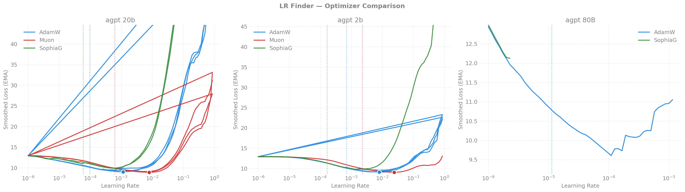
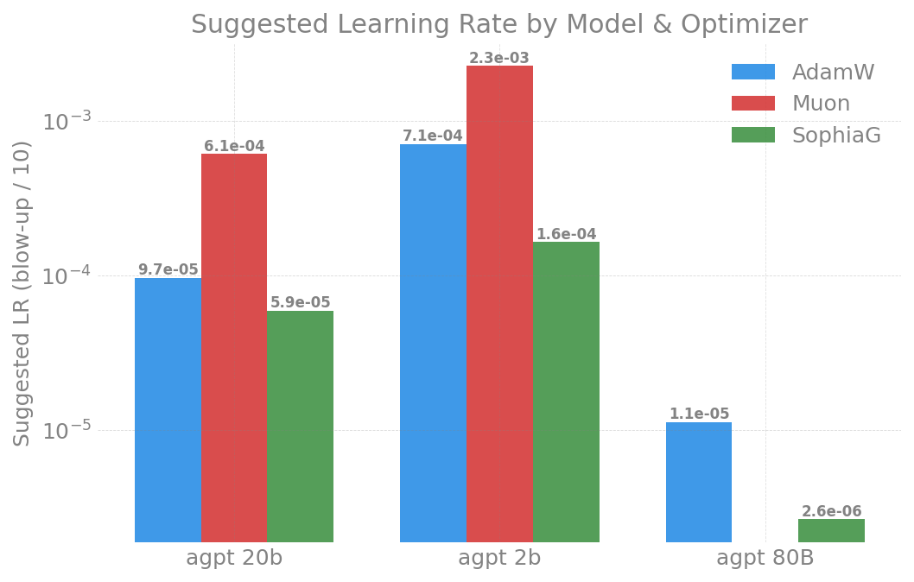
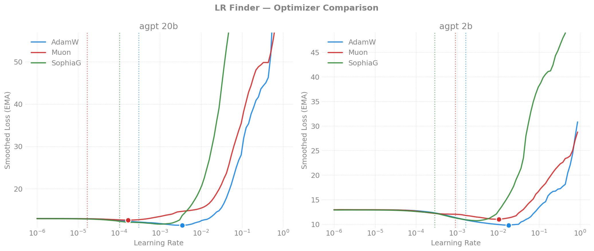
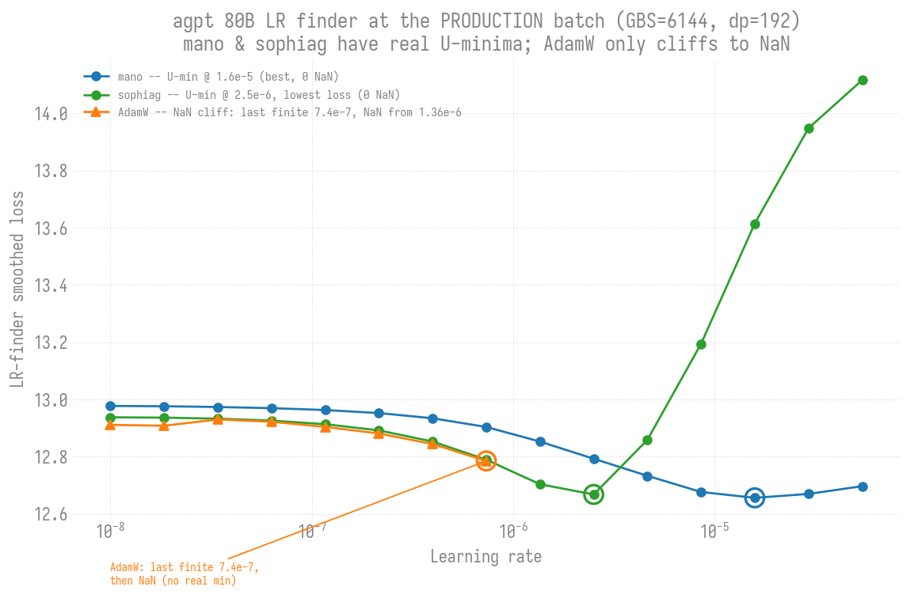

# LR Finder -- agpt (Dense) -- index

Learning-rate-finder results for the dense **agpt** (AuroraGPT) models. This
page is the cross-model index (master recommended-LR table + findings that
span model sizes / machines). Per-model detail lives in its own page:

- **[agpt 2B](2b/README.md)** -- small-batch finders + production-batch trend (never cliffs)
- **[agpt 20B](20b/README.md)** -- small-batch finders (no trend yet)
- **[agpt 80B](80b/README.md)** -- GBS=192 finder, GBS=6144 production batch, LR-ceiling-vs-GBS trend

For how the finder works, its knobs, and usage, see the
[methodology README](../README.md). Index-level cross-model figures
(`*_comparison`, `*_optimal_lr`) are in [`figures/`](figures/); single-model
figures live under each model page's `figures/`.

## Recommended Learning Rates

**Calibrate at your production batch size, not a small one.** The optimal LR
is batch-dependent, and for large models the small-batch number is actively
misleading -- the 80B small-batch finder said "AdamW 1.1e-5" but at the real
production batch (GBS=6144) AdamW's usable LR collapses to ~7e-7 and 1e-6
sits on a NaN cliff. Prefer the production-batch results below; treat the
small-batch table as a rough starting point for *small* runs only.

### 80B at the production batch (GBS=6144) -- the validated guidance

| Optimizer @ GBS=6144 | usable LR | min loss | behavior |
|---|---|---|---|
| **mano** | **~1.6e-5 (use ~3e-6)** | 12.62 | **clean broad U-min, 0 NaN** |
| **sophiag** | ~2.5e-6 (use ~1e-6) | **12.60** | real U-min, 0 NaN, narrower band |
| AdamW | ~7e-7 (use ~5e-7) | 12.78 | NaN cliff at 1.36e-6 |
| muon | -- | -- | broken (NaN from step 7) |

**Recommendation: do not run AdamW @ 1e-6 at GBS=6144; mano is the safest 80B
production optimizer, sophiag a viable second.** Full detail + the
LR-ceiling-vs-GBS trend: [agpt 80B](80b/README.md).

### 2B at the production batch (GBS=6144) -- the validated guidance

GBS=6144 is the common production batch (the 2B 256N chain and all 80B runs).
The 2B chains also run larger: GBS=12288 (512N) and 24576 (1024N) -- 2B is
batch-independent across the whole 192..24576 range (clean U-min, 0 NaN
everywhere; no cliff -- the collapse is large-model-specific). At GBS=6144:

| Optimizer @ GBS=6144 | min LR | min loss | suggested (min/10) |
|---|---|---|---|
| AdamW | 8.6e-3 | 11.57 | ~8.6e-4 |
| mano | 1.6e-2 | 11.71 | ~1.6e-3 |
| sophiag | 1.4e-3 | 12.29 | ~1.4e-4 |

Note: 2B production currently runs sophiag at **LR=2.28e-5**, which is ~60x
below the finder's suggested ~1.4e-3 -- i.e. there is substantial LR headroom
at this batch (consistent with small models being forgiving). Worth a
convergence A/B before changing a live run, but the finder says a higher 2B
LR is safe. Full per-GBS detail: [agpt 2B](2b/README.md).

### Small-batch finder (reference only -- does NOT transfer to large-model production)

`sqrt(2/(5*d))` weight init, 5% warmup, Sunspot 2026-04-14, GBS at the 2-node
default. Useful as a rough starting LR for small / small-batch runs; for 20B+
at production batch, re-run the finder at that batch.

| Model | AdamW   | Muon    | SophiaG |
|-------|---------|---------|---------|
| 2B    | 1.3e-3 | 2.4e-3 | 3.1e-4 |
| 20B   | 4.0e-4 | 1.7e-4 | 1.8e-5 |
| 80B (GBS=192) | 1.1e-5 [1] | N/A[2] | N/A[2] |

[1] Superseded for production -- see the GBS=6144 table above (real ceiling
~7e-7).
[2] At GBS=192, Muon/SophiaG NaN'd: bf16 overflow in Newton-Schulz (Muon) and
Hessian estimate (SophiaG) on 9216-dim matrices. **At GBS=6144 SophiaG is NOT
broken** (real U-min at lr~2.5e-6); only Muon stays broken. See
[agpt 80B](80b/README.md).

## Key Findings (cross-model / cross-machine)

1. **Optimizer sensitivity:** `AdamW (most tolerant) > Muon > SophiaG (most sensitive)`
2. **Model scaling:** Larger models need lower LRs. Muon/SophiaG scale more
   aggressively (~N^-0.5) than AdamW (~N^-0.25).
3. **Blow-up severity:** SophiaG diverges catastrophically (loss 7,000+) vs
   gradual blow-up for AdamW (loss ~60). SophiaG requires tighter LR scheduling.
4. **Cross-hardware consistency:** Suggested LRs match within 2x across Intel
   XPU (Aurora, Sunspot) and NVIDIA A100 (Polaris).
5. **Batch dependence is large-model-specific.** At 80B the usable/ceiling LR
   collapses ~20x with batch and turns into a NaN cliff
   ([trend](80b/README.md#lr-ceiling-vs-gbs-trend-adamw)). At
   [2B](2b/README.md#2-production-gbs-ladder-15-steps-lr-ceiling-vs-gbs-trend)
   the usable LR is flat at ~1e-2 across a 128x batch range (0 NaN) --
   **no collapse, no cliff.**
   So a small-batch sweep cannot calibrate a *large*-model production LR, but
   small models are themselves forgiving of large batches (likely the same
   dim=9216 bf16 fragility that breaks 80B).

### Cross-Machine Comparison -- agpt 2B

| Optimizer | Aurora (std=0.02) | Sunspot (sqrt(2/5d)) | Polaris (std=0.02) |
|-----------|--------|---------|---------|
| **AdamW** suggested LR | 2e-3 | 1.3e-3 | 2e-3 |
| **Muon** suggested LR | 8e-4 | **2.4e-3** | 1e-3 |
| **SophiaG** suggested LR | 3e-4 | 3.1e-4 | 3e-4 |

### Cross-Machine Comparison -- agpt 20B

| Optimizer | Aurora (std=0.02) | Sunspot (sqrt(2/5d)) | Polaris (std=0.02) |
|-----------|--------|---------|---------|
| **AdamW** suggested LR | 4e-4 | 4.0e-4 | 4e-4 |
| **Muon** suggested LR | 4e-5 | **1.7e-4** | -- |
| **SophiaG** suggested LR | 1e-5 | 1.8e-5 | -- |

**Takeaway:** AdamW and SophiaG are robust to weight init changes. Muon is
sensitive -- `sqrt(2/(5*d))` init allows 3-10x higher LRs vs fixed `std=0.02`.
This is because Muon's orthogonal momentum amplifies gradient scale differences.

### Cross-machine finder curves (2B + 20B side by side)

| Machine | Comparison | Optimal LR |
|---|---|---|
| Aurora |  |  |
| Sunspot |  |  |
| Polaris |  |  |

### Cross-model finder curves at the PRODUCTION batch (GBS=6144)

All optimizers, one curve per optimizer, at the common production batch
(GBS=6144, dp=192) -- the apples-to-apples comparison across model size. This
is where the large-model fragility shows: 2B descends to clean U-minima for
every optimizer; 80B's AdamW has no minimum (it cliffs to NaN) while mano and
sophiag still find real minima.

| Model | all-optimizer finder curves @ GBS=6144 |
|---|---|
| 2B (dim=2048) |  |
| 20B (dim=5120) |  |
| 80B (dim=9216) |  |

Min-LR / min-loss at GBS=6144 (0 NaN unless noted):

| Optimizer | 2B (dim=2048) | 20B (dim=5120) | 80B (dim=9216) |
|---|---|---|---|
| **AdamW** | 8.6e-3 / 11.57 (U-min) | 1.6e-4 / 11.90 (U-min) [1] | **~7.4e-7 / 12.78 (NaN cliff, no min)** |
| **mano** | 1.6e-2 / 11.71 (U-min) | 8.6e-5 / 11.51 (U-min) | 1.6e-5 / 12.62 (U-min) |
| **sophiag** | 1.4e-3 / 12.29 (U-min) | 1.4e-3 / 12.30 (U-min) | 2.5e-6 / 12.60 (U-min) |
| **muon** | _(not swept)_ | _(not swept)_ | broken -- NaN from step 7 (bf16 dim=9216) |

[1] 20B AdamW min-LR is noisy across batches (shallow basin); 1.6e-4 is the
GBS=6144 point estimate. All 20B cells are 0 NaN -- it never cliffs (cf. the
[20B trend](20b/README.md#2026-06-29----lr-ceiling-vs-gbs-trend-16n-tp1-dp192)).

Reading across a row shows the model-size dependence of the optimal LR at
fixed batch: AdamW falls ~4 orders of magnitude (8.6e-3 -> 1.6e-4 -> ~7e-7)
across 2B/20B/80B, but only **80B changes character** (U-min -> NaN cliff) --
2B and 20B both keep clean minima with 0 NaN. So the cliff is not a smooth
midpoint 20B sits on; 20B (dim=5120) is on the clean side of a threshold only
80B (dim=9216) crosses. mano/sophiag fall similarly and keep real minima at
all three sizes.

## Reports

Per-model pages (each holds all dates / machines / batch sizes for that model):

| Model | Page | Experiments |
|-------|------|-------------|
| 2B  | [2b/README.md](2b/README.md)   | Aurora/Sunspot/Polaris small-batch (Apr 12-21) + production-batch trend (Jun 28: never cliffs) |
| 20B | [20b/README.md](20b/README.md) | Aurora/Sunspot/Polaris small-batch (Apr 12-21) |
| 80B | [80b/README.md](80b/README.md) | GBS=192 finder (Apr 21), GBS=6144 production (Jun 27), LR-ceiling-vs-GBS trend |
