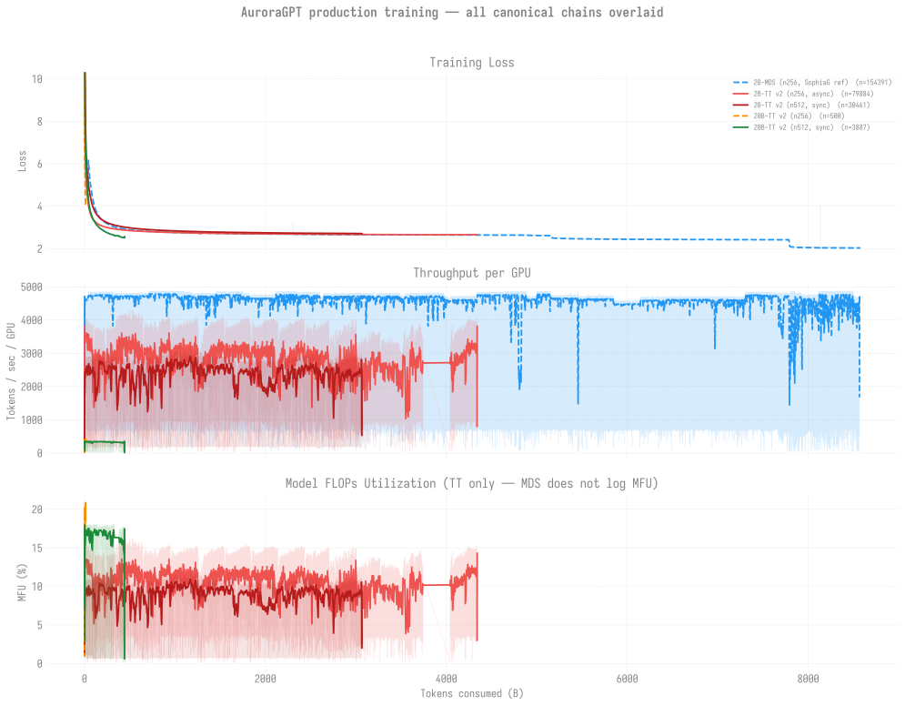

# Production Training Runs — Aurora

> **Living document** — updated as jobs complete and new runs are submitted.
> Run `scripts/refresh_all.sh` to regenerate the tables/charts below from
> disk + W&B.
>
> Last updated: 2026-07-01

**Jump to:** [Status at a glance](#status-at-a-glance) ·
[Canonical chains](#canonical-chains-one-per-model) ·
[256N trajectories](#active-256n-trajectories) ·
[Other jobs](#other-jobs) · [Known issues](#known-issues) ·
[Overview](#overview)

## Status at a glance

One row per live trajectory; `% target` is against the 4.67T olmo-mix
budget. Detail + per-dispatch history in the linked pages.

| Trajectory | State | Persisted step | Loss | % target | Trend |
|------------|-------|---------------:|-----:|---------:|-------|
| [**2B 256N**](agpt/2b/n256/README.md) async | **COMPLETE** ✅ | **92,859** | 2.652 | **100.0%** | 🏁 target reached (4.674T) |
| [**80B** 512/1024N](agpt/80b/README.md) | 512N+1024N Q; **2048N crashed** | — | — | — | 🟡 2048N SIGSEGV'd in set_determinism (24,864 ranks); 512N+1024N live |
| [20B 256N](agpt/20b/n256/README.md) | running→PM | **2,100** | 2.85 | 2.3% | 🟢 advancing (resumes post-PM) |
| [2B 512N](agpt/2b/n512/README.md) sync | stalled (Q ~25d) | 30,400 | 2.71 | 65.5% | 🟡 queue-starved |
| [20B 512N](agpt/20b/n512/README.md) sync | stalled (Q ~25d) | 4,400 | 2.51 | 9.5% | 🟡 queue-starved + init-crash |

> **512N queue starvation** (both 512N chains ~20 days in `small`) is
> pure node contention, not a hold or bad request — and re-submitting
> would *reset* their accrued priority. Full diagnosis + data:
> [queue-wait-analysis.md](queue-wait-analysis.md).

> **80B status (2026-07-01)**: launch attempted post-PM; **2048N crashed at
> init, 512N + 1024N running.** All 6 SophiaG/constant-LR jobs queued through the
> 06-29 maintenance (no head ran pre-PM). Post-PM the **2048N head (8574387)
> started first** (~15:00 UTC, 5th attempt after 4 exec-server rejects) but
> **SIGSEGV'd in `set_determinism`** at 24,864 ranks (`F`, rc=143) -- the
> documented init-crash class (seen 2B/20B at 1024N), now confirmed at 2048N for
> 80B. Its continuation was `qhold`'d (would recrash). **512N (8574385,
> proven-safe) + 1024N (8574386, the untested 80B data point) are the live
> brackets** -- 1024N will bracket exactly where the init ceiling sits. Also
> found: auto-retry misclassified the SIGSEGV (rc=143) as a walltime stop and
> skipped its retries (a classifier gap; moot for a deterministic crash but real
> for swappable bad-node SIGSEGVs). The old AdamW step-2 NaN was a
> production-batch LR problem (LR-finder: AdamW NaN-cliff at GBS=6144; mano ~3e-6
> / sophiag ~1e-6 clean). TEAM DECISION OPEN: SophiaG vs mano. Full plan +
> launch log:
> [20260628-80b-sophiag-constant-lr-512-1024-2048.md](../experiments/agpt/aurora/20260628-80b-sophiag-constant-lr-512-1024-2048.md);
> LR-finder: [lr-finder/agpt/80b](../experiments/lr-finder/agpt/80b/README.md).

## All production trajectories — overlay vs tokens

All canonical chains overlaid on shared axes (Loss / TPS-per-GPU / MFU)
against tokens consumed (loss y-axis cropped to the post-warmup band).
Direct cross-GBS comparison.

Companion eval-side chart (HellaSwag / ARC / Winogrande vs tokens):
[`../evals/figures/all_production_evals.svg`](../evals/figures/all_production_evals.svg).
Per-model overlays: [2B](agpt/2b/README.md) · [20B](agpt/20b/README.md).
Reproduce: `python3 -m torchtitan.experiments.ezpz.utils.plot_production_combined`.

## Active Runs

### Canonical chains (one per model)

| Model | Nodes | Cumulative steps | Loss | Tokens | Latest job | Status |
|-------|------:|-----------------:|-----:|-------:|------------|--------|
| 2B  | 512 | **30,400** (persisted) | **2.71** | **3.06T** (65.5%) | [`8521631`](agpt/2b/n512/README.md) Q (sync-mode) | **Q+H for 14 days — Aurora `small` queue contention.** Last R was 8521627 (cont9) on 2026-06-07 21:12, died 8 min in when 1 of 522 nodes failed yeet-env rsync (the failure mode fixed by [ezpz PR #160](https://github.com/saforem2/ezpz/pull/160) but not yet deployed to v2 prod venv pending review). Cont10 (8521631) Q for next 512N slot. |
| 20B | 512 | **4,400** (persisted) | **3.46** | **442.9B** (9.5%) | [`8521632`](agpt/20b/n512/README.md) Q (sync-mode) | **Q+H — Aurora `small` queue contention.** 8521628 ran 2026-06-10, advanced step-4400 → step-4500 cleanly + persisted DCP, then crashed at the next `set_determinism` init step (std::bad_alloc, same failure mode as 8466848). Cont (8521632) Q for next 512N slot — resumes from step-4500. |
| 80B | 512/1024 | — (2048N crashed) | — | — | [`8574385`](agpt/80b/README.md)+`8574386` Q; `8574387` F | **Launch attempted 2026-07-01; 2048N crashed at init.** SophiaG @ 1e-6, constant-LR, validator on. All 6 jobs queued through the 06-29 PM; post-PM the 2048N head (8574387) started first (5th attempt after 4 exec-server rejects) but **SIGSEGV'd in `set_determinism` at 24,864 ranks** (`F`, rc=143) — the documented init-crash class, now confirmed at 2048N for 80B. 2048N cont `qhold`'d (would recrash). **512N (8574385, proven) + 1024N (8574386, untested 80B data point) are live** and backfilling as 2048N's nodes release. Plan + launch log: [20260628-80b-sophiag-constant-lr-...](../experiments/agpt/aurora/20260628-80b-sophiag-constant-lr-512-1024-2048.md). |

> **Failover wrapper production-validated 2026-05-23**: [`8505298`](agpt/2b/n256/README.md) (2B 8N smoke) caught a real silent hang at step 37, watchdog tripped, blind-swapped the bad node, attempt-2 recovered cleanly + persisted DCP checkpoints. **First end-to-end real-world validation of the swap-and-retry path on a true silent-hang failure.** See [incident report](../experiments/agpt/aurora/20260523-failover-silent-hang-recovery-8505298.md).

### Active 256N trajectories

| Model | Nodes | Cumulative steps | Loss | Tokens | Latest job | Status |
|-------|------:|-----------------:|-----:|-------:|------------|--------|
| 2B  | 256 | **92,859** (persisted) | **2.652** | **4.674T** (**100.0%**) | [`8558531`](agpt/2b/n256/README.md) Done ✅ (cont12) | **COMPLETE — target reached.** cont12 (`8558531`) finished clean exit-0 (~10.2h) on 2026-06-29 03:03 at **step-92,859 = 4.674T tokens (100.0%** of 4.67T). Full v2 2B base pre-training run done. cont13 (`8558532`) Q behind it but <1 ckpt-interval to target (no-op). **Next: eval the final ckpt (blocked on PM).** |
| 20B | 256 | **2,100** (persisted) | **2.85** | **105.7B** (2.3%) | [`8558548`](agpt/20b/n256/README.md) Done→PM (cont1 Q) | Advanced step-1,100 → **2,100** (+1,000 steps), loss **2.85**, ~21.8% MFU; clean exit at the PM boundary. cont1 (`8558549`) Q to resume step-2,100 post-maintenance. Relocated 2026-06-12 to its own `agpt-20b-n256/` clone (spmd_types fixed 2026-06-16). |

### Other jobs

| Job ID | Date | Model | Nodes | Walltime | Status |
|--------|------|-------|------:|---------:|--------|
| [`8463182`](agpt/2b/n1024/README.md#log-8463182) | 2026-05-04 | 2B | 1024 | 12h | **Crashed @ startup (211s, std::bad_alloc)** |
| [`8463183`](agpt/20b/n1024/README.md#log-8463183) | 2026-05-04 | 20B | 1024 | 12h | **Crashed @ startup (211s, SIGSEGV)** |
| [`8463659`](agpt/20b/n256/README.md#log-8463659) | 2026-05-04 | 20B | 256 | 12h | **NODE_FAIL** after step 364 (loss 4.61); step-300 ckpt saved |
| [`8466848`](agpt/20b/n512/README.md#log-8466848) | 2026-05-07 | 20B | 512 | — | **Crashed @ startup** (`set_determinism` `std::bad_alloc`); didn't reproduce on 8479579 retry |
| [`8467141`](agpt/2b/n512/README.md#log-8467141)/[`8467142`](agpt/2b/n512/README.md#log-8467142) | 2026-05-07/11 | 2B | 512 | 12h | √2-LR fork — chain1 ran 4h, chain2 ran 1h53m; both done. Tests `LR=3.22e-5` at GBS=12,288 (separate ckpt dir `gbs12288-lr3.22e-5`) |
| [`8470102`](agpt/20b/n256/README.md#log-8470102)/[`8470103`](agpt/20b/n256/README.md#log-8470103) | 2026-05-08 | 20B | 256 | — | Both **crashed** with gloo TCP timeouts at ~3h elapsed |

### Dense (agpt) — bf16-tainted (superseded, kept for record)

See per-model READMEs (`agpt/2b/`, `agpt/20b/`, `agpt/80b/`).

### MoE

| Run | Model | Nodes | Status |
|-----|-------|------:|--------|
| [10B_2B EP=12](moe/10b_2b_sdpa_ep/) | 10B_2B_sdpa | TBD | Planned |

## Known Issues

1. **bf16-master RMSNorm freeze (RESOLVED 2026-04-30):** Default
   `training.dtype` flipped from `bfloat16` to `float32` after we
   discovered RMSNorm.weight was frozen at 1.0 by sub-ULP updates at
   bf16. v2 runs fix this; checkpoints from before the fix are
   tainted. See [bf16-norm-freeze guide](../guides/training-dtype-bf16-norm-freeze.md).
2. **NODE_FAIL at end-of-walltime is common** — both v2 2B runs hit
   NODE_FAIL after 6 hours of clean training, with TPS dragging from
   ~5K → ~30 in the final few hundred steps before kill. Single bad
   node taking down the whole job. Mitigation: keep_latest_k=0 (keep
   all ckpts) so `step-N00` snapshots survive the failure.
3. **torch.compile OOM at 512N** — 2B OOMs on GPU, 80B OOMs on CPU.
   Use `--compile.no-enable` for 512+ node jobs.
4. **SophiaG/Muon broken at 80B** — bf16 overflow in Hessian/Newton-Schulz.
   Use AdamW only at 80B.
5. **80B AdamW LR=1.1e-5 → NaN** — loss diverges at step 138 (256N) and
   step 15 (512N). Pending v2 restart with LR=1e-6.
6. **yeet-env saturates flare at 512N (RESOLVED via tarball mode)** —
   the per-file rsync mode used to take hours and saturate Lustre. The
   tarball mode (`ezpz yeet-env --src .venv.tar.gz`, default in v2
   submit scripts) does the same broadcast in 70-420 seconds at
   8-2048N. See [yeet_env scaling](../scaling/yeet_env/README.md).
7. **Async checkpoint save is being killed mid-write by bad-node
   crashes** (discovered 2026-05-22 during eval refresh). Every recent
   20B run *logs* progress past the latest persisted ckpt (e.g. 8481645
   logged step 1000 but step-900 ckpt dir is empty; 8481646 logged
   step 500 but no ckpt past step-300 has finalized in 3 weeks). The
   `--checkpoint.async-mode=async` flag lets training continue while
   the save streams to flare in the background; if the bad-node crash
   fires during that window, the partially-written `step-N00/` dir
   stays in place but lacks `.metadata` and `__*_0.distcp` shards,
   making it unloadable. **Mitigation:** consider switching to
   `--checkpoint.async-mode=sync` for at least one save per chain
   continuation, OR detect and `mv` the orphaned ckpt dir before next
   training start (the resume code falls back to the previous step).

## Overview

Full-scale production training of AuroraGPT models on the
[olmo-mix-1124](https://huggingface.co/datasets/allenai/olmo-mix-1124) dataset
(4.67T tokens) across Aurora compute nodes.

**Restarted on 2026-04-30 (v2)** after discovering the bf16-master
RMSNorm-freeze bug. All current production runs use `dtype=float32`
master weights, plain CrossEntropyLoss, LBS=2 with the torch 2.13 venv
(yeet-env tarball mode). See
[`docs/guides/training-dtype-bf16-norm-freeze.md`](../guides/training-dtype-bf16-norm-freeze.md)
for the diagnosis.

## Scaling Performance

- [`scaling-performance.md`](scaling-performance.md) — detailed
  experiment log from Apr 18-21 (compile scaling, 80B at 4-512N,
  interactive workflow validation).
- [`docs/scaling/`](../scaling/README.md) — per-model weak-scaling
  tables (2B / 20B / MoE, 1-512N).
- [`docs/scaling/yeet_env/`](../scaling/yeet_env/README.md) —
  yeet-env tarball broadcast scaling (8N to 4096N) on Aurora.
