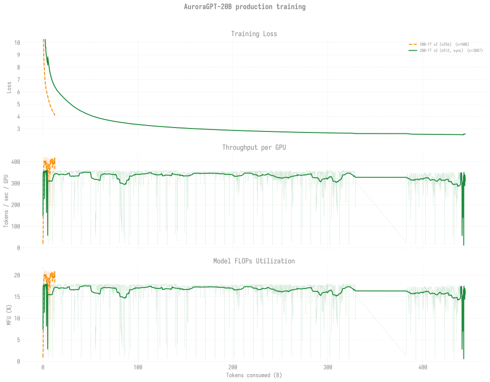

# Production Training — agpt 20B

> Last updated: 2026-06-29
>
> Current v2 production runs on `--training.dtype=float32`.
> Historical v1 (bf16-tainted) runs are archived at
> [`../historical/v1-bf16/`](../historical/v1-bf16/README.md) along
> with the diagnosis link.

## 20B chains overlaid

Every 20B trajectory (TT v2 256N + TT v2 512N sync) overlaid on shared
axes vs tokens consumed. Three panels: training loss / TPS-per-GPU /
MFU. Refreshed via `python3 -m
torchtitan.experiments.ezpz.utils.plot_production_combined`.

For the cross-model view (2B + 20B together) with per-token efficiency
comparison, see [`../README.md`](../README.md).

## 🏁 Headline (2026-06-09)

**20B 512N sync chain still beats 2B 256N async on every benchmark per
token** at step **4,400** / ~442B tokens — but chain has been stalled
**since 2026-05-29** (zero new ckpts in 11 days, queue contention only).
The eval headline is the same data as 2026-05-28, eval'd across
35+ ckpts step-100 → step-4,400:

- ARC-Easy `acc` 0.463 → **0.664** (+20pp)
- HellaSwag `acc_norm` 0.296 → **0.635** (+34pp)
- ARC-C `acc_norm` 0.224 → **0.380** (+16pp)
- Winogrande `acc` 0.493 → **0.586** (+9pp)

Monotonic lift across 35+ consecutive ckpts. See
[`evals/agpt/20b/`](../../../evals/agpt/20b/README.md) for the full
per-task table.

## Snapshot

| Trajectory | Status | Cumulative steps | Loss | Tokens |
|------------|--------|-----------------:|-----:|-------:|
| [**v2 512N (sync)**](n512/README.md) (canonical chain) | Stalled — last walltime-clean run 8509393 (2026-05-29 12:01); 8516701 / 8521624 / 8521625 trained in-RAM past step-4400 but a stale `step-4500/` placeholder (renamed 2026-06-06) blocked persistence; cont (8521628) Q in `small`, cont (8521632) H | **4,400** (persisted) | **2.51** | **~442.9B (9.5%)** |
| [v2 256N](n256/README.md) (8505255 final) | Done — 12h walltime end 2026-05-26 20:35 at step **1,125**. No chain continuation queued (256N is per-token comparator; canonical 20B chain is 512N). | 2,100 | — | — |
| [v2 1024N](n1024/README.md) | First attempt 8463183 crashed at startup (SIGSEGV at 12,288 ranks); not retried | — | — | — |

**Canonical 512N chain (sync-mode)**: 8505258 (🏁 sync-mode
breakthrough, +6) → 8505259 (+6) → 8507197 (+6) → 8507200 (+6,
walltime, ended step 3,270) → 8508214 (walltime, +5 ckpts, ended step
3,806) → [**8509393**](n512/README.md#log-8509393) (walltime exit
2026-05-29 12:01, +6 ckpts, ended step 4,400). Then: 8513546 / 8514610
(retries, no new ckpts), 8516701 (PBS killed mid-save → empty
`step-4500/` placeholder), 8521624 / 8521625 (trained in-RAM past
4,400 but blocked by stale placeholder), placeholder
renamed `.bak-empty-20260606-170503/` on 2026-06-06 to unblock resume,
cont (8521628) Q, cont (8521632) H.

## Per-trajectory detail

- [n512/](n512/README.md) — **canonical v2 512N sync chain** (stalled
  on queue + persistence-blocked retries)
- [n256/](n256/README.md) — v2 256N (ended step 1,125; no continuation)
- [n1024/](n1024/README.md) — v2 1024N (8463183 crashed at startup,
  std::bad_alloc / SIGSEGV — needs 768N/896N bracket before retry)

## Eval scores

See [`docs/evals/agpt/20b/`](../../../evals/agpt/20b/README.md) for the
current 20B lm-eval tables and the **🏁 headline** finding above. At
step 4,400 (~442.9B tokens) v2 512N sync reaches ARC-Easy **0.6641**
and HellaSwag `acc_norm` **0.6346** — beating the 2B 256N async chain
at step-69,900 / ~3.52T tokens (HSn 0.5552) by a wide per-token margin.
The 20B per-token efficiency advantage is dramatic and the chain has
not begun to plateau yet.
