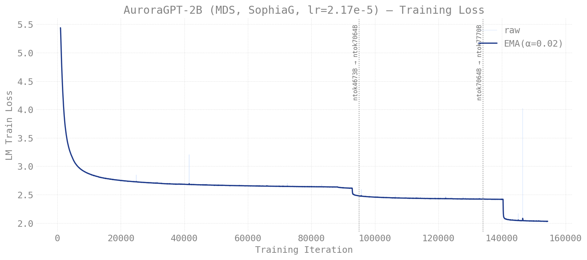
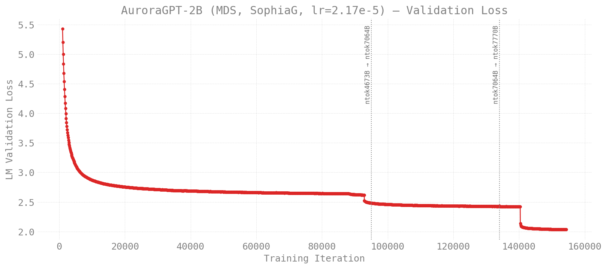
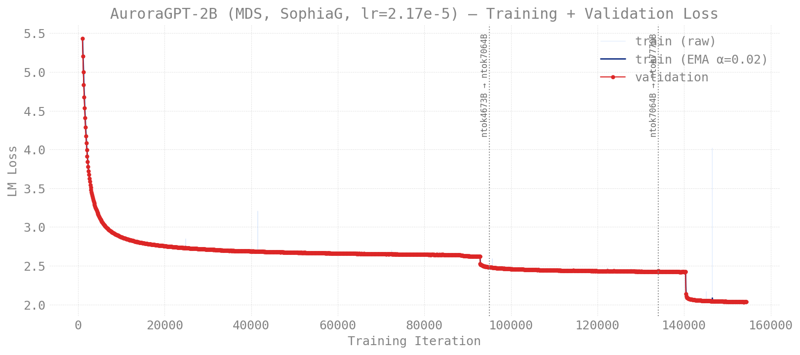
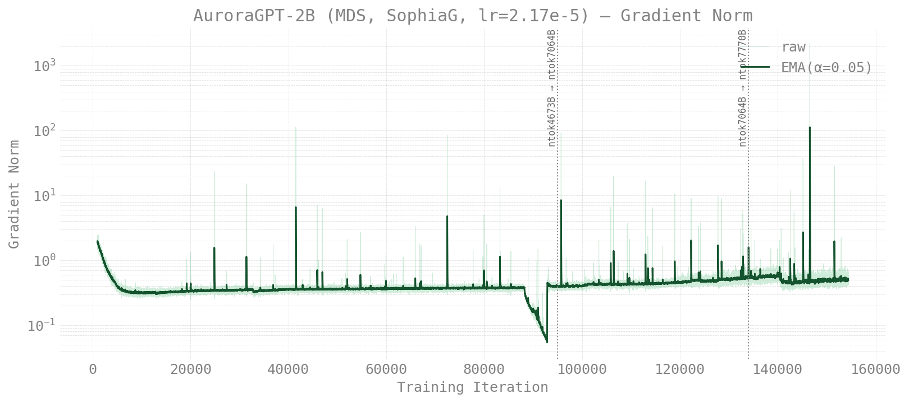
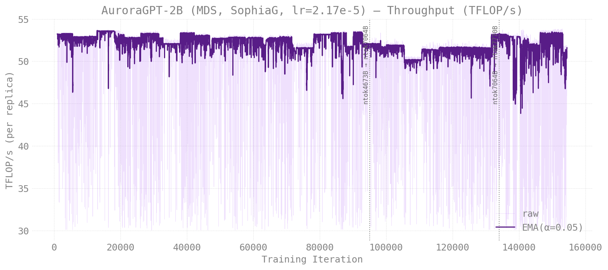
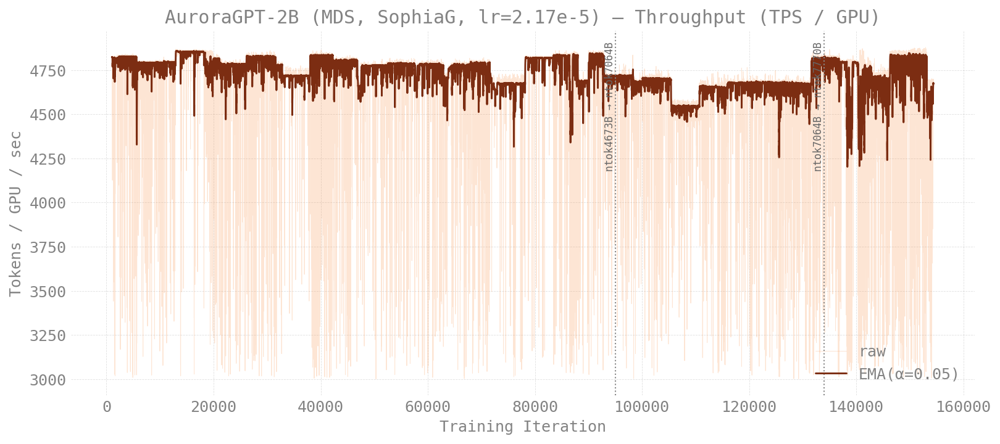

# Production Training — agpt 2B (Megatron-DeepSpeed SophiaG)

> **Scope:** the original Megatron-DeepSpeed AuroraGPT-2B SophiaG
> continuation. One continuous 140K-step / ~7.77T-token run; the three
> "stage" suffixes in the source path (`ntok4673B`, `ntok7064B`,
> `ntok7770B`) reflect data-mix transitions inside the single
> trajectory but all resolve via symlinks to the same physical
> checkpoint dir.
>
> This is **not** a torchtitan run — it predates the migration. It's
> documented here because the loss/throughput history is the natural
> "what does a healthy 2B SophiaG trajectory look like?" reference for
> the v2 torchtitan production runs.
>
> Eval-side scores live at
> [`docs/evals/agpt/2b-mds/`](../../../evals/agpt/2b-mds/README.md).
>
> Last updated: 2026-05-03

## Setup

| Field | Value |
|-------|-------|
| Model | AuroraGPT-2B (Llama, 1.99B params) |
| Tokenizer | google/gemma-7b (vocab_size=256128) |
| Stack | Megatron-DeepSpeed (NOT torchtitan) |
| Optimizer | SophiaG, LR=2.17e-5 |
| GBS | 6,144 · seq_len 8,192 |
| Total steps | 140,000 |
| Total tokens | ~7.77T |
| Source | `/flare/AuroraGPT/AuroraGPT-v1/Experiments/AuroraGPT-2B/optimizer-experiments/Megatron-DeepSpeed/checkpoints/...sophiag-lr2.17e-5..._ntok4673B_..._flash` |

The data-mix stages (per the W&B
[3-stage pretraining report](https://api.wandb.ai/links/aurora_gpt/ux408056)):

| Stage label | Data slice |
|-------------|-----------|
| `ntok4673B` | first 4.673T tokens of the AdamW-trained parent |
| `ntok7064B` | next 2.391T tokens (4.673T → 7.064T) |
| `ntok7770B` | final 0.706T tokens (7.064T → 7.770T) |

## Training Curves

Pulled from W&B (`aurora_gpt/AuroraGPT`, 113 SophiaG continuation runs
matching the production config: nl=12, hs=2048, seq=8192, gbs=6144) and
stitched by iteration. The first 1,000 iterations are dropped from every
plot to skip the warm-up transient. Reproduce with
`loss_data/pull_wandb_loss.py` then `loss_data/plot_loss.py`.

### Loss

| | |
|---|---|
|  |  |

- Two distinct downward steps in val loss line up with the data-mix
  transitions:
  - **iter ≈ 95K**: ntok4673B → ntok7064B (val ~2.65 → ~2.45)
  - **iter ≈ 134K**: ntok7064B → ntok7770B (val ~2.40 → ~2.05)

### Optimization & Throughput

| | |
|---|---|
|  |  |

- **Gradient norm** plotted on a log y-axis; SophiaG's hessian-clipped
  updates keep grad-norm in a tight band after warm-up, with brief
  spikes around each data-mix transition.
- **TFLOP/s** and **TPS / GPU** are per-replica throughput as logged by
  Megatron-DeepSpeed; both are dominated by node-level variance (PBS
  reschedules across slightly different node counts and topologies).

## Eval scores

See [`docs/evals/agpt/2b-mds/`](../../../evals/agpt/2b-mds/README.md)
for the lm-eval sweep results (HellaSwag / ARC-Easy / ARC-Challenge /
Winogrande, 28 checkpoints × 3 measurement replicates).
