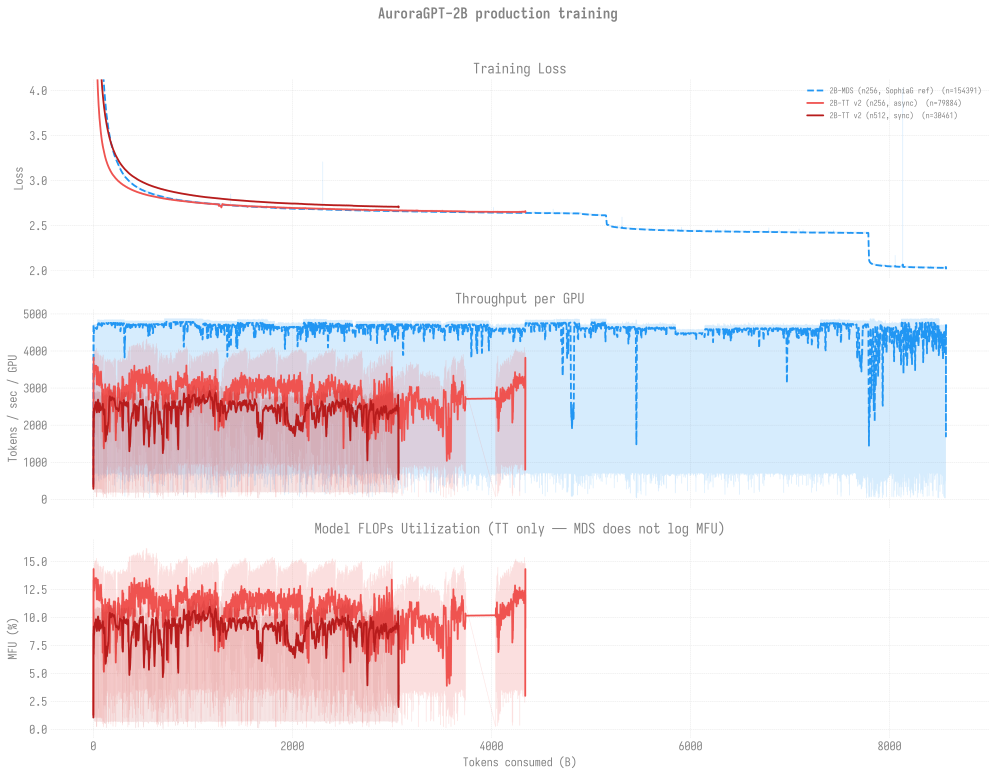

# Production Training — agpt 2B

> Last updated: 2026-06-29
>
> Current v2 production runs on `--training.dtype=float32`.
> Historical v1 (bf16-tainted) runs are archived at
> [`../historical/v1-bf16/`](../historical/v1-bf16/README.md) along
> with the diagnosis link.

## 2B chains overlaid

Every 2B trajectory (MDS-reference + TT v2 256N async + TT v2 512N sync)
overlaid on shared axes vs tokens consumed. Three panels: training loss /
TPS-per-GPU / MFU. Refreshed via `python3 -m
torchtitan.experiments.ezpz.utils.plot_production_combined`.

For the cross-model view (2B + 20B together), see
[`../README.md`](../README.md).

## Snapshot

| Trajectory | Status | Cumulative steps | Loss | Tokens |
|------------|--------|-----------------:|-----:|-------:|
| [**v2 256N (async)**](n256/README.md) (per-token comparator) | 8519833 walltime-finished 2026-06-06 18:07; cont6 (8521626) Q, cont7 (8521630) H | **92,859** | **2.6511** | **~4.674T (100.0%)** |
| [**v2 512N (sync)**](n512/README.md) (canonical chain) | Stalled — last walltime-clean run 8508753 (2026-05-27); 8521627 yeet-rsync failure on 2026-06-07; cont10 (8521631) Q | **30,400** | **2.71** | **~3.06T (65.5%)** |
| [v2 1024N](n1024/README.md) | Crashed at startup (12,288-rank init OOM/SIGSEGV); not retried | — | — | — |
| v2 512N sqrt(2)-LR fork | 8467141 → 8467142 (separate ckpt dir `gbs12288-lr3.22e-5`) | 200 | — | ~20B |

**Headlines (2026-06-09):**

- **256N async chain advanced +14,900 steps since 2026-05-30** across
  5 dispatches: 8513544 → 8516364 → 8516365 (pals-RPC init fail) →
  [**8519833**](n256/README.md#log-8519833) (walltime-clean exit 2026-06-06 18:07 at step-69,900). Loss
  **~2.67** flat; **step-69900 eval**: HSn **0.5552**, ARC-E
  **0.5939**, ARC-C **0.3294**, **Wino 0.5627 (best yet on this chain)**.
  Per-task plateau on HSn/ARC since ~step-64K (±1pp swings); Winogrande
  has the cleanest monotonic trend. Cont6 8521626 Q for 256N slot, cont7
  8521630 held behind it.
- **512N sync chain stalled at step 30,500 since 2026-05-30** —
  **zero progress in 11 days** due to Aurora `small` queue contention.
  [8521627](n512/README.md#log-8521627) launched 2026-06-07 21:12 but
  died at ~8 min when 1 of 522 nodes failed the yeet-env rsync
  (`x4112c1s7b0n0` Connection reset). Mitigation:
  ezpz [PR #160](https://github.com/saforem2/ezpz/pull/160) adds
  per-target rsync retries; not yet deployed to prod venv pending review.
  Cont10 8521631 Q.

## Per-trajectory detail

- [n256/](n256/README.md) — v2 256N async (canonical per-token comparator;
  +14.9K steps in last 10 days)
- [n512/](n512/README.md) — **canonical v2 512N sync chain** (stalled,
  queue-blocked)
- [n1024/](n1024/README.md) — v2 1024N (8463182/8463183 both crashed
  at 12,288-rank init; needs 768N/896N bracket before retry)

## Eval scores

See [`docs/evals/agpt/2b/`](../../../evals/agpt/2b/README.md) for the
current 2B lm-eval tables (HellaSwag / ARC-Easy / ARC-Challenge /
Winogrande). Latest entries are at the bottom of that table; step-69900
holds the chain's **best Winogrande** at 0.5627.

**Per-token efficiency note:** the 20B 512N sync chain at step 4,400
(~442B tokens) hits HSn 0.6346 / ARC-E 0.6641 — beating this 2B 256N
plateau on every benchmark per token. The 2B chain has burned ~8×
more tokens to reach a worse score, which is expected; the comparator
exists to confirm the 20B chain is converging *qualitatively faster*
per token, not just per FLOP. See
[`evals/agpt/20b/`](../../../evals/agpt/20b/README.md).
