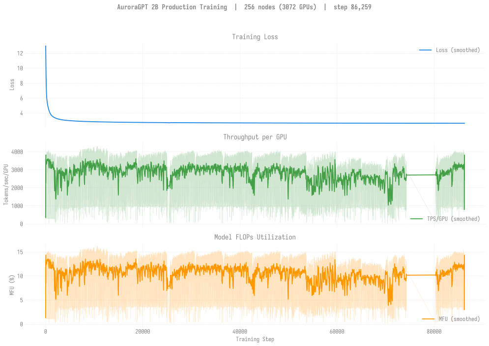
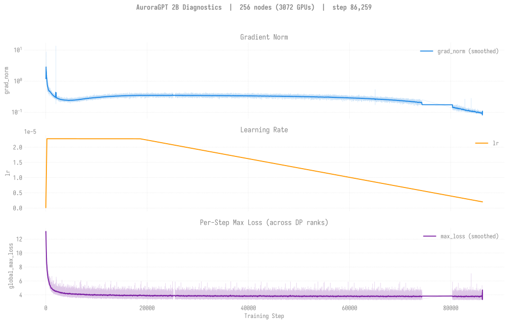
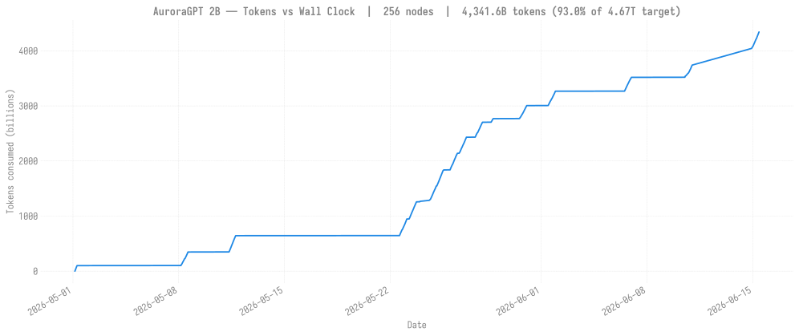

# Production Training — agpt 2B @ 256 nodes

> **Eval scores:** see [`docs/evals/agpt/2b/`](../../../../evals/agpt/2b/README.md)
> for the v2 lm-eval results.

## v2 — 2B @ 256N — SophiaG LR=2.28e-5 (fp32 master)

> Last updated: 2026-06-29
>
> Status: **COMPLETE — target reached.** Chain at step **92,859** =
> **4.674T tokens (100.0%** of the 4.67T target). The final dispatch
> `8558531` (cont12) finished **clean** (exit 0, ~10.2h walltime run) on
> 2026-06-29 at step-92,859 = the full pre-training budget. Continuation
> `8558532` (cont13) is queued behind it but has <1 checkpoint-interval
> (~90 steps) of slack to the target -- effectively a no-op. This v2 2B
> 256N pre-training run is done; subsequent tokens would be continued
> pre-training (CPT), not the base run.
>
> Earlier 2026-06-28: a 2h "sneak" run `8572612` advanced step-86,200 ->
> 86,674 (256N, +474 steps / 19 ckpts, loss **2.65**) -- the first run
> after the fused-optimizer ckpt-resume incident
> ([2026-06-26 writeup](../../../../experiments/agpt/aurora/20260626-512n-sneak-umbrella-walltime.md)),
> resuming **clean** from the rolled-back pre-fused clone; then cont12
> `8558531` carried it the rest of the way to target. Prior:
> `8534293` (cont11) ran 2026-06-14 → 2026-06-15, clean 12h exit at
> step-86,260.
>
> Prior dispatches: `8521630` (cont10, 2026-06-12 → 13) added +51
> ckpts step-74,400..80,400, clean 12h exit, loss 2.66325 → 2.66286.
> `8521626` (cont9, 2026-06-10) added +44 ckpts step-70000..74,300.
> `8519833` (cont8, 2026-06-06) added +50 ckpts step-65000..69,900.
> Five dispatches landed across the
> 5/28 → 6/6 window: `8508977` (cont4, 5/28 pals-RPC infra failure,
> persisted ~5 ckpts step-53800..54200 before bailing), `8513544`
> (cont5, 5/30 walltime to step-59700), `8516364` (cont6, 6/1
> walltime to step-64900), `8516365` (cont7, 6/4 pals-RPC infra
> failure at init, no ckpts), and `8519833` (cont8, 6/6 walltime to
> step-69900 — clean, advanced step 65,000 → 69,900 = +4,900 steps
> in ~11h). Async-mode remained stable across all dispatches at 256N
> — only 512N+ hits the async-save cluster cascade documented on the
> 2B/20B 512N pages. Loss flat ~2.66-2.67 (eval plateau in HSn
> 0.554-0.558; **step-69900 Winogrande 0.5627 is best yet**, see
> [`docs/evals/agpt/2b/`](../../../../evals/agpt/2b/README.md) row
> for step 69,900). Continuation chain stays **+2 deep**: `8521626`
> (cont9, `afterany:8519833`) is Q for the next 256N slot since
> 2026-06-03 07:20, with `8521630` H'd behind it.
>
> Earlier runs: 8459818 (initial, NODE_FAIL @ 2070), 8470100 / 8470101
> (chain1/chain2 walltime to step ~10,723). Loss tracking the
> canonical 512N chain closely — at matched step counts the per-token
> under-training pattern documented in
> [`docs/evals/agpt/2b/`](../../../../evals/agpt/2b/README.md) is
> visible (256N learns more per token, 512N learns more per wall
> clock).

| Field | Value |
|-------|-------|
| Clone | `/flare/AuroraGPT/foremans/runs/agpt-2b-v2/torchtitan-ezpz/` |
| Submit script | [`scripts/submit_agpt_2b_aurora_venv_failover.sh`](../../../../../scripts/submit_agpt_2b_aurora_venv_failover.sh) (failover wrapper: bad-node preflight + spare-swap retry; one script handles all node counts via env vars) |
| Stack | torch 2.13 venv (yeet-env tarball mode) |
| Optimizer | SophiaG, LR=2.28e-5 |
| Compile | on |
| GBS | 6,144 (LBS=2) |
| Total steps | 92,859 |
| Total tokens | 4.67T |
| Checkpoint dir | `outputs/checkpoints/agpt-2b-sophiag-olmo-mix-1124-n256-gbs6144` |
| Checkpoint interval | 100 steps, keep_latest_k=0 (keep all) |
| W&B | [lytjeegk](https://wandb.ai/aurora_gpt/torchtitan.ezpz.train/runs/lytjeegk) |

### Loss / Throughput / MFU

### Diagnostics

### Tokens vs Wall Clock

### Progress

| Job ID | Date | Steps | Loss (start → end) | TPS/GPU | MFU | Status |
|--------|------|-------|---------------------|---------|-----|--------|
| [`8459818`](#log-8459818) | 2026-05-01 | 1–2070 | 12.93 → 3.33 | ~3,500 | ~13% | NODE_FAIL after step 2070 (single bad node dragged TPS to ~30 then killed). 20 ckpts saved (every 100 steps). |
| [`8470100`](#log-8470100) | 2026-05-08 | 2000–~10000 | 3.33 → ~2.85 | ~1,000 | ~3.8% | Done (walltime, 12h02m). Resumed from step-2000. |
| [`8470101`](#log-8470101) | 2026-05-11 | 10000–12889 | 2.85 → 2.81 | ~1,000 | ~3.8% | Done (walltime, 12h00m20s; cleanly walltime-finished). |
| [`8505175`](#log-8505175) | 2026-05-23 | 12h | ~25,500 → 30,791 | ~1,000 | ~3.8% | Done (walltime, exit -29). Async mode. Resumed from step ~25,500, persisted **8 ckpts** step-30000..step-30700, ended at loss **2.72**. |
| [`8505252`](#log-8505252) | 2026-05-24 | 12h | 30,700 → 36,528 | ~1,000 | ~3.8% | Done (walltime, exit -29). Async mode. `afterany` continuation of 8505175. Persisted **57 ckpts** step-30800..step-36500, ended at loss **2.71**. |
| [`8507195`](#log-8507195) | 2026-05-25 → 2026-05-26 | 12h | ~36,528 → **42,515** | ~1,000 | ~3.8% | Done (walltime, exit -29). Async mode. `afterany` continuation of 8505252 (22:41 → 10:35). Persisted **~57 ckpts** step-36800..step-42500, ended at loss **2.69**. |
| [`8507198`](#log-8507198) | 2026-05-26 | 12h | 42,500 → **48,329** | ~1,000 | ~3.8% | Done (walltime, exit -29). Async mode. `afterany` continuation of 8507195 (08:02 → 20:02). Persisted **~57 ckpts** step-42600..step-48300, ended at loss **2.68**. |
| [`8508020`](#log-8508020) | 2026-05-27 | 12h | 48,300 → **49,666** (last log; ckpts ran to step-54900-ish in async) | ~1,000 | ~3.8% | Done (walltime, exit -29). Async mode. `afterany` continuation of 8507198 (09:32 → 21:33). Persisted ckpts through step-54700. Loss **2.68**. |
| [`8508977`](#log-8508977) | 2026-05-28 | <4h | 53,700 → 55,026 (last log) | ~1,000 | ~3.8% | **pals-RPC infra failure** (RPC launch could not forward to compute node). Async mode. `afterany` continuation of 8508020 (started 10:53, RPC error storm and exit before 14:39). Persisted **~5 ckpts** step-53800..step-54200, loss **2.67**. Same `Couldn't forward RPC launch` pattern as documented in `project_aurora_pals_rpc_launch_failure.md`. |
| [`8513544`](#log-8513544) | 2026-05-30 | 12h | 55,001 → **59,750** (last log) | ~3,000-3,500 peak | ~10-13% peak | Done (walltime, exit -29: `walltime 43206 exceeded limit 43200`). Async mode. `afterany` continuation of 8508977 (08:04 → 19:49). Persisted **~47 ckpts** step-55100..step-59700, ended at loss **2.676**. |
| [`8516364`](#log-8516364) | 2026-06-01 | 12h | 59,701 → **64,922** (last log) | ~1,000 | ~3.8% | Done (walltime, exit -29: `walltime 43213 exceeded limit 43200`). Async mode. `afterany` continuation of 8513544 (05:37 → 17:20). Persisted **~52 ckpts** step-59800..step-64900, ended at loss **2.666**. |
| [`8516365`](#log-8516365) | 2026-06-04 | <1h | n/a (failed at init) | — | — | **pals-RPC infra failure** at init (same `Couldn't forward RPC launch` + rank death signals 15). No steps run, no ckpts persisted. `afterany` continuation of 8516364 (mtime 6/4 11:02). |
| [`8519833`](#log-8519833) | 2026-06-06 | 11h | 64,901 → **69,914** (last log) | ~1,000 | ~3.8% | Done (walltime, exit -29: `walltime 43209 exceeded limit 43200`). Async mode. `afterany` continuation of 8516365 (07:05 → 18:08; last ckpt step-69900 at 18:07:17). Persisted **~50 ckpts** step-65000..step-69900, ended at loss **2.659**. **Clean walltime exit**, no infra issues. |
| **[`8521626`](#log-8521626)** | 2026-06-10 | 12h | 69,900 → **74,300** | — | — | Done (walltime exit at 18:37). Async mode. `afterany` continuation of 8519833 — finally landed after 4 days of queue contention. step-70000 ckpt persisted at 06:55 (first new persisted ckpt in 4 days); ckpts every 100 steps since at ~9-15 min/ckpt steady-state through step-74,300. **+44 ckpts persisted** across this 12h run. |
| **[`8521630`](#log-8521630)** | 2026-06-12 → 2026-06-13 | 12h | 74,300 → **80,400** (last log step-80,404) | ~3,400-3,900 | ~13-14.5% | Done (**clean walltime exit at 12h00m22s**). Async mode. `afterany` continuation of 8521626 — landed 2026-06-12 14:42 after **9 days of `small` queue contention**. Loss **2.66325 → 2.66286**, grad_norm steady ~0.14. **+51 ckpts persisted** (step-74,400..step-80,400, last persisted 8 seconds before walltime kill). No NaN, no NODE_FAIL. |
| **[`8534293`](#log-8534293)** | 2026-06-14 → 2026-06-15 | 12h | 80,400 → **86,260** (last log) | ~3,200-3,900 | ~12-14.5% | Done (**clean 12h walltime exit at 04:45**). Async mode. `afterany` continuation of 8521630. Loss **2.656**, grad_norm ~0.10. **+59 ckpts persisted** (step-80,500..step-86,200). No NaN, no NODE_FAIL. |
| **`8572612`** | 2026-06-28 | 2h (sneak) | 86,200 → **86,674** | ~3,400 | ~13% | Done (**clean walltime exit -29 at 07:03**). 2h short-walltime "sneak" (256N, sync, `CKPT_INTERVAL=25`) on the rolled-back pre-fused clone — first run after the fused-optimizer ckpt-resume incident (see [2026-06-26 experiment](../../../../experiments/agpt/aurora/20260626-512n-sneak-umbrella-walltime.md)). Resumed step-86,200 **clean** (no Missing-key), loss **2.65**, grad_norm ~0.13. **+19 ckpts persisted** (step-86,225..step-86,674, every 25 steps). No NaN, no NODE_FAIL. Not a chain continuation — opportunistic advance; cont12/8558531 will resume from step-86,674. |
| `8558531` | 2026-06-28 → 2026-06-29 | ~10.2h | 86,674 → **92,859** | ~3,400 | ~13% | **Done — TARGET REACHED.** `afterany` cont12, resumed step-86,674 clean. Ran ~10.2h, **clean exit 0** at 03:03 on 2026-06-29, final ckpt **step-92,859 = 4.674T tokens (100.0%** of the 4.67T target). Loss ~2.64. This completes the v2 2B 256N base pre-training run. |
| `8558532` | — | 12h | (cont13) | — | — | **Queued** behind 8558531, but <1 ckpt-interval (~90 steps) to target — effectively a no-op now that 8558531 reached 92,859. |
| `8558532` | — | 12h | (cont13) | — | — | Held (`afterany:8558531`). |

**Latest checkpoint:** step-92,859 (FINAL -- target reached; cont12/8558531 finished clean exit 0 on 2026-06-29, ~10.2h)

**Cumulative steps:** 92,859

**Tokens consumed:** 92,859 × 6,144 × 8,192 = **4.674T tokens** (**100.0%** of 4.67T target)

**Loss:** 2.6511 (last log ~step-86,260 from 8534293; evals current through step-80,400 — backfill for step-80,500..86,200 pending)

> **Note:** 2026-05-24 → 2026-06-06 chain has now advanced step 25,500
> → **69,900** (+44,400 steps) across 10 dispatches; **~395 ckpts
> persisted** in async mode. Two of the ten dispatches were pals-RPC
> infra failures (8508977 partial, 8516365 init-only); the remaining
> eight all walltime-exited cleanly with no async-save cascade at
> 256N. Compare to 2B/20B 512N pages where the async-save cluster
> cascade forced a switch to sync mode at 6,144 ranks.

### Recent evals

Pulled from the canonical sweep table at
[`docs/evals/agpt/2b/`](../../../../evals/agpt/2b/README.md). Latest
evaluated ckpt is step-69900 (landed 2026-06-08). Metric is
`acc_norm,none` for HellaSwag / ARC; `acc,none` for Winogrande.

| Step | Tokens (B) | HellaSwag | ARC-Easy | ARC-Chall | Winogrande |
|-----:|-----------:|----------:|---------:|----------:|-----------:|
| 64,000 | 3221.4 | 0.5538 | 0.6040 | 0.3336 | 0.5549 |
| 66,000 | 3321.9 | 0.5577 | 0.5918 | 0.3302 | 0.5462 |
| 68,000 | 3422.6 | 0.5577 | 0.5905 | 0.3302 | 0.5509 |
| **69,900** | **3518.0** | **0.5552** | **0.5939** | **0.3294** | **0.5627** |

Step-69900 sets a new best on Winogrande (0.5627, +0.8pp over the
prior step-64000 high of 0.5549). HellaSwag/ARC plateau pattern
documented in the evals README remains: each new 2k-step window
shifts the four-metric vector by <1pp in any direction now that we're
~3.5T tokens in.

### Continuation chain

- **Next up:** `8521626` (cont9, `afterany:8519833`) Q for next 256N
  slot since 2026-06-03 07:20.
- **Behind it:** `8521630` (cont10) H'd behind 8521626 — chain stays
  **+2 deep** so a clean walltime exit on cont9 will immediately
  release cont10 onto the next available 256N slot.
- Submit script unchanged: `scripts/submit_agpt_2b_aurora_venv_failover.sh`
  with the same env (LBS=2, GBS=6144, SophiaG LR=2.28e-5, fp32 master,
  async ckpt mode, ckpt-interval=100, keep-latest-k=0).

### Logs

| Job ID | Path |
|--------|------|
| `8459818` | `/flare/AuroraGPT/foremans/runs/agpt-2b-v2/torchtitan-ezpz/agpt-2b-n256.o8459818` |
| `8470100` | `/flare/AuroraGPT/foremans/runs/agpt-2b-v2/torchtitan-ezpz/agpt-2b-n256-v2-chain1.o8470100` |
| `8470101` | `/flare/AuroraGPT/foremans/runs/agpt-2b-v2/torchtitan-ezpz/agpt-2b-n256-v2-chain2.o8470101` |
| `8505175` | `/flare/AuroraGPT/foremans/runs/agpt-2b-v2/torchtitan-ezpz/agpt-2b-n256-v2-chain3.o8505175` |
| `8505252` | `/flare/AuroraGPT/foremans/runs/agpt-2b-v2/torchtitan-ezpz/agpt-2b-n256-v2-chain4.o8505252` |
| `8507195` | `/flare/AuroraGPT/foremans/runs/agpt-2b-v2/torchtitan-ezpz/agpt-2b-n256-v2-failover-cont.o8507195` |
| `8507198` | `/flare/AuroraGPT/foremans/runs/agpt-2b-v2/torchtitan-ezpz/agpt-2b-n256-v2-failover-cont2.o8507198` |
| `8508020` | `/flare/AuroraGPT/foremans/runs/agpt-2b-v2/torchtitan-ezpz/agpt-2b-n256-v2-failover-cont3.o8508020` |
| `8508977` | `/flare/AuroraGPT/foremans/runs/agpt-2b-v2/torchtitan-ezpz/agpt-2b-n256-v2-failover-cont4.o8508977` |
| `8513544` | `/flare/AuroraGPT/foremans/runs/agpt-2b-v2/torchtitan-ezpz/agpt-2b-n256-v2-failover-cont5.o8513544` |
| `8516364` | `/flare/AuroraGPT/foremans/runs/agpt-2b-v2/torchtitan-ezpz/agpt-2b-n256-v2-failover-cont6.o8516364` |
| `8516365` | `/flare/AuroraGPT/foremans/runs/agpt-2b-v2/torchtitan-ezpz/agpt-2b-n256-v2-failover-cont7.o8516365` |
| `8519833` | `/flare/AuroraGPT/foremans/runs/agpt-2b-v2/torchtitan-ezpz/agpt-2b-n256-v2-failover-cont8.o8519833` |
