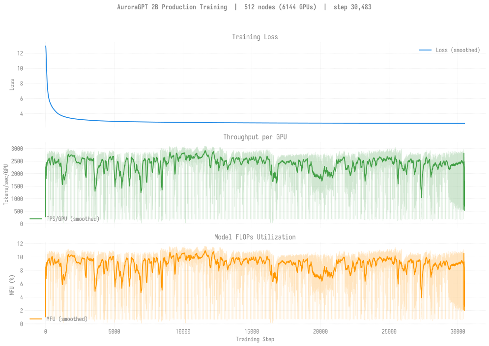
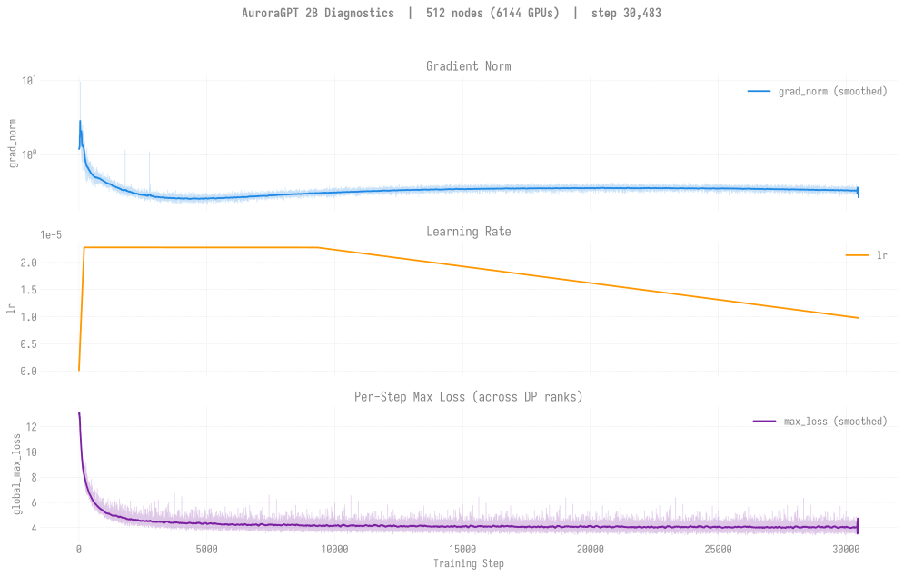
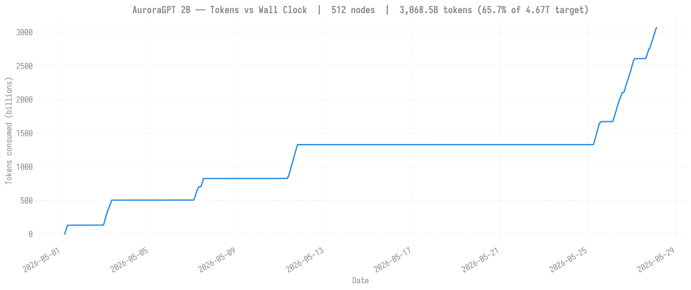

# Production Training — agpt 2B @ 512 nodes

> **Last updated: 2026-06-29.**
>
> **This is the canonical 2B production chain.**
>
> **Status:** chain pinned at step **30,500** since **2026-05-30 07:53**
> — **stalled ~10 days** waiting on the Aurora `small` queue. The
> stall is *not* a training-stack failure; the chain is healthy and
> simply has not held a 512N slot for sustained training since the
> last R cleared. The one brief R event in the stall window was
> `8521627` (cont9), which ran for **~8 minutes** on **2026-06-07
> 21:12 → 21:20** and died in yeet-env before training started:
> 1 of 522 nodes (`x4112c1s7b0n0`) failed `rsync` with
> `Connection reset by 10.112.164.235 port 22` after the 120s
> per-node timeout. The other 521 nodes copied the venv tarball
> cleanly in ~20s each. No checkpoints were written past
> step-30,500. Loss **2.71**, tokens **3.07T (65.7% of 4.67T
> target)**. Sync-mode workaround for the async-cascade continues
> to hold; the async-mode runs (`8505176` and earlier) had been pinned
> at step-13,300 for two weeks before the sync-mode pivot.
>
> **Next up:** `8521631` (cont10) Q in `small`; will resume from
> step-30,500 once a 512N slot opens.
>
> **Mitigation for the yeet-env transient:** ezpz
> [PR #160](https://github.com/saforem2/ezpz/pull/160)
> (`yeet-retry-on-rsync-failure`) adds per-target rsync retries
> gated by `EZPZ_YEET_RSYNC_RETRIES` (default 2). Not yet deployed
> to the v2 production venv pending PR review — a single bad-node
> rsync timeout currently kills the whole job.
>
> **Eval scores:** see [`docs/evals/agpt/2b/`](../../../../evals/agpt/2b/README.md)
> for the current v2 lm-eval results (last evaluated v2 512N
> checkpoint is **step-30,000**).

## v2 — 2B @ 512N — SophiaG LR=2.28e-5 (fp32 master)

| Field | Value |
|-------|-------|
| Clone | `/flare/AuroraGPT/foremans/runs/agpt-2b-v2/torchtitan-ezpz/` |
| Submit script | [`scripts/submit_agpt_2b_aurora_venv_failover.sh`](../../../../../scripts/submit_agpt_2b_aurora_venv_failover.sh) (failover wrapper: bad-node preflight + spare-swap retry; one script handles all node counts via env vars) |
| Stack | torch 2.13 venv (yeet-env tarball mode) |
| Compile | on |
| GBS | 12,288 (LBS=2) |
| Total steps | 46,429 |
| Total tokens | 4.67T |
| Checkpoint dir | `outputs/checkpoints/agpt-2b-sophiag-olmo-mix-1124-n512-gbs12288` |
| W&B chain | [i252kps9](https://wandb.ai/aurora_gpt/torchtitan.ezpz.train/runs/i252kps9) → [d4hlr8qe](https://wandb.ai/aurora_gpt/torchtitan.ezpz.train/runs/d4hlr8qe) |

### Loss / Throughput / MFU

### Diagnostics

### Tokens vs Wall Clock

### Progress (chain)

| Job ID | Date | Walltime | Steps | Loss (start → end) | TPS/GPU | MFU | Status |
|--------|------|---------:|------:|-------------------:|--------:|----:|--------|
| [`8460301`](#log-8460301) | 2026-05-01 | 6h | 1–1387 | 12.65 → 3.59 | ~2,700 | ~10% | NODE_FAIL after step 1387. 13 ckpts saved. |
| [`8463626`](#log-8463626) | 2026-05-03 | 12h | 1300–5073 | 3.59 → 2.97 | ~2,700 | ~10% | Walltime hit (NODE_FAIL at end). **50 ckpts saved (every 100 steps).** |
| [`8463627`](#log-8463627) | 2026-05-07 | 12h | 5000–6955 | 2.97 → 2.90 | varies | varies | Done (walltime, 12h00m18s). |
| [`8466847`](#log-8466847) | 2026-05-11 | 12h | 6900–13279 | 2.90 → **2.79** | ~2,800 | ~10% | Done (walltime, 12h00m13s). step-13200 ckpt saved. |
| [`8479988`](#log-8479988) | 2026-05-11 | 12h | 13200+ | — | — | — | **Queued** (resubmit, 2026-05-11 evening) — auto-resumes from step-13200 |
| [`8479989`](#log-8479989) | 2026-05-11 | 12h | (cont.) | — | — | — | Held (`afterany:8479988`) |
| [`8505176`](#log-8505176) | 2026-05-23 | 12h | 13,300 → ~13,400 | — | — | — | **All 3 wrapper attempts failed in async-save cluster cascade @ step 13400** (same regression first observed at 20B 512N). Wrapper exhausted retries, exit 143. Only ckpt persisted across the dispatch was step-13300 from attempt 1's brief progress. **Async mode pinned at step-13300.** |
| [`8506215`](#log-8506215) | 2026-05-24 | — | (qsub fail) | — | — | — | **Sync-mode resubmit aborted in preflight.** All 3 wrapper attempts tripped the 120s preflight DDP-init watchdog (timeout doesn't scale with N at 6,144 ranks). Exit 1. **Bug fix:** bumped default to 600s + added `--train-iters 5` to cap preflight length. |
| [`8506221`](#log-8506221) | 2026-05-24 | 12h | 13,300 → **16,676** | 2.79 → **2.76** | ~2,700 | ~10% | **SYNC mode (async disabled).** 21 ckpts step-14600..step-16600 persisted. Preflight attempt 1 hung at iter 111 (real silent hang, 49 min of silence); wrapper SIGTERM'd and blind-swapped bad node `x4305c0s7b0n0` for spare `x4602c3s3b0n0`. Preflight attempt 2 succeeded ~75 min total; main training started 00:17 and ran to walltime exit -29. **First sustained 512N progress in two weeks.** |
| [`8507196`](#log-8507196) | 2026-05-25 → 2026-05-26 | 11h+ | 13,300 → ~**20,989** | 2.76 → **2.74** | ~2,700 | ~10% | **SYNC mode.** Resumed from step-13,300, ran through 21:12 → 08:17. Trained cleanly to step **20,989** in-memory, persisted **+76 ckpts** before all 3 wrapper attempts tripped an **Aurora pals-RPC infra failure** (exit 127 in launch phase, 3 different "bad" nodes swapped — pals failures the wrapper cannot recover from). See `memory/project_aurora_pals_rpc_launch_failure.md`. |
| [`8507199`](#log-8507199) | 2026-05-26 | 12h | 20,900 → **25,967** | 2.74 → **2.72** | ~2,700 | ~10% | Done (walltime, exit -29). **SYNC mode.** `afterany` continuation, ran 09:24 → 21:26. Persisted **~50 ckpts** step-21000..step-25900. |
| [`8508753`](#log-8508753) | 2026-05-27 → 2026-05-28 | 12h | 25,900 → **30,484** | 2.72 → **2.71** | ~2,700 | ~10% | Done (walltime exit -29). **SYNC mode.** `afterany` continuation of 8507199, ran 09:19 → 21:19. +80 ckpts step-22600..step-30400 persisted. |
| (~5–9 day Q wait — Aurora `small` queue saturated) | 2026-05-30 → 2026-06-07 | — | — | — | — | — | **No R events.** Chain pinned at step-30,500 since 2026-05-30 07:53. |
| [`8521627`](#log-8521627) | 2026-06-07 | ~8 min | (none) | (none) | — | — | **Failed in yeet-env preflight, no training.** `afterany` cont9. R 21:12 → E 21:20. 1 of 522 nodes (`x4112c1s7b0n0`) tripped a 120s rsync timeout with `Connection reset by 10.112.164.235 port 22`; the other 521 nodes finished the tarball copy in ~20s each. yeet-env reported `1/522 node(s) failed`, the failover wrapper bailed (exit 1), and no checkpoints were written past step-30,500. See **Recent issues** below. |

**Latest checkpoint:** step-30400 (8508753 last persisted; cont9 wrote nothing past it)

**Cumulative steps:** 30,400 (chain pinned since 2026-05-30 07:53)

**Tokens consumed:** 30,400 × 12,288 × 8,192 = **3.06T tokens** (65.5% of 4.67T target)

### Recovery

Async checkpoint saves cluster-cascaded at 6,144 ranks: every
dispatch from 2026-05-11 → 2026-05-23 cleanly trained ~100 steps
to the next save then died the same way, pinning the chain at
step-13,300 for two weeks. Same pattern hit the 20B 512N chain.

`8506221` (2026-05-24) ran with `CHECKPOINT_ASYNC_MODE=disabled`
and advanced the chain by 3,376 steps (+21 ckpts persisted) in
12h. Sync mode is the operational workaround for both 2B and 20B
512N trajectories. The follow-on chain (`8507199` + `8508753`)
has continued the pattern, taking the chain from step-16,676 to
**27,106+** across two more sustained dispatches.

`8507196` (2026-05-25) was the one stumble in this stretch: trained
cleanly to step **20,989** in-memory (+76 persisted ckpts), then all
three wrapper attempts hit an **Aurora pals-RPC infrastructure
failure** (exit 127 during launch). The wrapper correctly identified
the failures as node-related and swapped three different nodes before
exhausting retries — but pals-RPC failures are upstream of anything
the wrapper can repair. The chain still benefited (76 persisted ckpts
from step-13,400..step-20,900 advanced the on-disk frontier
significantly), and `8507199` resumed cleanly from step-20900.

Note the preflight gotcha discovered in `8506215`: the wrapper's
default 120s smoke-test timeout doesn't scale to 6,144-rank DDP
init, so all three attempts watchdog-tripped before any real
training. Default is now 600s + `--train-iters 5`.

### Recent issues

- **Aurora `small` queue stall (2026-05-30 → present).** Chain has
  not held a 512N slot for sustained training in ~10 days. There
  is nothing wrong with the model, the venv, or the failover
  wrapper — the queue itself has been saturated. `8521631` (cont10)
  is the next-up afterany continuation and will resume from
  step-30,500 the moment a slot opens. Cross-chain note: the
  separately-tracked **256N** 2B chain has its own pair of held
  continuations (`8521626` / `8521630`) — they belong to that
  trajectory, not this one. `8521632` (H in `small`) is part of
  the **20B** chain, also unrelated to this page.
- **yeet-env single-bad-node rsync transient (2026-06-07, job
  `8521627`).** One node out of 522 dropped its incoming rsync
  connection (`Connection reset by 10.112.164.235 port 22`) and
  hit the 120s per-target timeout. The other 521 nodes finished
  in ~20s each, so the venv tarball was effectively broadcast,
  but yeet-env's exit code reflects the single failure and the
  failover wrapper bails before training starts. Same failure
  mode the user's
  [ezpz PR #160](https://github.com/saforem2/ezpz/pull/160)
  (`yeet-retry-on-rsync-failure`) is intended to fix: it adds
  per-target rsync retries controlled by
  `EZPZ_YEET_RSYNC_RETRIES` (default 2). Not yet deployed to the
  v2 prod venv pending PR review.

### Logs

| Job ID | Path |
|--------|------|
| `8460301` | `/flare/AuroraGPT/foremans/runs/agpt-2b-v2/torchtitan-ezpz/agpt-2b-n512.o8460301` |
| `8463626` | `/flare/AuroraGPT/foremans/runs/agpt-2b-v2/torchtitan-ezpz/agpt-2b-n512-v2-chain1.o8463626` |
| `8463627` | `/flare/AuroraGPT/foremans/runs/agpt-2b-v2/torchtitan-ezpz/agpt-2b-n512-v2-chain2.o8463627` |
| `8466847` | `/flare/AuroraGPT/foremans/runs/agpt-2b-v2/torchtitan-ezpz/agpt-2b-n512-v2-chain3.o8466847` |
| `8479988` | `/flare/AuroraGPT/foremans/runs/agpt-2b-v2/torchtitan-ezpz/agpt-2b-n512-v2-chain4.o8479988` |
| `8479989` | `/flare/AuroraGPT/foremans/runs/agpt-2b-v2/torchtitan-ezpz/agpt-2b-n512-v2-chain5.o8479989` |
| `8485509` | `/flare/AuroraGPT/foremans/runs/agpt-2b-v2/torchtitan-ezpz/agpt-2b-n512-v2-chain6.o8485509` (ran 1h19m, walltime; pinned at step-13400) |
| `8485511` | `/flare/AuroraGPT/foremans/runs/agpt-2b-v2/torchtitan-ezpz/agpt-2b-n512-v2-chain7.o8485511` (ran 1h23m, walltime; also pinned at step-13400 — same ckpt as 8485509 resume) |
| `8505176` | `/flare/AuroraGPT/foremans/runs/agpt-2b-v2/torchtitan-ezpz/agpt-2b-n512-v2-chain8.o8505176` |
| `8506215` | `/flare/AuroraGPT/foremans/runs/agpt-2b-v2/torchtitan-ezpz/agpt-2b-n512-v2-sync-chain1.o8506215` |
| `8506221` | `/flare/AuroraGPT/foremans/runs/agpt-2b-v2/torchtitan-ezpz/agpt-2b-n512-v2-sync-chain2.o8506221` |
| `8507196` | `/flare/AuroraGPT/foremans/runs/agpt-2b-v2/torchtitan-ezpz/agpt-2b-n512-v2-failover-sync-cont.o8507196` |
| `8507199` | `/flare/AuroraGPT/foremans/runs/agpt-2b-v2/torchtitan-ezpz/agpt-2b-n512-v2-failover-sync-cont2.o8507199` |
| `8508753` | `/flare/AuroraGPT/foremans/runs/agpt-2b-v2/torchtitan-ezpz/agpt-2b-n512-v2-failover-sync-cont3.o8508753` |
| `8521627` | `/flare/AuroraGPT/foremans/runs/agpt-2b-v2/torchtitan-ezpz/agpt-2b-n512-v2-failover-sync-cont9.o8521627` (yeet-env transient — 1/522 nodes failed rsync, training never started) |
