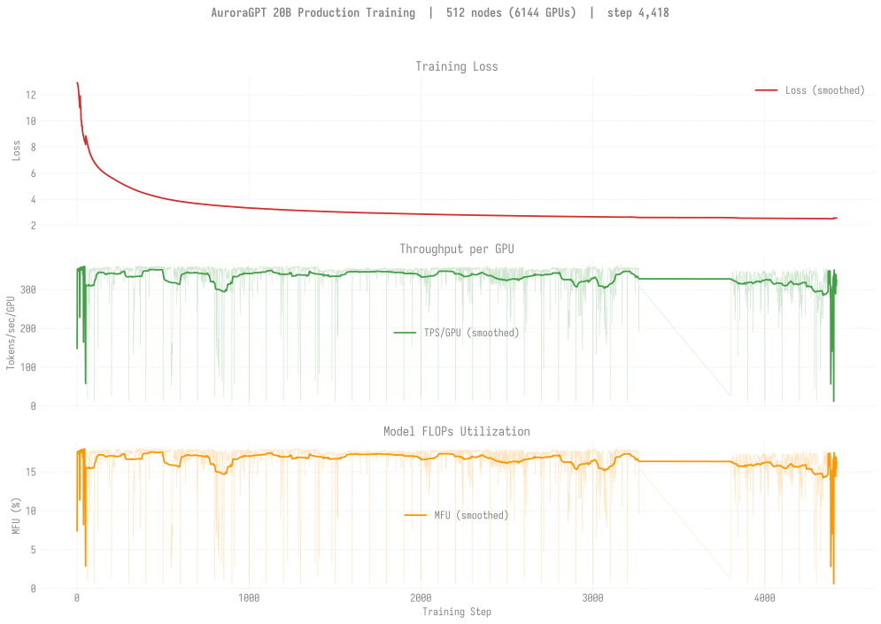
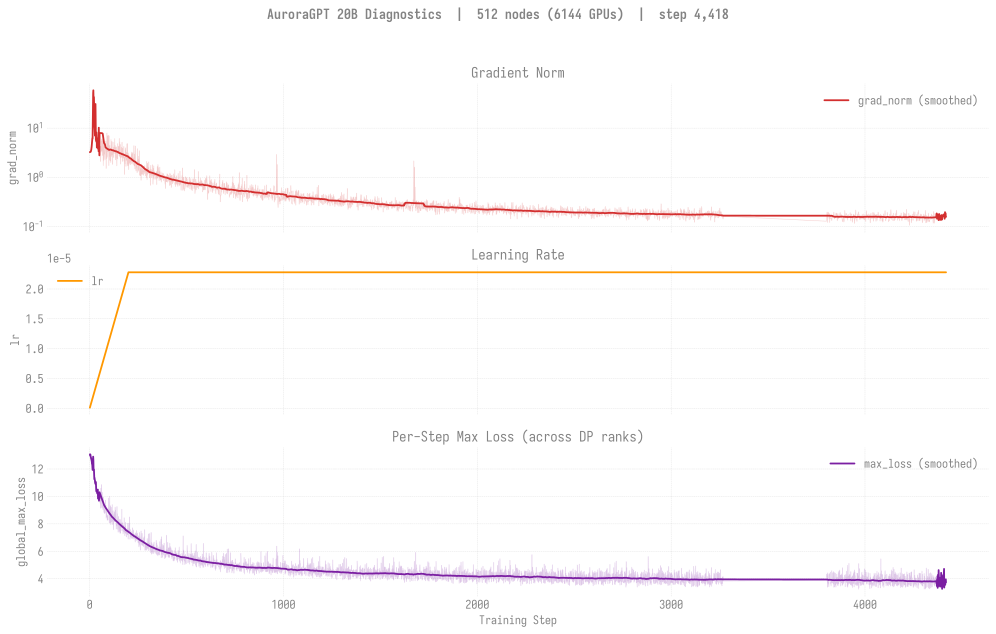
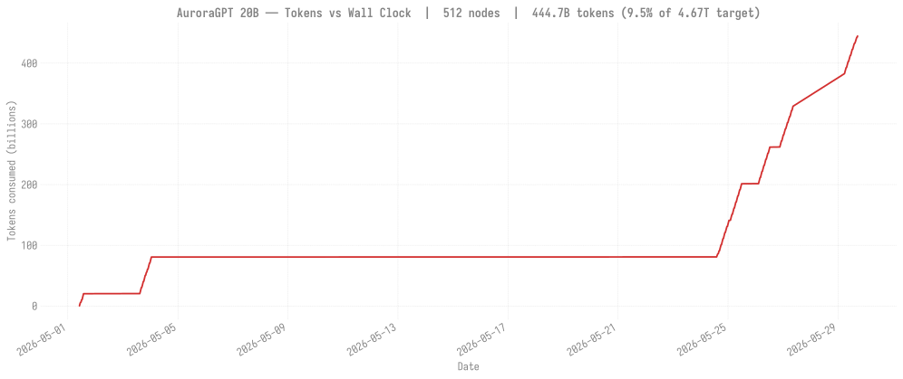
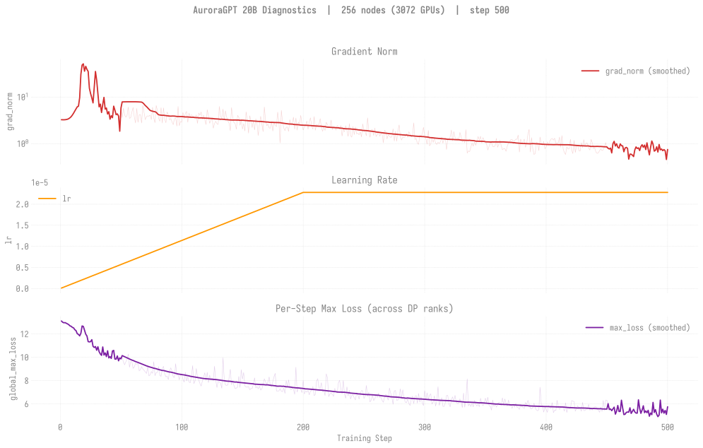
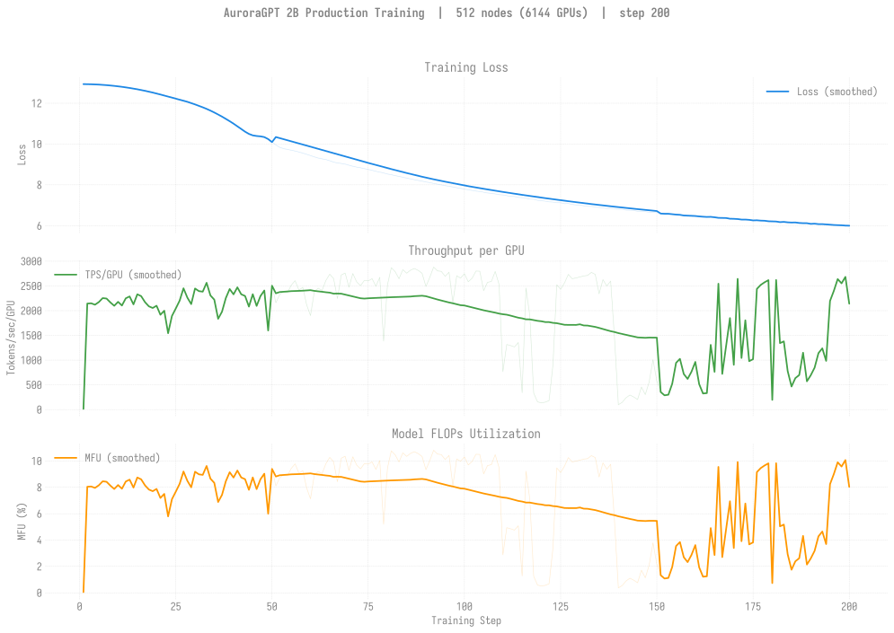

# Production Training — Dense (agpt) Models

> Last updated: 2026-07-01
>
> **Restarted in v2 clones on 2026-04-30** after the bf16-master
> RMSNorm-freeze regression. All current production training is on
> `dtype=float32` master weights. Historical bf16-tainted runs:
> [`historical/v1-bf16/`](historical/v1-bf16/README.md).

## All chains overlaid (every dense agpt trajectory)

Cross-model overview: 2B (MDS reference + TT v2 256N + TT v2 512N) and
20B (TT v2 256N + TT v2 512N) plotted against tokens consumed
(log-scale), three panels: training loss / TPS-per-GPU / MFU. Refreshed
via `scripts/update_all_charts.sh`. Per-model overlays:
[2b/](2b/README.md#all-2b-chains-overlaid), [20b/](20b/README.md#all-20b-chains-overlaid). 80B not yet
included (no overlay until production ckpts land — see
[80b/](80b/README.md#all-80b-chains-overlaid)).

## Headline (2026-07-01)

- **🏁 2B 256N async chain COMPLETE — step 92,859 = 4.674T tokens
  (100.0%** of target). cont12 [8558531](2b/n256/README.md) finished
  clean exit-0 (~10.2h) 2026-06-29 03:03, final loss **2.652**. The full
  v2 2B base pre-training run is done; cont13 [8558532](2b/n256/README.md)
  Q behind it but <1 ckpt-interval to target (no-op). **Next: eval the
  final ckpt (blocked on PM maintenance).**
- **80B launch attempted (2026-07-01) — 2048N crashed at init; 512N + 1024N
  running.** SophiaG @ 1e-6, **constant-LR** (for CPT), validator on, at
  **512N+1024N+2048N** ([8574385](80b/README.md)/8574386/8574387 + 3 conts).
  All 6 queued through the 06-29 PM (no head ran pre-PM); post-PM the **2048N
  head (8574387) started first** (~15:00 UTC, 5th attempt after 4 exec-server
  rejects) but **SIGSEGV'd in `set_determinism`** at 24,864 ranks (`F`, rc=143)
  — the documented init-crash class, now confirmed for 80B at 2048N. 2048N cont
  `qhold`'d. **512N (proven) + 1024N (untested 80B data point) are live** and
  will bracket where the 80B init ceiling sits. Also: auto-retry misclassified
  the SIGSEGV (rc=143) as walltime and skipped its retries. The old AdamW
  step-2 NaN was a production-batch LR problem (LR-finder: AdamW NaN-cliff at
  GBS=6144; mano ~3e-6 / sophiag ~1e-6 train clean). **TEAM DECISION OPEN:
  SophiaG vs mano** for the base. Plan + launch log:
  [80B SophiaG launch](../../experiments/agpt/aurora/20260628-80b-sophiag-constant-lr-512-1024-2048.md).
- **20B 256N** advanced to step **2,100** (105.7B, 2.3%, loss 2.85,
  ~21.8% MFU); clean exit at the PM boundary, cont1
  [8558549](20b/n256/README.md) Q to resume post-maintenance.
- **2B 512N sync chain** still stalled at step **30,400** (loss 2.71,
  ~3.06T, 65.5%) — no advance since 2026-05-30; cont10 [8521631](2b/n512/README.md) Q.
- **20B 512N sync chain** at step **4,400** (loss 2.51, ~442.9B, 9.5%) —
  the step-4,500 dir is a mid-save placeholder (no `.metadata`), so the
  last finalized ckpt is step-4,400; cont [8521632](20b/n512/README.md) Q.

## Headline (2026-06-10)

- **🏁 2B 256N async chain advanced to step 74,300** (loss ~2.67, **~3.740T tokens, 80.1%** of target — first time past 80%). [8521626](2b/n256/README.md#log-8521626) cont9 ran 2026-06-10 06:35 → 18:37 (12h walltime exit clean) and **persisted +44 ckpts** (step-70,000 → step-74,300). **+4,400 step advance since 2026-06-06.** Chain now idle pending the next 256N slot for 8521630 cont10.
- **2B 512N sync chain** still stalled at step **30,500** (loss **2.71**, ~3.07T tokens, **65.7%** of target) — no advance since 2026-05-30. Cont10 [8521631](2b/n512/README.md) still Q in `small`; cont11 [8534294](2b/n512/README.md) H'd behind it.
- **🏁 20B 512N sync chain ADVANCED to step 4,500** (loss ~2.51, ~453.0B tokens, **9.7%** of target). [8521628](20b/n512/README.md#log-8521628) ran 2026-06-10 01:27 → 05:32 (4h04m, exit 143) and **persisted the first new ckpt in 12 days** (since 2026-05-29 step-4,400). The renamed `step-4500.bak-empty-20260606-170503/` placeholder no longer blocked the save. After step-4,500 the failover wrapper hit the documented intermittent `MemoryError: std::bad_alloc` at `set_determinism` rank 3,195 (same mode as 8466848, 8514610) and exhausted 3 retries. Cont12 (8521632) Q'd to resume from step-4,500; cont13 (8534295) H'd behind it.
- **🏁 20B 512N still leads 2B 256N per token** (step-4,500 ARC-Easy 0.6641, HellaSwag `acc_norm` 0.6346 with only ~453B tokens, vs 2B 256N at step-69,900 with 3.52T tokens scoring HellaSwag 0.5552 — 20B's per-token efficiency advantage is dramatic at this token count).
- **80B 4N production stack validated end-to-end on Aurora on 2026-06-08** — [interactive smoke r7](80b/n4/README.md) hit step-10 sync ckpt save cleanly (904 GB, 48 distcp shards, .metadata — matches Sunspot 12468197 reference exactly). **256N attempt 8530891** trained but **loss went NaN at step 2** — open hypotheses on bf16 overflow / TP=2 loss-reduction / fp32 second-moment. LR=1e-7 retry (8531721) hit `std::bad_alloc` at model construction. **256N validation still pending.**
- **🏁 Eval backfill COMPLETE** — added piqa, openbookqa, boolq to the default 7-task set. Final state: 2B 512N **27/27 ✓**, 2B 256N **32 fresh 7-task + 23 4-task-only (`no DCP`) = 55/55 ✓** (early ckpts permanently 4-task-only since their DCPs were destroyed by 2026-05-25 keep-latest-k bug), **20B 512N 36/36 ✓**. All eval tables + the `eval_overview.svg` chart now show complete 7-task data across every production trajectory.

## Single canonical chain per model

Per-model production training is consolidated on **one** chain to
avoid divergent trajectories. Other queued jobs at different node
counts share the model but write to *different* checkpoint dirs (keyed
on `gbs`), so they're independent trajectories — they're not joining
the canonical chain. Treat them as scaling experiments, not as
extensions.

### 2B canonical chain (512N, sync-mode)

| Job ID | Date | Walltime | Steps | Loss | Status |
|--------|------|---------:|------:|-----:|--------|
| [`8460301`](2b/n512/README.md#log-8460301) | 2026-05-01 | 6h | 1–1387 | 12.65 → 3.59 | Done (NODE_FAIL @ end) |
| [`8463626`](2b/n512/README.md#log-8463626) | 2026-05-03 | 12h | 1300–5073 | 3.59 → 2.97 | Done (NODE_FAIL @ end). 50 ckpts saved. |
| [`8463627`](2b/n512/README.md#log-8463627) | 2026-05-07 | 12h | 5000–6955 | 2.97 → 2.90 | Done (walltime). |
| [`8466847`](2b/n512/README.md#log-8466847) | 2026-05-11 | 12h | 6900–13279 | 2.90 → 2.79 | Done (walltime). step-13200 ckpt saved. |
| [`8479988`](2b/n512/README.md#log-8479988) | 2026-05-11 | 12h | 13200+ | — | Done. |
| `8505121` | 2026-05-23 | 12h | — | — | **Failed** (pre-fix, async-cascade regression). |
| [`8505176`](2b/n512/README.md#log-8505176) | 2026-05-23 | 12h | — | — | **Failed** (async-cascade regression). |
| [`8506215`](2b/n512/README.md#log-8506215) | 2026-05-24 | 12h | — | — | **Failed** (preflight bug). |
| **[`8506221`](2b/n512/README.md#log-8506221)** | 2026-05-24 | 12h | 13200–~14000 | 2.79 → ~2.77 | **🏁 sync-mode breakthrough** (CHECKPOINT_ASYNC_MODE=disabled). +21 ckpts. |
| [`8507196`](2b/n512/README.md#log-8507196) | 2026-05-25 | 12h | ~14000–~17500 | ~2.77 → ~2.75 | Aurora pals-RPC launcher infra fail mid-run (exit 127), +76 ckpts still persisted. See [pals-RPC writeup](../../experiments/agpt/aurora/). |
| **[`8507199`](2b/n512/README.md#log-8507199)** | 2026-05-25 | 12h | ~17500–~22500 | ~2.75 → ~2.73 | Sync-mode, +50 ckpts. |
| **[`8508753`](2b/n512/README.md#log-8508753)** | 2026-05-26 → 2026-05-27 | 12h | ~22500–**30,484** | ~2.73 → **2.71** | Done (walltime exit -29). +80 ckpts step-22600..step-30400 persisted. |
| `8509042` | 2026-05-27 | 12h | — | — | **Crashed** in `set_determinism std::bad_alloc` at 6,144 ranks (documented intermittent). |
| `8513545` | 2026-05-28 | 12h | (cont.) | — | **Queued** then ran briefly; handed off down the chain. |
| (chain stalled in queue 2026-05-30 → 2026-06-06) | — | — | — | — | — |
| [`8521627`](2b/n512/README.md#log-8521627) | 2026-06-07 | 12h | — | — | **Failed** @ 8 min — 1 of 522 nodes failed yeet-env rsync (`x4112c1s7b0n0` Connection reset). Mitigation: ezpz [PR #160](https://github.com/saforem2/ezpz/pull/160). |
| `8521631` | 2026-06-07 | 12h | (cont10) | — | **Queued** in `small` (`afterany:8521627`). |

**Latest cumulative**: step **30,500** · loss **2.71** · **~3.07T tokens** (65.7% of 4.67T target).

### 2B per-token comparator chain (256N, async-mode)

| Job ID | Date | Walltime | Steps | Loss | Status |
|--------|------|---------:|------:|-----:|--------|
| `8505118` / `8505119` | 2026-05-23 | 12h | (post-fix dispatches) | — | Done. |
| **[`8505175`](2b/n256/README.md#log-8505175)** | 2026-05-23 | 12h | (cont.) | — | Done. +57 ckpts. |
| **[`8505252`](2b/n256/README.md#log-8505252)** | 2026-05-24 | 12h | (cont.) | — | Done. +57 ckpts. |
| **[`8507195`](2b/n256/README.md#log-8507195)** | 2026-05-25 | 12h | (cont.) | — | Done. +57 ckpts. |
| **[`8507198`](2b/n256/README.md#log-8507198)** | 2026-05-26 | 12h | (cont.) | — | Done. +57 ckpts. |
| **[`8508020`](2b/n256/README.md#log-8508020)** | 2026-05-26 → 2026-05-27 | 12h | ~48,300–**~52,500** | ~2.69 → **2.68** | Done (walltime exit 2026-05-27 21:33). |
| [`8508977`](2b/n256/README.md#log-8508977) | 2026-05-27 | 12h | (cont.) | — | **Failed** (Aurora pals-RPC infra exit 127, not failover-recoverable). |
| [`8513544`](2b/n256/README.md#log-8513544) | 2026-05-28 | 12h | ~52,500–~59,700 | ~2.68 → ~2.67 | Done (walltime). +71 ckpts. |
| [`8516364`](2b/n256/README.md#log-8516364) | 2026-05-30 | 12h | ~59,700–~64,900 | ~2.67 → ~2.67 | Done (walltime). |
| [`8516365`](2b/n256/README.md#log-8516365) | 2026-06-01 | 12h | — | — | **Failed** (pals-RPC init fail, no ckpts). |
| **[`8519833`](2b/n256/README.md#log-8519833)** | 2026-06-06 | 12h | 69,300 → **69,900** | ~2.67 | Done (walltime exit -29). +6 ckpts. |
| **[`8521626`](2b/n256/README.md#log-8521626)** | 2026-06-10 | 12h | 69,900 → **74,300** | ~2.67 | **🏁 Done (walltime exit 18:37).** +44 ckpts persisted (step-70,000 → step-74,300). |
| `8521630` | 2026-06-06 | 12h | (cont10) | — | Held (`afterany:8521626`). |
| `8534293` | 2026-06-10 | 12h | (cont11) | — | Held (`afterany:8521630`). |

**Latest cumulative (256N)**: step **74,300** · loss **2.67** · **~3.740T tokens** (80.1% of 4.67T target — past the 80% mark). Step-69900 evals:
HSn **0.5552**, ARC-E **0.5939**, ARC-C **0.3294**, **Wino 0.5627 (best yet)**. Per-task plateau on HSn/ARC since step-64K
(~+1pp swings); Wino has the clearest monotonic trend.

### 20B canonical chain (512N, sync-mode)

| Job ID | Date | Walltime | Steps | Loss | Status |
|--------|------|---------:|------:|-----:|--------|
| [`8460302`](20b/n512/README.md#log-8460302) | 2026-05-01 | 6h | 1–300 | 12.94 → 4.95 | Done (NODE_FAIL @ end). 3 ckpts saved. |
| [`8463628`](20b/n512/README.md#log-8463628) | 2026-05-03 | 12h | 200–863 | 5.62 → 3.46 | Done (walltime hit). step-100..800 ckpts saved. |
| [`8466848`](20b/n512/README.md#log-8466848) | 2026-05-07 | — | — | — | **Crashed @ startup** (127s) — `set_determinism` `std::bad_alloc`. Intermittent. |
| [`8479579`](20b/n512/README.md#log-8479579) | 2026-05-11 | 12h | 800–803 | 3.46 → 3.53 | Killed by qdel @ 5h56m — silent hang after step 803. See [hang report](../../experiments/agpt/aurora/20260511-20b-n512-hang-8479579.md). |
| [`8479580`](20b/n512/README.md#log-8479580) | 2026-05-11 | 12h | 800+ | — | Done. |
| `8505124` | 2026-05-23 | 12h | — | — | **Failed** (pre-fix, async-cascade regression). |
| `8505256` | 2026-05-24 | 12h | — | — | qdel-dup. |
| **[`8505258`](20b/n512/README.md#log-8505258)** | 2026-05-24 | 12h | (cont.) | — | **🏁 sync-mode breakthrough**. +6 ckpts. |
| **[`8505259`](20b/n512/README.md#log-8505259)** | 2026-05-24 | 12h | (cont.) | — | Sync-mode, +6 ckpts. |
| **[`8507197`](20b/n512/README.md#log-8507197)** | 2026-05-25 | 12h | (cont.) | — | Sync-mode, +6 ckpts. |
| **[`8507200`](20b/n512/README.md#log-8507200)** | 2026-05-26 | 12h | ~2700–**3,270** | ~2.70 → **2.65** | Done (12h walltime end at 2026-05-27 03:43). +6 ckpts. |
| **[`8508214`](20b/n512/README.md#log-8508214)** | 2026-05-28 | 12h | 3,270–~3,800 | 2.65 → **2.60** | Done (walltime). Sync-mode, ~5 ckpts. |
| **[`8509393`](20b/n512/README.md#log-8509393)** | 2026-05-29 | 12h | 3,800–**4,419** | 2.60 → **2.51** | Done (walltime exit at 12:01). +6 ckpts (step-3,900..step-4,400). |
| [`8513546`](20b/n512/README.md#log-8513546) | 2026-05-29 | 12h | (cont.) | — | Handed off down chain. |
| [`8514610`](20b/n512/README.md#log-8514610) | 2026-05-29 | 12h | (cont.) | — | Handed off. |
| [`8516701`](20b/n512/README.md#log-8516701) | 2026-06-02 | — | 4,400+ | — | **Killed mid-save 22:38** — `step-4500/` placeholder dir created (4 KB, 0 .distcp shards). Renamed to `.bak-empty-20260606-170503/` on 2026-06-06 to unblock resume. |
| [`8521624`](20b/n512/README.md#log-8521624) | 2026-06-04 | 5h | — | — | **Failed** (Exit 143 mid-run). |
| [`8521625`](20b/n512/README.md#log-8521625) | 2026-06-06 | 11h | 4,400 → 4,600 (in-RAM) | 2.51 → 2.50 | **Trained to step 4,600 in-RAM but step-4500 placeholder blocked persistence; no new ckpt past step-4,400.** |
| (chain stalled in queue 2026-06-06 → 2026-06-10) | — | — | — | — | — |
| **[`8521628`](20b/n512/README.md#log-8521628)** | 2026-06-10 | 4h | 4,400 → **4,500** | ~2.51 | **🏁 +1 ckpt persisted (first new in 12 days).** Ran 01:27 → 05:32, exit 143. After step-4,500 save, failover wrapper hit intermittent `set_determinism std::bad_alloc` and exhausted 3 retries. |
| `8521632` | 2026-06-10 | 12h | (cont12) | — | **Queued** (`afterany:8521628`). |
| `8534295` | 2026-06-10 | 12h | (cont13) | — | Held (`afterany:8521632`). |

**Latest cumulative**: step **4,500** · loss **~2.51** · **~453.0B tokens** (9.7% of 4.67T target).

**🏁 Eval headline (35+ ckpts, step-900 → step-4,400)**: ARC-Easy `acc` 0.463 → **0.664** (+20pp), HellaSwag `acc_norm`
0.296 → **0.635** (+34pp), ARC-C `acc_norm` 0.224 → **0.380** (+16pp), Winogrande 0.493 → 0.586 (+9pp).
**20B 512N sync now beats 2B 256N async on every benchmark per token.** Monotonic across 35+ consecutive ckpts. See
[`evals/agpt/20b/`](../../evals/agpt/20b/README.md).

## Other jobs (independent ckpt trajectories)

| Job ID | Date | Model | Nodes | Walltime | Status | Notes |
|--------|------|-------|------:|---------:|--------|-------|
| [`8463182`](2b/n1024/README.md#log-8463182) | 2026-05-04 | 2B | 1024 | 12h | **Crashed @ startup (211s, std::bad_alloc)** | Fresh start, separate ckpt dir (`n1024-gbs24576`) |
| [`8463183`](20b/n1024/README.md#log-8463183) | 2026-05-04 | 20B | 1024 | 12h | **Crashed @ startup (211s, SIGSEGV)** | Fresh start, separate ckpt dir (`n1024-gbs24576`) |
| [`8463659`](20b/n256/README.md#log-8463659) | 2026-05-04 | 20B | 256 | 12h | **NODE_FAIL** after step 364 (loss 4.61) | Fresh start, separate ckpt dir (`n256-gbs6144`). step-300 ckpt saved. |
| [`8470100`](2b/n256/README.md#log-8470100) | 2026-05-08 | 2B  | 256 | 12h | Done | Resumed from step-2000 → step ~10000 in 12h. |
| [`8470101`](2b/n256/README.md#log-8470101) | 2026-05-11 | 2B  | 256 | 12h | Done (12h00m20s; 12,889/2.81) | step **12,889**, loss **2.81** — caught up to canonical 512N per-step. |
| [`8470102`](20b/n256/README.md#log-8470102) | 2026-05-08 | 20B | 256 | 12h | **Crashed** (gloo TCP timeout @ 3h15m) | Resumed step-300 → step-400 saved before crash |
| [`8470103`](20b/n256/README.md#log-8470103) | 2026-05-08 | 20B | 256 | 12h | **Crashed** (gloo TCP timeout @ 2h59m) | Chained continuation, also bad-node |
| [`8467141`](2b/n512/README.md#log-8467141) | 2026-05-07 | 2B  | 512 | 12h | Done | √2-LR fork (LR=3.22e-5) chain1, separate ckpt dir |
| [`8467142`](2b/n512/README.md#log-8467142) | 2026-05-11 | 2B  | 512 | 12h | Done | √2-LR fork chain2 |
| [`8479581`](20b/n256/README.md#log-8479581) | 2026-05-11 | 20B | 256 | 12h | **Crashed** (gloo TCP timeout @ 3h39m) — step-500 ckpt saved | step **500**, loss **4.08** |
| [`8479582`](20b/n256/README.md#log-8479582) | 2026-05-11 | 20B | 256 | 12h | Done | resumed from step-500 |
| **`8505255`** | 2026-05-24 | 20B | 256 | 12h | Done (12h walltime end on 2026-05-26 20:35) — step **1,125** | 256N is per-token comparator; canonical 20B chain is 512N. **No chain continuation queued.** |

### 80B 256N production status (2026-05-27)

**Still completely blocked.** 11+ dispatches since 2026-05-11; zero ckpts persisted. Latest dispatch `8505222`
(2026-05-24) failed after **5 wrapper retries** — every attempt hit SIGSEGV on a different bad node, 3 of them from
the x4101c5/c6 rack cluster. Canonical writeup:
[`20260524-80b-256n-sigsegv-cascade-8505222.md`](../../experiments/agpt/aurora/20260524-80b-256n-sigsegv-cascade-8505222.md).
Distinct from the 80B 8N smoke (8505326), which surfaced a separate `blendcorpus` EOFError race documented in
[`blendcorpus-eoferror-race.md`](../../guides/known-bugs/blendcorpus-eoferror-race.md). The 4N smoke 12466025
(2026-05-05) remains the only successful 80B training to date (20 steps). See [`80b/`](80b/README.md) for full
status + next steps.

## Reference: pre-torchtitan MDS run (2B SophiaG, ~7.77T tokens)

The Megatron-DeepSpeed AuroraGPT-2B SophiaG continuation predates the
torchtitan migration but is the natural "what does a healthy 2B
SophiaG trajectory look like?" baseline. Training curves (loss /
grad_norm / TFLOPS / TPS) and eval scores live at:

- [`production/agpt/2b-mds/`](2b-mds/README.md) — training curves
- [`evals/agpt/2b-mds/`](../../evals/agpt/2b-mds/README.md) — lm-eval scores

## Historical v1 (bf16-tainted) runs

All pre-2026-04-30 production runs used `--training.dtype=bfloat16`,
which silently froze RMSNorm.weight at its 1.0 init. v2 is the clean
restart on `--training.dtype=float32`. v1 archive (training curves,
v1-vs-v2 overlays, job tables, log paths):
[`historical/v1-bf16/`](historical/v1-bf16/README.md). Root-cause
diagnosis: [`guides/training-dtype-bf16-norm-freeze.md`](../../guides/training-dtype-bf16-norm-freeze.md).

## Canonical chain dashboards (v2)

### 2B 512N — Loss / Throughput / MFU

### 2B 512N — Diagnostics

### 2B 512N — Tokens vs Wall Clock

### 20B 512N — Loss / Throughput / MFU

### 20B 512N — Diagnostics

### 20B 512N — Tokens vs Wall Clock

<strong>2B 256N v2 (active async chain at step 49,900+) — click to expand</strong>

Separate ckpt trajectory at 256 nodes (`gbs6144`, independent from
the canonical 512N `gbs12288` chain). Now the **per-token comparator** for
the 20B 512N sync chain. Running async-mode at step **49,900+, loss 2.68,
~2.50T tokens (53.5% of target)**. Eval plateau: ARC-Easy ~0.645,
HellaSwag acc_norm ~0.547 — now beaten by 20B 512N sync on every benchmark
per token.

<strong>20B 256N v2 (one-shot, ended at step 1,125) — click to expand</strong>

Separate ckpt trajectory at 256 nodes (`gbs6144`, independent from
the canonical 512N `gbs12288` chain). History: 8463659 (NODE_FAIL after
step 364), 8470102 + 8470103 (gloo TCP timeouts ~3h), 8479581 + 8479582,
and most recently **8505255** which ran out the 12h walltime ending
2026-05-26 20:35 at step **1,125**. **No chain continuation queued** —
256N is the per-token comparator; the canonical 20B chain is 512N.

<strong>2B 512N √2-LR fork (LR=3.22e-5, 200 steps) — click to expand</strong>

Experimental fork that scaled LR by √2 (3.22e-5 vs canonical
2.28e-5) at the doubled GBS=12,288 — tests whether closing the
per-token gap to 256N is achievable with LR scaling. Two short runs:
8467141 (4h) and 8467142 (1h53m). Writes to its own ckpt dir
`gbs12288-lr3.22e-5`.

