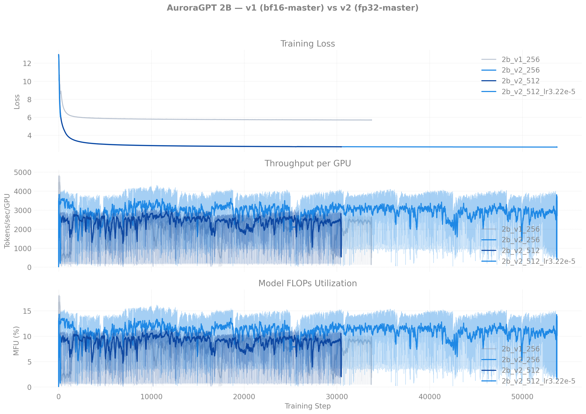
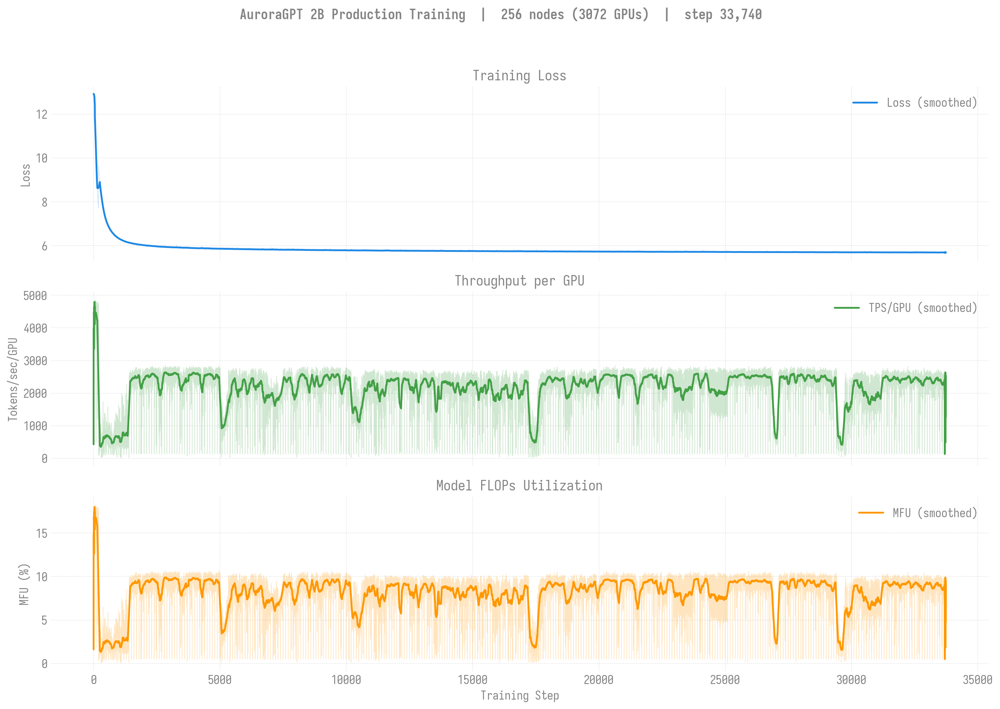
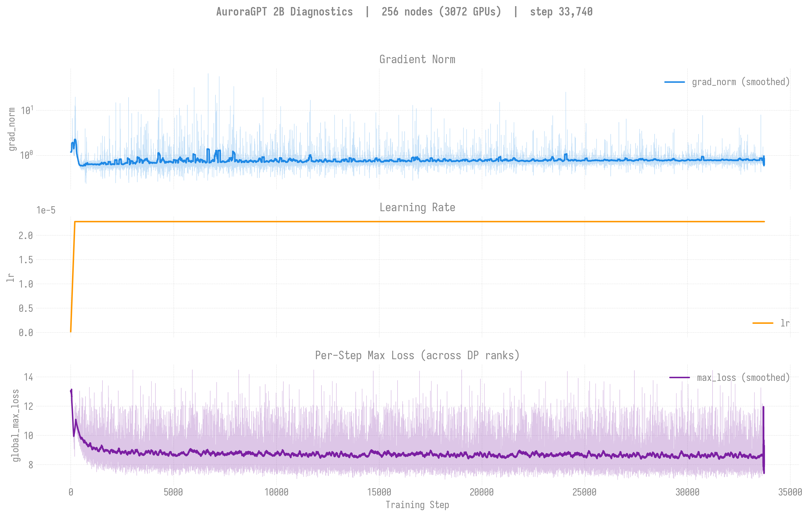
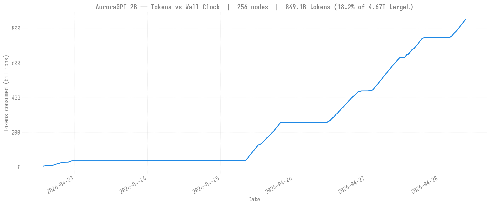
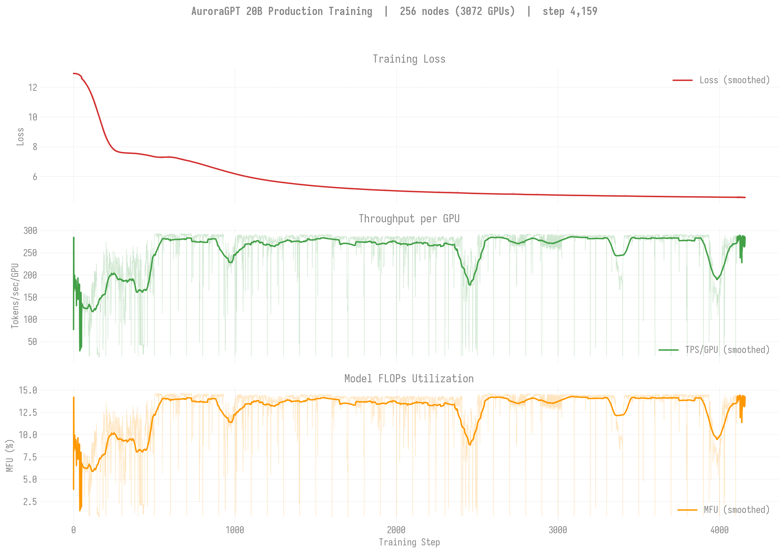
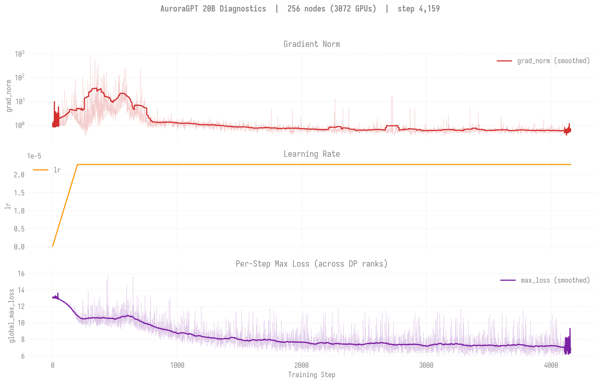
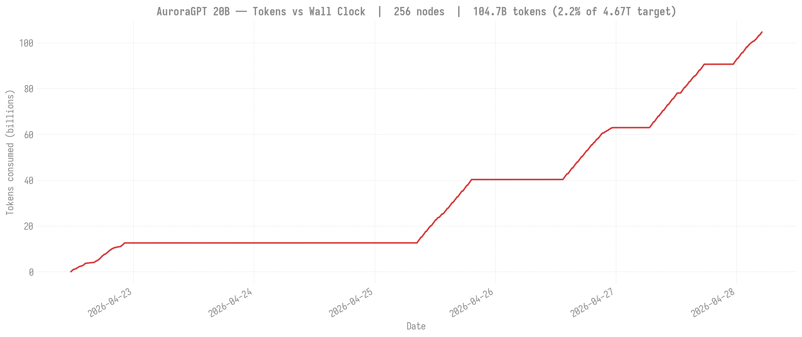

# Historical: AuroraGPT v1 (bf16-master, tainted) training runs

> **Status: archived.** All v1 runs were terminated on 2026-04-30 after
> the bf16-master RMSNorm-freeze bug was diagnosed. Current production
> lives at [`../../README.md`](../../README.md).

## Why v1 was killed

All pre-2026-04-30 production runs (2B / 20B / 80B at every node count)
used `--training.dtype=bfloat16` for the master parameter copy. The
bf16 ULP at 1.0 is ~7.8e-3, and per-step optimizer updates to
RMSNorm.weight are ~1.6e-5 — every update rounds to zero. Empirically:
**every v1 RMSNorm.weight stayed at exactly 1.0 for the entire run.**
Training/loss curves descend because attention/FFN weights are
unfrozen, but the model has no trainable normalization. Eval scores
hovered at the noise floor across the whole run.

Full diagnosis + side-by-side weight evidence:
[`docs/guides/training-dtype-bf16-norm-freeze.md`](../../../../guides/training-dtype-bf16-norm-freeze.md).

The fix flipped the default to `--training.dtype=float32`. All
production was restarted from scratch in v2 clones on 2026-04-30.

## v1 vs v2 overlays

Same training-loss axes, both trajectories overlaid. v1 (gray, bf16)
descends — attention/FFN are unfrozen — but the divergence shows up at
*eval* time, where v1 stays in the noise band and v2 lifts cleanly.

### 2B



### 20B


Regenerate via:

```bash
python3 torchtitan/experiments/ezpz/utils/plot_production_wandb.py --overlay 2b
python3 torchtitan/experiments/ezpz/utils/plot_production_wandb.py --overlay 20b
```

---

## v1 — 2B @ 256N — SophiaG LR=2.28e-5 (bf16 master, BROKEN)

| Field | Value |
|-------|-------|
| Model | agpt_2b (1.99B params) |
| Submit script | [`submit/aurora/submit_agpt_2b.sh`](../../../../../submit/aurora/submit_agpt_2b.sh) (v1 torch 2.10 layout) |
| Nodes / GPUs | 256 / 3,072 |
| Parallelism | TP=1, FSDP=3072 |
| Compile | on |
| Optimizer | SophiaG, LR=2.28e-5 |
| GBS | 3,072 (LBS=1) |
| Total steps (target) | 185,718 |
| Total tokens (target) | 4.67T |
| Seq len | 8,192 |
| Checkpoint dir | `outputs/checkpoints/agpt-2b-sophiag-olmo-mix-1124-n256-gbs3072` |
| Checkpoint interval | 100 steps |

### Loss / Throughput / MFU



### Diagnostics (grad_norm / lr / max_loss)



### Tokens vs Wall Clock



### Progress

| Job ID | Date | Steps | Loss (start → end) | TPS/GPU | MFU | Memory | Status |
|--------|------|-------|---------------------|---------|-----|--------|--------|
| [`8444122`](#log-8444122) | 2026-04-22 | 1–1431 | 12.94 → 6.13 | 489 | 1.8% | 47.12 GiB | Complete (walltime) |
| [`8446337`](#log-8446337) | 2026-04-25 | 1401–9876 | 6.13 → 5.78 | 1,794 | 6.7% | — | Complete (walltime) |
| [`8446338`](#log-8446338) | 2026-04-26 | 9876–17424 | 5.78 → 5.73 | 2,280 | 8.6% | 47.02 GiB | Complete (walltime) |
| [`8446339`](#log-8446339) | 2026-04-27 | 17401–17518+ | 5.73 → 5.73 | 761 | 2.9% | 47.02 GiB | Walltime |

**W&B:** [pjanidnw](https://wandb.ai/aurora_gpt/torchtitan.ezpz.train/runs/pjanidnw) (8444122), [4u9w23p9](https://wandb.ai/aurora_gpt/torchtitan.ezpz.train/runs/4u9w23p9) (8446337)

**Latest checkpoint:** step-17400 · **Tokens consumed:** 17,518 × 3,072 × 8,192 = **441.1B** (9.4% of v1 target)

**Note:** TPS degraded significantly (2,400 → 40–700) during 8446338/8446339 due to
concurrent 512N yeet-env copies saturating the flare filesystem.

### Logs

| Job ID | Path |
|--------|------|
| <a id="log-8444122"></a>`8444122` | `/lus/flare/projects/AuroraGPT/foremans/projects/saforem2/torchtitan-ezpz/agpt-2b-sophiag-n256.o8444122` |
| <a id="log-8446337"></a>`8446337` | `/lus/flare/projects/AuroraGPT/foremans/projects/saforem2/torchtitan-ezpz/agpt-2b-sophiag-n256.o8446337` |
| <a id="log-8446338"></a>`8446338` | `/lus/flare/projects/AuroraGPT/foremans/projects/saforem2/torchtitan-ezpz/agpt-2b-sophiag-n256.o8446338` |
| <a id="log-8446339"></a>`8446339` | `/lus/flare/projects/AuroraGPT/foremans/projects/saforem2/torchtitan-ezpz/agpt-2b-sophiag-n256.o8446339` |

---

## v1 — 2B @ 512N — SophiaG LR=2.28e-5 (bf16 master, BROKEN)

| Field | Value |
|-------|-------|
| Model | agpt_2b (1.99B params) |
| Submit script | [`submit/aurora/submit_agpt_2b_n512.sh`](../../../../../submit/aurora/submit_agpt_2b_n512.sh) (v1 torch 2.10 layout) |
| Nodes / GPUs | 512 / 6,144 |
| Parallelism | TP=1, FSDP=6144 |
| Compile | **off** (OOM at 512N) |
| Optimizer | SophiaG, LR=2.28e-5 |
| GBS | 6,144 (LBS=1) |
| Total steps (target) | 92,859 |
| Total tokens (target) | 4.67T |
| Checkpoint dir | `outputs/checkpoints/agpt-2b-sophiag-olmo-mix-1124-n512-gbs6144` |

### Progress

| Job ID | Date | Steps | Loss | TPS/GPU | MFU | Memory | Status |
|--------|------|-------|------|---------|-----|--------|--------|
| [`8443818`](#log-8443818) | 2026-04-22 | 0 | — | — | — | — | OOM (compile) |
| [`8446349`](#log-8446349) | 2026-04-25 | 0 | — | — | — | — | Segfault (signal 11) |
| [`8446350`](#log-8446350) | 2026-04-26 | — | — | — | — | — | Queued |

(No v1 512N training-curve figures were ever generated — the run never
got past the first step.)

### Logs

| Job ID | Path |
|--------|------|
| <a id="log-8443818"></a>`8443818` | `/lus/flare/projects/AuroraGPT/foremans/projects/saforem2/torchtitan-ezpz/agpt-2b-sophiag-n512.o8443818` |
| <a id="log-8446349"></a>`8446349` | `/lus/flare/projects/AuroraGPT/foremans/projects/saforem2/torchtitan-ezpz/agpt-2b-sophiag-n512.o8446349` |
| <a id="log-8446350"></a>`8446350` | `/lus/flare/projects/AuroraGPT/foremans/projects/saforem2/torchtitan-ezpz/agpt-2b-sophiag-n512.o8446350` |

---

## v1 — 20B @ 256N — SophiaG LR=2.28e-5 (bf16 master, BROKEN)

| Field | Value |
|-------|-------|
| Model | agpt_20b (20.7B params) |
| Submit script | [`submit/aurora/submit_agpt_20b.sh`](../../../../../submit/aurora/submit_agpt_20b.sh) (v1 torch 2.10 layout) |
| Nodes / GPUs | 256 / 3,072 |
| Parallelism | TP=1, FSDP=3072 |
| Compile | on |
| Optimizer | SophiaG, LR=2.28e-5 |
| GBS | 3,072 (LBS=1) |
| Total steps (target) | 185,718 |
| Total tokens (target) | 4.67T |
| Checkpoint dir | `outputs/checkpoints/agpt-20b-sophiag-olmo-mix-1124-n256-gbs3072` |

### Loss / Throughput / MFU



### Diagnostics (grad_norm / lr / max_loss)



### Tokens vs Wall Clock



### Progress

| Job ID | Date | Steps | Loss (start → end) | TPS/GPU | MFU | Memory | Status |
|--------|------|-------|---------------------|---------|-----|--------|--------|
| [`8443212`](#log-8443212) | 2026-04-21 | 1–100 | 12.93 → 11.84 | 280 | 14.0% | 40.95 GiB | Killed (qdel) |
| [`8444123`](#log-8444123) | 2026-04-22 | 100–581 | 11.84 → 7.35 | 248 | 12.4% | 43.95 GiB | Complete (walltime) |
| [`8446340`](#log-8446340) | 2026-04-25 | 501–1614 | 7.33 → 5.25 | 283 | 14.1% | — | Complete (walltime) |
| [`8446341`](#log-8446341) | 2026-04-26 | 1614–? | — | — | — | — | Complete |
| [`8446342`](#log-8446342) | 2026-04-26 | 1601–2562 | 5.26 → 4.83 | 280 | 14.0% | 44.38 GiB | Complete (walltime) |
| [`8451749`](#log-8451749) | 2026-04-27 | cont. | — | — | — | — | Queued |

**W&B:** [q9oq5huj](https://wandb.ai/aurora_gpt/torchtitan.ezpz.train/runs/q9oq5huj) (8443212), [pnkaurba](https://wandb.ai/aurora_gpt/torchtitan.ezpz.train/runs/pnkaurba) (8444123), [lrlv3xsc](https://wandb.ai/aurora_gpt/torchtitan.ezpz.train/runs/lrlv3xsc) (8446340)

**Latest checkpoint:** step-2500 · **Tokens consumed:** 2,562 × 3,072 × 8,192 = **64.5B** (1.4% of v1 target)

**Note:** TPS degraded to ~30–100 during final 2h due to concurrent 512N yeet-env
copies saturating the flare filesystem. Effective training time was ~8h of the 12h walltime.

### Logs

| Job ID | Path |
|--------|------|
| <a id="log-8443212"></a>`8443212` | `/lus/flare/projects/AuroraGPT/foremans/projects/saforem2/torchtitan-ezpz/agpt-20b-sophiag-n256.o8443212` |
| <a id="log-8444123"></a>`8444123` | `/lus/flare/projects/AuroraGPT/foremans/projects/saforem2/torchtitan-ezpz/agpt-20b-sophiag-n256.o8444123` |
| <a id="log-8446340"></a>`8446340` | `/lus/flare/projects/AuroraGPT/foremans/projects/saforem2/torchtitan-ezpz/agpt-20b-sophiag-n256.o8446340` |
| <a id="log-8446341"></a>`8446341` | `/lus/flare/projects/AuroraGPT/foremans/projects/saforem2/torchtitan-ezpz/agpt-20b-sophiag-n256.o8446341` |
| <a id="log-8446342"></a>`8446342` | `/lus/flare/projects/AuroraGPT/foremans/projects/saforem2/torchtitan-ezpz/agpt-20b-sophiag-n256.o8446342` |
| <a id="log-8451749"></a>`8451749` | `/lus/flare/projects/AuroraGPT/foremans/projects/saforem2/torchtitan-ezpz/agpt-20b-sophiag-olmo-mix-n256.o8451749` |

---

## v1 — 20B @ 512N — SophiaG LR=2.28e-5 (bf16 master, BROKEN)

| Field | Value |
|-------|-------|
| Model | agpt_20b (20.7B params) |
| Submit script | [`submit/aurora/submit_agpt_20b_n512.sh`](../../../../../submit/aurora/submit_agpt_20b_n512.sh) (v1 torch 2.10 layout) |
| Nodes / GPUs | 512 / 6,144 |
| Parallelism | TP=1, FSDP=6144 |
| Compile | on |
| Optimizer | SophiaG, LR=2.28e-5 |
| GBS | 6,144 (LBS=1) |
| Total steps (target) | 92,859 |
| Total tokens (target) | 4.67T |
| Checkpoint dir | `outputs/checkpoints/agpt-20b-sophiag-olmo-mix-1124-n512-gbs6144` |

### Loss / Throughput / MFU


### Progress

| Job ID | Date | Steps | Loss (start → end) | TPS/GPU | MFU | Memory | Status |
|--------|------|-------|---------------------|---------|-----|--------|--------|
| [`8443819`](#log-8443819) | 2026-04-22 | 1–458 | 12.94 → 7.09 | 41 | 2.1% | 54.14 GiB | Complete (walltime) |
| [`8446343`](#log-8446343) | 2026-04-25 | 0 | — | — | — | — | Segfault (signal 11) |
| [`8446344`](#log-8446344) | 2026-04-26 | — | — | — | — | — | Queued |

**W&B:** [8of5hse0](https://wandb.ai/aurora_gpt/torchtitan.ezpz.train/runs/8of5hse0)

**Latest checkpoint:** step-400 · **Tokens consumed:** 458 × 6,144 × 8,192 = **23.1B** (0.5% of target)

**Note:** Very low TPS (41) — compile took most of the 12h walltime.
512N continuation (8446343) segfaulted on a bad node.

### Logs

| Job ID | Path |
|--------|------|
| <a id="log-8443819"></a>`8443819` | `/lus/flare/projects/AuroraGPT/foremans/projects/saforem2/torchtitan-ezpz/agpt-20b-sophiag-n512.o8443819` |
| <a id="log-8446343"></a>`8446343` | `/lus/flare/projects/AuroraGPT/foremans/projects/saforem2/torchtitan-ezpz/agpt-20b-sophiag-n512.o8446343` |
| <a id="log-8446344"></a>`8446344` | `/lus/flare/projects/AuroraGPT/foremans/projects/saforem2/torchtitan-ezpz/agpt-20b-sophiag-n512.o8446344` |

---

## v1 job chains (historical, for reproducibility)

```
2B-256N  (torch 2.10, LBS=1): 8446337 → 8446338 → 8446339 → 8451750 → 8451752
2B-512N  (torch 2.10, LBS=1): 8446349 → 8446350
2B-512N  (torch 2.13, LBS=2): 8451723 → 8451724 (killed — yeet-env saturated flare)
20B-256N (torch 2.10, LBS=1): 8446340 → 8446341 → 8446342 → 8451749 → 8451751
20B-512N (torch 2.10, LBS=1): 8446343 → 8446344
20B-512N (torch 2.13, LBS=2): 8451725 → 8451726 (killed — yeet-env saturated flare)
```

---

## v1 — 80B history (NaN'd, kept for record)

> **Different root cause from the 2B/20B RMSNorm-freeze bug.** 80B v1
> training NaN'd due to bf16 overflow at dim=9216 in the Hessian /
> Newton-Schulz computation — not the RMSNorm-freeze issue. SophiaG
> and Muon both produce NaN at this scale. **AdamW is the only viable
> optimizer for 80B.** Live 80B production status is at
> [`../../80b/README.md`](../../80b/README.md).

### 80B @ 256N — AdamW LR=1.1e-5

| Field | Value |
|-------|-------|
| Model | agpt_80b (80.8B params) |
| Nodes / GPUs | 256 / 3,072 |
| Parallelism | TP=2, FSDP=1536 |
| Compile | on |
| Optimizer | AdamW, LR=1.1e-5 |
| GBS | 1,536 (LBS=1) |
| Total steps (target) | 371,437 |
| Total tokens (target) | 4.67T |
| Checkpoint dir | `outputs/checkpoints/agpt-80b-AdamW-olmo-mix-1124-n256-gbs1536` |

| Job ID | Date | Steps | Loss (start → end) | TPS/GPU | MFU | Memory | Status |
|--------|------|-------|---------------------|---------|-----|--------|--------|
| `8444124` | 2026-04-22 | 0 | — | — | — | — | Segfault (node) |
| `8446345` | 2026-04-25 | 1–685+ | 12.94 → NaN (step 138) | 92 | 16.8% | 52.94 GiB | NaN at step 138 |
| `8446346` | 2026-04-25 | cont. | — | — | — | — | Held (dep) |

**W&B:** [47pxgzf3](https://wandb.ai/aurora_gpt/torchtitan.ezpz.train/runs/47pxgzf3)

**Issue:** Loss went NaN at step 138 (started at 12.94 → 12.00 → NaN). 137 steps of good convergence + 87 TPS / 16% MFU before diverging.

**LR finder at 256N (2026-04-25):** init_lr=1e-9, max_lr=1e-4. NaN appeared at step 30 (LR=3e-8). Puzzlingly low — the production run survived 137 steps at LR=1.1e-5. NaN may be data-dependent rather than LR-dependent.

### 80B @ 512N — AdamW LR=1.1e-5 (no compile)

| Field | Value |
|-------|-------|
| Model | agpt_80b (80.8B params) |
| Nodes / GPUs | 512 / 6,144 |
| Parallelism | TP=2, FSDP=3072 |
| Compile | **off** (CPU OOM at 512N) |
| Optimizer | AdamW, LR=1.1e-5 |
| GBS | 3,072 (LBS=1) |
| Total steps (target) | 185,718 |
| Total tokens (target) | 4.67T |
| Checkpoint dir | `outputs/checkpoints/agpt-80b-AdamW-olmo-mix-1124-n512-gbs3072` |

| Job ID | Date | Steps | Loss (start → end) | TPS/GPU | MFU | Memory | Status |
|--------|------|-------|---------------------|---------|-----|--------|--------|
| `8443820` | 2026-04-22 | 0 | — | — | — | — | CPU OOM (compile) |
| `8446347` | 2026-04-25 | — | — | — | — | — | Queued |
| `8446348` | 2026-04-25 | 1–495+ | 12.94 → NaN (step 15) | 65 | 11.9% | 56.33 GiB | NaN at step 15 |

**W&B:** [mbszs7ij](https://wandb.ai/aurora_gpt/torchtitan.ezpz.train/runs/mbszs7ij)

**Issue:** Loss NaN at step 15 (14 steps converged). Same LR issue as 256N but worse — higher GBS (3,072) made the effective LR even more aggressive.

### 80B @ 256N — AdamW LR=1e-6

| Field | Value |
|-------|-------|
| Model | agpt_80b (80.8B params) |
| Nodes / GPUs | 256 / 3,072 |
| Parallelism | TP=2, FSDP=1536 |
| Compile | on |
| Optimizer | AdamW, LR=1e-6 |
| GBS | 1,536 (LBS=1) |

| Job ID | Date | Steps | Loss (start → end) | TPS/GPU | MFU | Memory | Status |
|--------|------|-------|---------------------|---------|-----|--------|--------|
| `8451225` | 2026-04-26 | 1–51 | 12.94 → 12.91 | — | — | — | Complete (walltime) |
| `8451226` | 2026-04-26 | 0 | — | — | — | — | Crashed (Gloo timeout, bad node) |

**Note:** LR=1e-6 stabilized the 80B model (51 steps without NaN). Job 8451226 crashed during dataloader init (`Gloo connectFullMesh failed ... No route to host`). The LR=1e-6 finding carried into the v2 80B production design.

### 80B v1 job chains (historical)

```
80B-256N (LR=1.1e-5): 8446345 → 8446346
80B-256N (LR=1e-6):   8451225 → 8451226 (crashed)
80B-512N (LR=1.1e-5): 8446347 → 8446348
80B-512N (torch 2.13, LR=1e-6): 8451727 → 8451728
```
