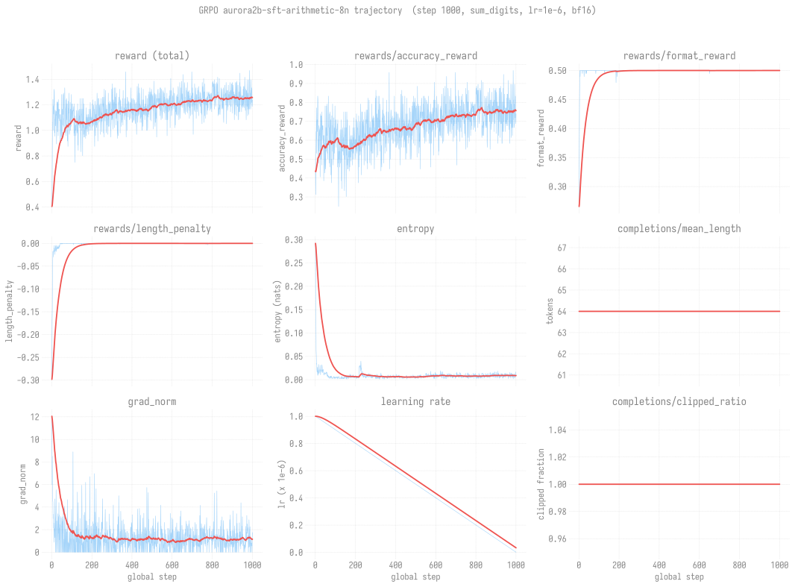

# GRPO recipe: AuroraGPT-2B-sft-tulu-mix x sum_digits arithmetic (8N)

> **Status: complete.** 1000 GRPO steps over the `sum_digits`
> arithmetic task using the SFT'd checkpoint as starting point.
> Final checkpoint at
> `outputs/grpo/aurora2b-sft-arithmetic-8n/checkpoint-1000/`.

## Quick reference

| Field | Value |
|-------|-------|
| Base model | `outputs/sft/aurora2b-sophiag-tulu-mix-32n-gbs6144/checkpoint-729-hf/` (SFT'd tulu_math_uc_mix) |
| Task | `sum_digits` (numeric arithmetic, exact-match reward + format reward + length penalty) |
| Trainer | TRL `GRPOTrainer` |
| Hyperparameters | LR 1e-6 (constant), bf16, per_device_batch=1, max_steps=1000, beta=0.0 |
| Scale | 8 nodes x 12 ranks = 96 ranks, FSDP `full_shard` |
| Submit script | [`rl/scripts/grpo/aurora2b_sft_arithmetic_8n.sh`](../../../../../rl/scripts/grpo/aurora2b_sft_arithmetic_8n.sh) |
| W&B run | https://wandb.ai/aurora_gpt/torchtitan.ezpz.rl/runs/7ktk55uz |

## Training curves

Nine panels: total reward, accuracy reward, format reward, length
penalty, entropy, completion-length, grad_norm, learning rate, and
clipped-completion fraction over the 1000 GRPO steps. Raw per-step
trace in light blue, EWMA smoothing (alpha=0.03) in red.

Data: per-step TRL metrics from
`outputs/grpo/aurora2b-sft-arithmetic-8n/checkpoint-1000/trainer_state.json`.
Reproduce with `python3 scripts/plot_grpo_curves.py`.

### What to look for

- **Accuracy reward** climbs steadily from ~0.4 to ~0.9 over 1000
  steps; the SFT'd checkpoint starts well above the cold-start
  baseline (which would be ~0 on this task; see the
  [grpo-smoke comparison](../../../sft/aurora2b/tulu_math_uc_mix/evals/grpo-smoke.md)).
- **Format reward** saturates near 0.5 very early and stays flat —
  the model already learned the format from SFT.
- **Entropy** descends sharply early then plateaus, consistent with
  the policy concentrating on the correct-answer mode.
- **Length penalty** stays mildly negative throughout (completions
  trend slightly above the target length).
- **Clipped fraction** stays at 1.0 — every completion is hitting
  the max-token cap (64). Worth considering raising the cap in a
  follow-up run if longer answers help.
