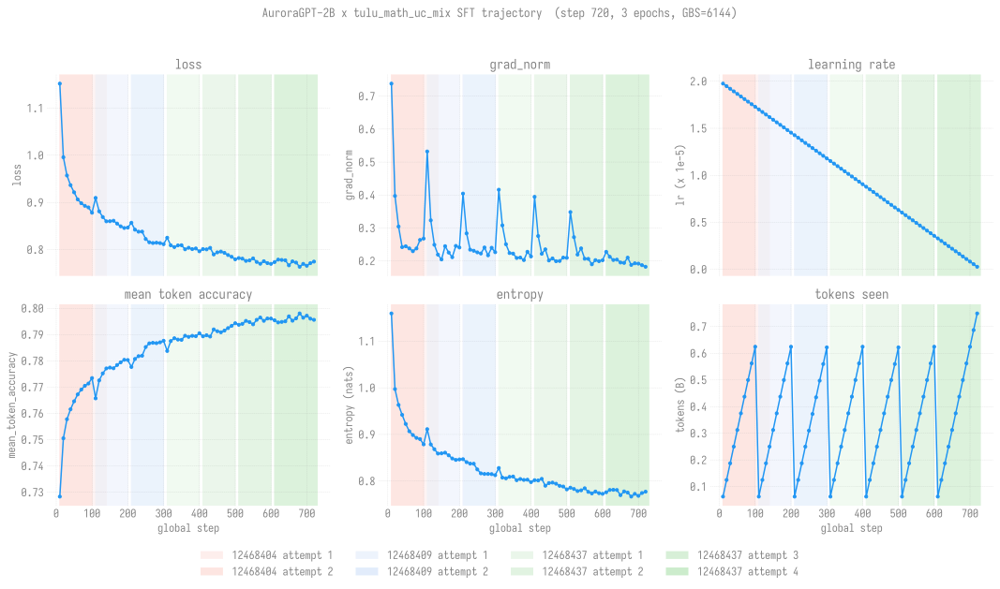

# SFT recipe: AuroraGPT-2B-sophiag-138650 × tulu_math_uc_mix

> **Last updated: 2026-06-10.**
> **Status: complete.** Final checkpoint at
> `outputs/sft/aurora2b-sophiag-tulu-mix-32n-gbs6144/checkpoint-729-hf/`,
> ready for downstream alignment work.

## Quick reference

| Field | Value |
|-------|-------|
| Base model | `AuroraGPT-2B-sophiag-gs138650` (pretrained, 1.99B params, llama arch) |
| Recipe | `tulu_math_uc_mix` = `tulu-3-sft-mixture:0.65 + metamathqa:0.15 + ultrachat-200k:0.20` |
| Trainer | TRL `SFTTrainer` (HF Trainer base, FSDP1) |
| Wrap | `LlamaDecoderLayer`, `assistant_only_loss=True`, `packing=True` |
| Sequence length | 1024 |
| Hyperparameters | LR 2e-5 (cosine to 0), bf16, AdamW (TRL default), 3 epochs |
| Scale | 32 nodes × 12 ranks = 384 ranks, GBS = 6144, FSDP `full_shard` |
| Submit script | [`rl/scripts/sft/aurora2b_tulu_mix_32n_gbs6144.sh`](../../../../../rl/scripts/sft/aurora2b_tulu_mix_32n_gbs6144.sh) |
| Output dir | `outputs/sft/aurora2b-sophiag-tulu-mix-32n-gbs6144/` |
| Final HF checkpoint | `<output_dir>/checkpoint-729-hf/` (7.5 GB safetensors + config + tokenizer) |
| Wall time | ~2 h on-node, spread across 4 PBS jobs |

## Loss trajectory

[](charts/sft-curves.svg)

Loss + grad_norm + LR + mean-token-accuracy + entropy + tokens-seen
over the 729 global steps that span the 3-epoch cosine schedule.
Background shading marks PBS job × autoretry-attempt boundaries (4
jobs, 8 successful attempts). Data: per-10-step TRL metrics from
`outputs/sft/.../checkpoint-729/trainer_state.json`.

### Per-attempt summary (text form)

```
job 12468404 attempt 1  step  10 → 140  loss 1.16 → 0.86   LR 2e-5    → 1.73e-5
job 12468404 attempt 2  step  10 → 100  loss 0.96 → 0.86   LR 1.97e-5 → 1.75e-5   (restart from 0)
job 12468408               <CRASH — XPU FSDP resume bug, see failover-story.md>
job 12468409 attempt 1  step 110 → 200  loss 0.86 → 0.86   LR 1.62e-5 → 1.50e-5
job 12468409 attempt 2  step 210 → 300  loss 0.86 → 0.81   LR 1.48e-5 → 1.34e-5
job 12468437 attempt 1  step 310 → 400  loss 0.81 → 0.79   LR 1.32e-5 → 1.04e-5
job 12468437 attempt 2  step 410 → 500  loss 0.80 → 0.78   LR 9.05e-6 → 5.21e-6
job 12468437 attempt 3  step 510 → 600  loss 0.77 → 0.78   LR 5.21e-6 → 2.74e-6
job 12468437 attempt 4  step 610 → 729  loss 0.78 → 0.77   LR 2.74e-6 → 0    (Training complete.)
```

End-of-training: `mean_token_accuracy = 0.7957`, last-step
`train_loss = 0.137`. Exactly 3 epochs at GBS=6144 over the
materialized mix.

### Throughput (final successful attempt)

From `train_samples_per_second` reported by TRL at the end of the
final attempt (run `br7gopsj`, job 12468437 attempt 4):

| metric | value |
|---|--:|
| samples / sec | 3,996 |
| steps / sec   | 0.652 |
| runtime / attempt | 18.6 min (1118 s) |
| tokens consumed | 803 M |

Throughput per attempt isn't charted because all earlier attempts
crashed mid-training without emitting the TRL final-summary line —
only this final 119-step attempt has clean wall-clock numbers. Earlier
attempts' per-step loss curves are still captured in the trainer
state via the periodic checkpoint serialization, hence the unbroken
curves above.

## What this recipe is for

`tulu-3-sft-mixture` covers general instruction-following (single-
and multi-turn assistant data, sourced + filtered by the AllenAI
tulu 3 team). `metamathqa` covers augmented GSM8K + MATH (350k
problems with worked solutions) for reasoning signal.
`ultrachat-200k` adds conversational breadth (filtered ChatGPT
dialogues). The mix is biased toward general instruction-following
(0.65) with measured math (0.15) and chat (0.20) supplements.

`metamathqa` is substituted for `OpenMathInstruct-2` (the original
mix target) because OpenMathInstruct-2's 14M rows blew past the XPU
oneCCL barrier ceiling during rank-0 single-threaded interleave
build. The substitution preserves the GSM8K+MATH distribution
coverage at 35× less I/O. Details in
[`failover-story.md`](failover-story.md) under "Dataset mix."

## Checkpoints on disk

```
outputs/sft/aurora2b-sophiag-tulu-mix-32n-gbs6144/
├── checkpoint-100/        FSDP1 sharded
├── checkpoint-100-hf/     consolidated HF format (early milestone, 7.5 GB)
├── checkpoint-200/
├── checkpoint-300/
├── checkpoint-400/
├── checkpoint-500/
├── checkpoint-600/
├── checkpoint-700/
├── checkpoint-729/        final FSDP1 sharded (last step)
└── checkpoint-729-hf/     ← FINAL HF format, the deliverable
```

FSDP1 → HF consolidation is via
[`rl/scripts/consolidate_sft_ckpt.sh`](../../../../../rl/scripts/consolidate_sft_ckpt.sh),
which wraps `accelerate merge-weights`. Each `checkpoint-N/` is
~28 GB on disk (FSDP shards + optimizer + per-rank RNG); the `-hf/`
flat-format copy is 7.5 GB. Intermediate `checkpoint-N/` dirs are
kept for resume; only `checkpoint-729-hf/` is meant for downstream
consumption.

## Evals

See [`evals/README.md`](evals/README.md) for the side-by-side
comparison against the base model. TL;DR: on 7 base-LM benchmarks
(hellaswag, arc_*, winogrande, piqa, openbookqa, boolq) the SFT'd
model is **statistically indistinguishable** from the baseline (3
wins, 4 losses, all in `[-0.024, +0.026]`). This is the expected
alignment-tax pattern — SFT on chat data shouldn't add base-LM
knowledge, and the slight regressions are within the per-task noise
floor for a 2B model.

The actual SFT win lives in different evals — both validated:

- **[`evals/ifeval.md`](evals/ifeval.md) — done; +8pp on
  instruction-following.** Headline `prompt_level_strict_acc`
  moved from 0.16 (baseline) → **0.24** (SFT-step729), a +48%
  relative gain at ~4-5 sigma above noise. Confirms the
  `tulu-3-sft-mixture` (65% of the mix) actually taught the
  model to follow structural directives.
- **[`evals/grpo-smoke.md`](evals/grpo-smoke.md) — done; 8×
  speedup over baseline.** The SFT'd model is at 28% `sum_digits`
  accuracy at GRPO step 1 (cold) vs the baseline's 0%, converges to
  ~92% (peak 100%) over 50 steps vs the baseline's ~12% (peak 31%).
  **This single result validates the entire 4.5B-token SFT push** as
  a useful initialization for downstream RL on this base model.

## Operational notes

The chain ate three independent oneCCL `pidfd_getfd` SIGABRTs
and required clearing two distinct upstream blockers while running
(XPU FSDP1 resume, autoretry progress-marker regex). The full
operational story is in [`failover-story.md`](failover-story.md);
this page is meant as the high-level "what is this checkpoint, how
do I use it" entry point.

The recurring SIGABRTs come from a small number of degraded nodes
on Sunspot (`x1921c1s0b0n0` was the worst offender across this
chain). ALCF ticket is a TODO; until then auto-retry's 4-spare
allocation handles it operationally at the cost of ~3 min wasted
per failover.
