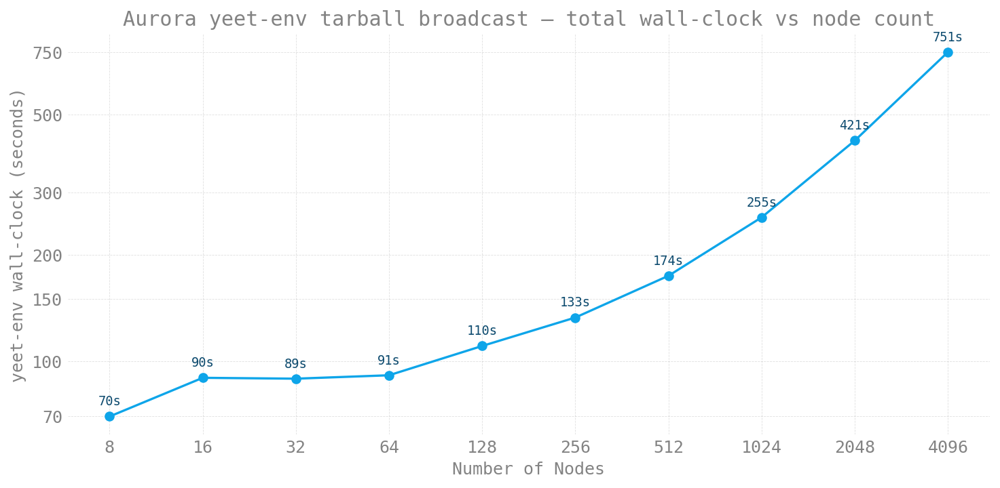
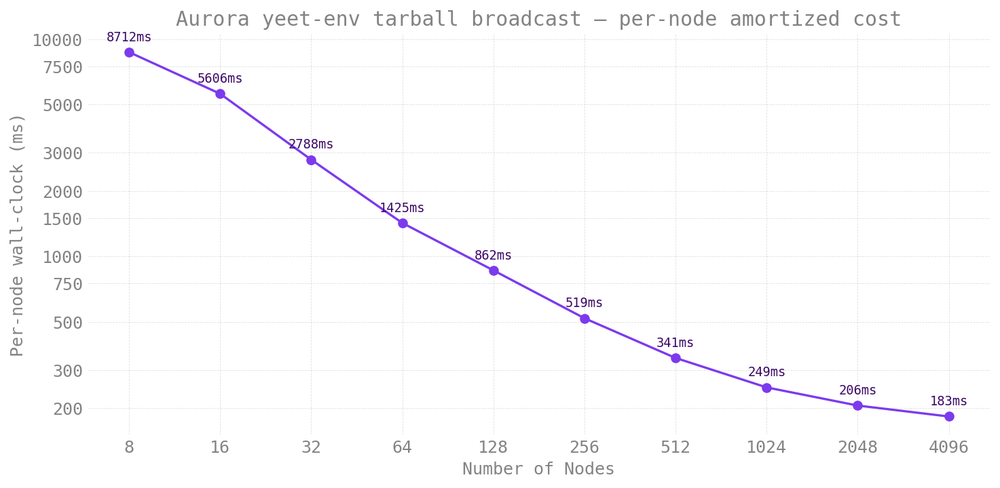

# yeet-env Tarball Broadcast Scaling

Measures `ezpz yeet-env --src .venv.tar.gz` wall-clock time across node
counts on Aurora. Replaces the per-file rsync mode previously documented
in CLAUDE.md (which predicted hours at 256+ nodes).

## Setup

Per-test job:
- 30-min walltime (1h for ≥1024N)
- 8/16/32/64/128/256 → debug-scaling
- 512/1024 → small (route prod)
- 2048/4096 → prod-large (route prod)
- Each job: time yeet-env, then 10 training steps of agpt_2b to verify
  the broadcast venv is functional.

Submit script: `torchtitan/experiments/ezpz/scripts/yeet_env_scaling_test.sh`
Results CSV: `.yeet-env-scaling-results.csv` (in repo root).
Plots: `figures/yeet_env_seconds.png`, `figures/yeet_env_per_node.png`.

## Reproducing

```bash
# Submit each scale, one at a time (PBS per-user-Q limit blocks
# concurrent submission; chain via qsub depend or a polling wrapper).
for N in 8 16 32 64 128 256; do
    qsub -q debug-scaling -l select=$N -l walltime=00:30:00 \
        -N yeet-n$N \
        torchtitan/experiments/ezpz/scripts/yeet_env_scaling_test.sh
done

# 512/1024 → prod (auto-routes to small)
for N in 512 1024; do
    qsub -q prod -l select=$N -l walltime=01:00:00 \
        -N yeet-n$N \
        torchtitan/experiments/ezpz/scripts/yeet_env_scaling_test.sh
done

# 2048/4096 → prod (auto-routes to prod-large)
for N in 2048 4096; do
    qsub -q prod -l select=$N -l walltime=01:00:00 \
        -N yeet-n$N \
        torchtitan/experiments/ezpz/scripts/yeet_env_scaling_test.sh
done

# Plot results once ≥3 points have landed:
python3 torchtitan/experiments/ezpz/docs/scaling/yeet_env/plot_yeet_env_scaling.py
```

## Results (2026-04-30 to 2026-05-01)

Full 10-point sweep complete.

| Nodes | yeet-env (s) | Per-node (ms) |
|------:|-------------:|--------------:|
| 8 | 69.7 | 8,712 |
| 16 | 89.7 | 5,606 |
| 32 | 89.2 | 2,788 |
| 64 | 91.2 | 1,425 |
| 128 | 110.4 | 862 |
| 256 | 132.9 | 519 |
| 512 | 174.5 | 341 |
| 1024 | 255.4 | 249 |
| 2048 | 421.4 | 206 |
| 4096 | 750.6 | 183 |





### Observations

- **Two regimes**: 8-64N is extract-bound (total wall-clock ~70-91s flat,
  per-node cost falls 8.7s → 1.4s as more nodes share the fixed-cost
  extraction); ≥128N is broadcast-bound (total wall-clock grows
  super-linearly).
- **Per-node amortized cost** drops monotonically from 8.7s/node (N=8)
  to 0.18s/node (N=4096) — a **48× efficiency gain** over the sweep.
- **Doubling overhead** in the broadcast-bound regime: each 2× in
  nodes adds ~1.5-1.8× wall-clock (256→512 was 1.31×, 512→1024 was
  1.46×, 1024→2048 was 1.65×, 2048→4096 was 1.78×) — the broadcast
  tree depth and per-leaf bandwidth contention both grow.
- **Practical takeaway**: pre-yeet-env overhead at production scale is
  <13 minutes even at 4096N. The "1-2 hour" estimate in CLAUDE.md was
  for the pre-tarball per-file rsync mode; tarball broadcast doesn't
  reach that regime even at the full Aurora scale.
